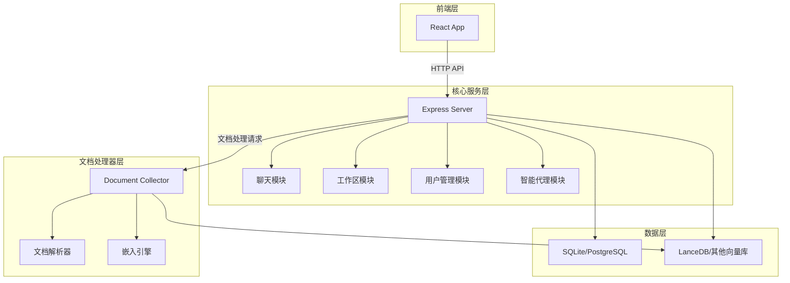
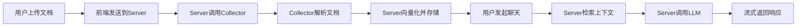

# AnythingLLM — 代码逻辑分析报告

## 1. 执行摘要

| 维度 | 内容 |
|------|------|
| **项目名称** | AnythingLLM |
| **项目定位** | 一体化AI生产力加速器，支持本地部署的私有化ChatGPT替代方案 |
| **技术栈** | Node.js + React + Express + Prisma + SQLite/LanceDB |
| **架构模式** | Monorepo + 微服务架构（前端、后端、文档处理器三个独立服务） |
| **代码规模** | 约908个JavaScript/JSX文件，总计约17万行代码 |
| **核心入口** | `server/index.js`, `collector/index.js`, `frontend/src/main.jsx` |

> **一段话总结**: AnythingLLM是一个功能丰富的开源AI应用，采用Monorepo结构包含前端、后端和文档处理器三个独立服务。项目支持多种LLM提供商、向量数据库和嵌入模型，特别注重隐私保护和本地部署。架构上采用模块化设计，通过Prisma进行数据管理，LanceDB作为默认向量数据库。核心亮点包括多用户支持、智能代理系统、MCP协议兼容性以及强大的文档处理能力。需要注意的是，项目依赖较多外部服务，配置复杂度较高，且部分功能仅在Docker版本中可用。

---

## 2. 目录结构解析

```
anything-llm/
├── frontend/          # 前端层: React + Vite 应用，负责UI交互
├── server/            # 核心层: Express服务器，处理API、聊天逻辑、用户管理
├── collector/         # 文档处理层: 专门处理文档解析和向量化
├── docker/            # 配置层: Docker相关配置和部署脚本
├── embed/             # 工具层: 网站嵌入式聊天组件
├── browser-extension/ # 工具层: 浏览器扩展
├── package.json       # 配置文件: 项目根配置和脚本命令
```

**关键观察**: 项目采用按功能分包的Monorepo架构，将前端、后端和文档处理器分离为三个独立但协同工作的服务。这种设计提高了模块化程度，便于独立开发和部署，同时也增加了系统复杂性。

---

## 3. 架构与模块依赖

### 3.1 架构概览

AnythingLLM采用三层微服务架构设计：
1. **前端层** (`frontend/`): 基于React和Vite构建的现代化Web应用，提供完整的用户界面，支持多语言国际化
2. **核心服务层** (`server/`): 基于Express的Node.js服务器，负责用户认证、工作区管理、聊天逻辑、API接口等核心业务
3. **文档处理器层** (`collector/`): 专门处理文档上传、解析、文本提取和预处理的服务，与核心服务解耦

数据持久化采用SQLite（默认）或PostgreSQL，向量存储使用LanceDB（默认）或其他支持的向量数据库。整个系统通过环境变量进行配置，支持灵活的部署选项。

### 3.2 模块依赖图



### 3.3 核心模块详解

#### 核心服务模块 (server/)

- **路径**: `server/`
- **职责**: 处理所有HTTP请求、用户认证、工作区管理、聊天逻辑、智能代理等核心功能
- **关键文件**:
  - `index.js` — 主入口文件，初始化Express应用和路由
  - `endpoints/chat.js` — 聊天流式API实现
  - `endpoints/workspaces.js` — 工作区管理API
  - `utils/chats/stream.js` — 核心聊天逻辑实现
  - `utils/agents/index.js` — 智能代理系统
- **对外暴露**: RESTful API接口，WebSocket支持
- **依赖关系**: 依赖collector服务进行文档处理，依赖各种AI提供商SDK

#### 文档处理器模块 (collector/)

- **路径**: `collector/`
- **职责**: 专门处理文档上传、解析、文本提取、向量化等文档相关操作
- **关键文件**:
  - `index.js` — 文档处理器主入口
  - `processSingleFile/` — 单文件处理逻辑
  - `processLink/` — 网页链接处理逻辑
  - `utils/` — 各种文档解析工具
- **对外暴露**: HTTP API接口供server调用
- **依赖关系**: 依赖puppeteer、tesseract.js等文档解析库

#### AI提供商抽象层

- **路径**: `server/utils/AiProviders/`
- **职责**: 为不同AI提供商（OpenAI、Anthropic、Ollama等）提供统一的接口抽象
- **关键文件**:
  - `openAi/index.js` — OpenAI提供商实现
  - `anthropic/index.js` — Anthropic提供商实现
  - 其他提供商实现...
- **对外暴露**: 统一的LLM接口，支持流式和非流式响应
- **依赖关系**: 依赖各提供商的官方SDK

---

## 4. 核心业务流程与数据流

### 4.1 主流程描述

用户与AnythingLLM的核心交互流程如下：
1. 用户上传文档到工作区
2. 前端发送文档到server服务
3. server服务调用collector服务进行文档解析
4. collector服务解析文档并提取文本内容
5. server服务使用嵌入引擎将文本向量化并存储到向量数据库
6. 用户发起聊天请求
7. server服务从向量数据库检索相关上下文
8. server服务调用配置的LLM提供商生成响应
9. 响应通过流式API返回给前端

### 4.2 流程图



### 4.3 数据模型

核心数据实体包括：
- **Workspace** (工作区): 用户的工作空间，包含聊天设置、文档集合
- **User** (用户): 系统用户，支持多用户和角色管理
- **Document** (文档): 上传的文档信息和元数据
- **WorkspaceChat** (聊天记录): 聊天历史记录
- **WorkspaceThread** (聊天线程): 多轮对话的线程管理

Prisma schema定义了这些实体之间的关系，使用SQLite作为默认数据库，支持轻松切换到PostgreSQL。

---

## 5. 关键 API 接口与调用链路

### 5.1 API 总览

| 方法 | 路径/接口 | 说明 | 所在文件 |
|------|-----------|------|----------|
| POST | `/workspace/:slug/stream-chat` | 流式聊天API | `server/endpoints/chat.js` |
| POST | `/workspace/new` | 创建新工作区 | `server/endpoints/workspaces.js` |
| POST | `/workspace/:slug/upload` | 上传文档 | `server/endpoints/workspaces.js` |
| POST | `/process` | 文档处理API | `collector/index.js` |

### 5.2 核心 API 调用链路分析

#### `stream-chat` API

**调用链**:

```
chat.js → streamChatWithWorkspace() → getLLMProvider() → VectorDb.performSimilaritySearch() → LLMConnector.getChatCompletion()
```

**关键代码片段**:

```120:150:server/utils/chats/stream.js
// If we are here we know that we are in a workspace that is:
// 1. Chatting in "chat" mode and may or may _not_ have embeddings
// 2. Chatting in "query" mode and has at least 1 embedding
let completeText;
let metrics = {};
let contextTexts = [];
let sources = [];
let pinnedDocIdentifiers = [];
const { rawHistory, chatHistory } = await recentChatHistory({
  user,
  workspace,
  thread,
  messageLimit,
});
```

**逻辑说明**: 这段代码处理核心聊天逻辑，首先获取聊天历史，然后处理固定文档（pinned documents），接着进行向量相似度搜索获取相关上下文，最后调用LLM生成响应。特别注意的是，系统会智能地处理上下文窗口限制，确保不会超出LLM的token限制。

---

## 6. 算法与关键函数实现

### 6.1 文档向量化算法

- **位置**: `server/utils/vectorDbProviders/lance/index.js` 第 85 行
- **用途**: 将文档文本转换为向量并存储到LanceDB向量数据库
- **复杂度**: 时间 O(n*m) / 空间 O(n*m)，其中n是文档数量，m是每个文档的平均长度

**核心代码**:

```85:120:server/utils/vectorDbProviders/lance/index.js
async addDocumentToNamespace(namespace, document, fullFilePath, skipCache = false) {
  const { client } = await this.connect();
  const exists = await this.namespaceExists(client, namespace);
  if (!exists) await this.createNamespace(client, namespace);

  const table = await client.openTable(namespace);
  const vectorRecord = {
    id: v4(),
    vector: document.vector,
    text: document.text,
    ...document.metadata,
  };

  // Store the vector record in the database
  await table.add([vectorRecord]);
  return { success: true, message: null };
}
```

**逐步解析**:

1. **连接数据库**: 首先连接到LanceDB客户端
2. **检查命名空间**: 验证目标命名空间（工作区）是否存在，不存在则创建
3. **构建向量记录**: 将文档的向量、文本内容和元数据组合成向量记录
4. **存储记录**: 将向量记录添加到对应的表中

### 6.2 本地嵌入引擎

- **位置**: `server/utils/EmbeddingEngines/native/index.js` 第 120 行
- **用途**: 使用Xenova/transformers库在本地运行嵌入模型，无需外部API
- **复杂度**: 时间 O(k*l) / 空间 O(k*l)，其中k是文本块数量，l是每个块的平均长度

**核心代码**:

```120:150:server/utils/EmbeddingEngines/native/index.js
async #fetchWithHost(hostOverride = null) {
  try {
    // Convert ESM to CommonJS via import so we can load this library.
    const pipeline = (...args) =>
      import("@xenova/transformers").then(({ pipeline, env }) => {
        if (!this.modelDownloaded) {
          // if model is not downloaded, we will log where we are fetching from.
          if (hostOverride) {
            env.remoteHost = hostOverride;
            env.remotePathTemplate = "{model}/"; // Our S3 fallback url does not support revision File structure.
          }
          this.log(`Downloading ${this.model} from ${env.remoteHost}`);
        }
        return pipeline(...args);
      });
    return {
      pipeline: await pipeline("feature-extraction", this.model, {
        cache_dir: this.cacheDir,
```

**逐步解析**:

1. **动态导入**: 使用动态import加载@xenova/transformers库
2. **配置远程主机**: 如果模型未下载，配置远程主机URL用于下载
3. **创建管道**: 初始化特征提取管道，指定模型和缓存目录
4. **模型缓存**: 自动处理模型的下载和缓存，提高后续使用效率

---

## 7. 架构评价与建议

### 优势

- **模块化设计**: 三个独立服务的架构使得系统易于维护和扩展
- **多提供商支持**: 抽象层设计使得可以轻松集成新的AI提供商和向量数据库
- **隐私优先**: 本地嵌入引擎和文档处理器确保敏感数据不离开本地环境
- **MCP协议兼容**: 支持Model Context Protocol，可以集成各种MCP工具
- **智能代理系统**: 强大的代理系统支持复杂的自动化工作流

### 潜在问题

- **配置复杂性**: 大量的环境变量和配置选项可能让新手用户感到困惑
- **资源消耗**: 本地运行嵌入模型和文档处理器需要较多的内存和CPU资源
- **功能差异**: 某些高级功能（如多用户支持、嵌入式聊天）仅在Docker版本中可用
- **依赖管理**: 项目依赖众多外部库，可能存在版本冲突或安全漏洞风险

### 进一步阅读建议

如果您想深入了解某个模块，建议从以下文件开始：

1. `server/utils/chats/stream.js` — 核心聊天逻辑的完整实现
2. `server/utils/agents/index.js` — 智能代理系统的架构和实现
3. `server/utils/helpers/index.js` — 各种工具函数和抽象层的实现
4. `collector/processSingleFile/index.js` — 文档处理的核心逻辑
5. `server/prisma/schema.prisma` — 数据模型的完整定义