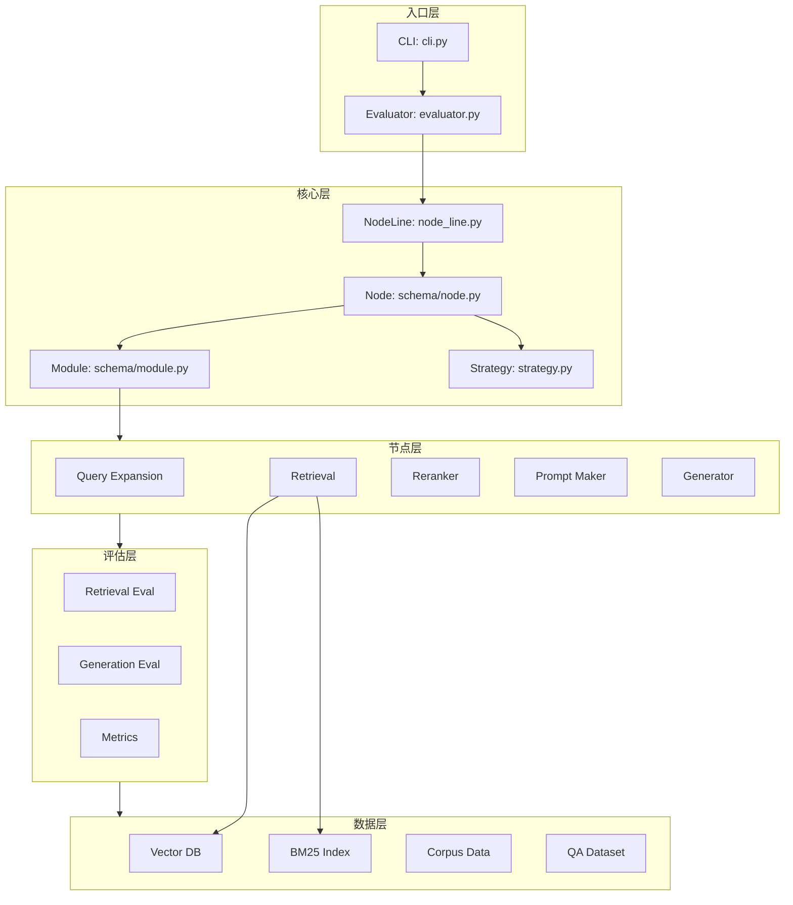
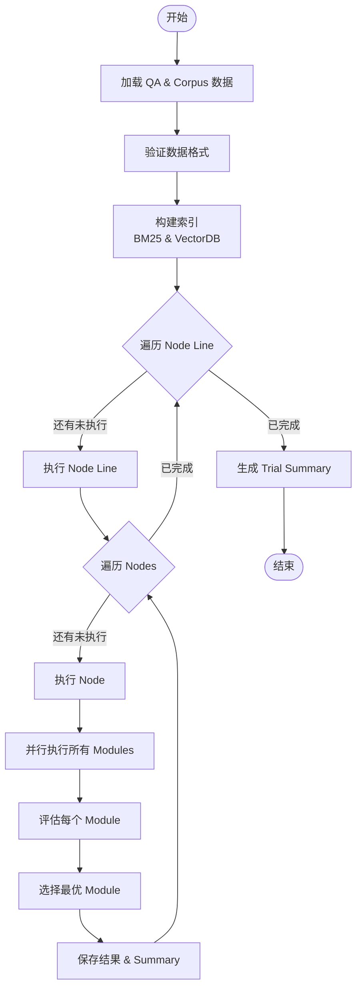

# AutoRAG — 代码逻辑分析报告

## 1. 执行摘要

| 维度 | 内容 |
|------|------|
| **项目名称** | AutoRAG |
| **项目定位** | RAG (Retrieval-Augmented Generation) 自动化评估与优化框架，采用 AutoML 风格自动寻找最优 RAG 流水线 |
| **技术栈** | Python 3.10+、LlamaIndex、LangChain、Pandas、PyArrow、OpenAI API、多种向量数据库 (Chroma/Milvus/Weaviate等) |
| **架构模式** | 节点流水线 (Node Pipeline) + 模块化策略模式，支持声明式 YAML 配置 |
| **代码规模** | 约 174 个 Python 文件，约 19,500 行代码 |
| **核心入口** | `autorag/cli.py` (CLI 入口)、`autorag/evaluator.py` (核心评估器) |

> **一句话总结**: AutoRAG 是一个面向 RAG 应用的自动化优化框架，通过定义节点流水线（检索、重排序、生成等），自动评估多种模块组合的性能，并选出最优配置。它采用模块化设计，支持多种检索策略（BM25、向量检索、混合检索）、重排序器和生成模型，用户只需提供 QA 数据集和语料库，即可自动找到最适合自己数据的最优 RAG 流水线。

---

## 2. 目录结构解析

```
AutoRAG/
├── autorag/                    # 核心代码库
│   ├── __init__.py            # 包初始化，定义 LazyInit 延迟加载和日志配置
│   ├── cli.py                 # 命令行接口 (CLI): evaluate, run_api, run_web, dashboard 等
│   ├── evaluator.py           # 核心评估器 Evaluator 类，执行完整的 RAG 优化流程
│   ├── node_line.py           # 节点流水线执行逻辑
│   ├── strategy.py            # 策略选择算法 (mean, rank, normalize_mean)
│   ├── support.py             # 模块和节点的动态查找注册表
│   ├── validator.py           # 配置和数据验证
│   ├── parser.py              # 数据解析器入口
│   ├── chunker.py             # 文本分块器入口
│   ├── dashboard.py           # 可视化仪表盘
│   ├── web.py                 # Web 界面支持
│   ├── schema/                # 数据模型定义
│   │   ├── base.py           # BaseModule 抽象基类
│   │   ├── node.py           # Node 数据类，定义节点行为
│   │   ├── module.py         # Module 数据类，定义模块行为
│   │   └── metricinput.py    # 评估指标输入 schema
│   ├── nodes/                 # 节点实现 (核心)
│   │   ├── retrieval/        # 检索基类和工具
│   │   ├── lexicalretrieval/ # 词法检索 (BM25)
│   │   ├── semanticretrieval/# 语义检索 (向量数据库)
│   │   ├── hybridretrieval/  # 混合检索 (RRF, CC)
│   │   ├── queryexpansion/   # 查询扩展
│   │   ├── passagereranker/  # 段落重排序
│   │   ├── passagefilter/    # 段落过滤
│   │   ├── passagecompressor/# 段落压缩
│   │   ├── passageaugmenter/ # 段落增强
│   │   ├── promptmaker/      # 提示词生成
│   │   └── generator/        # 答案生成
│   ├── evaluation/            # 评估系统
│   │   ├── retrieval.py      # 检索评估装饰器
│   │   ├── generation.py     # 生成评估装饰器
│   │   └── metric/           # 具体指标实现
│   ├── data/                  # 数据处理
│   │   ├── parse/            # 文档解析
│   │   ├── chunk/            # 文本分块
│   │   ├── qa/               # QA 数据生成
│   │   └── utils/            # 数据工具
│   ├── deploy/                # 部署支持
│   │   ├── base.py           # Runner 基类
│   │   ├── api.py            # API 服务
│   │   └── gradio.py         # Gradio 界面
│   ├── vectordb/              # 向量数据库适配器
│   ├── embedding/             # 嵌入模型适配器
│   └── utils/                 # 通用工具函数
├── sample_config/             # 示例配置文件
├── sample_dataset/            # 示例数据集
├── tests/                     # 测试代码
└── docs/                      # 文档
```

**关键观察**: 项目采用清晰的模块化分层架构，将 RAG 流水线的各个阶段抽象为独立节点（Node），每个节点包含多个可替换模块（Module）。通过 YAML 配置声明式地组合这些节点和模块，实现灵活的流水线定制。

---

## 3. 架构与模块依赖

### 3.1 架构概览

AutoRAG 采用**节点流水线架构 (Node Pipeline Architecture)**，其核心设计思想是将 RAG 流程拆分为多个独立的处理节点，每个节点负责特定的任务（如检索、重排序、生成等）。每个节点内部支持多种算法模块，系统通过自动评估选择每个节点的最优模块组合。

架构特点：
- **声明式配置**: 通过 YAML 文件定义流水线结构
- **模块化设计**: 每个节点支持多种可插拔模块
- **自动优化**: 基于评估指标自动选择最优模块
- **数据驱动**: 使用 Parquet 格式存储中间结果

### 3.2 模块依赖图



### 3.3 核心模块详解

#### Evaluator (评估器)

- **路径**: `autorag/evaluator.py`
- **职责**: 执行完整的 RAG 优化流程，包括数据验证、语料库索引、节点流水线执行、结果汇总
- **关键方法**:
  - `start_trial()`: 启动新的优化试验
  - `restart_trial()`: 从断点恢复试验
  - `_load_node_lines()`: 从 YAML 加载节点配置
  - `__ingest_bm25_full()`: 构建 BM25 索引
- **依赖关系**: 依赖所有节点模块和评估系统，被 CLI 调用

#### Node (节点)

- **路径**: `autorag/schema/node.py`
- **职责**: 抽象 RAG 流水线中的单个处理阶段，管理模块组合和执行
- **关键方法**:
  - `from_dict()`: 从配置字典创建节点实例
  - `get_param_combinations()`: 生成模块参数组合
  - `run()`: 执行节点，评估所有模块并选择最优
- **依赖关系**: 依赖 Module 和策略系统

#### Module (模块)

- **路径**: `autorag/schema/module.py`
- **职责**: 封装具体的算法实现，支持动态加载
- **关键方法**:
  - `from_dict()`: 从配置创建模块实例
  - `__post_init__()`: 通过 support.py 动态查找并加载模块实现
- **依赖关系**: 依赖 support.py 的模块注册表

#### Support (模块注册表)

- **路径**: `autorag/support.py`
- **职责**: 维护模块和节点的注册表，支持动态查找和加载
- **关键函数**:
  - `get_support_modules()`: 获取模块实现
  - `get_support_nodes()`: 获取节点运行函数
  - `dynamically_find_function()`: 动态导入模块

---

## 4. 核心业务流程与数据流

### 4.1 主流程描述

AutoRAG 的核心流程是**自动化 RAG 流水线优化**：

1. **数据准备阶段**:
   - 加载 QA 数据集 (`qa.parquet`) 和语料库 (`corpus.parquet`)
   - 验证数据格式和一致性
   - 将数据复制到项目目录

2. **索引构建阶段**:
   - 构建 BM25 词法索引 (如果配置包含 BM25 模块)
   - 向量化语料库并导入向量数据库 (如果配置包含向量检索模块)

3. **节点流水线执行阶段**:
   - 按顺序执行每个 Node Line
   - 每个 Node 内部并行执行所有配置的 Module
   - 使用评估指标选择最优 Module
   - 将最优结果传递给下一个 Node

4. **结果汇总阶段**:
   - 生成 `summary.csv` 汇总每个节点的最优模块
   - 保存每个模块的详细结果到 Parquet 文件

### 4.2 流程图



### 4.3 数据模型

**QA Dataset Schema**:
- `qid`: 查询 ID
- `query`: 查询文本
- `retrieval_gt`: 检索 ground truth (文档 ID 列表)
- `generation_gt`: 生成 ground truth (答案文本)

**Corpus Dataset Schema**:
- `doc_id`: 文档 ID
- `contents`: 文档内容
- `metadata`: 文档元数据

**Node Result Schema**:
- 保留前一节点的所有列
- 添加当前节点的输出列 (如 `retrieved_contents`, `retrieved_ids`, `retrieve_scores`)
- 添加评估指标列 (如 `retrieval_recall`, `retrieval_precision`)

---

## 5. 关键 API 接口与调用链路

### 5.1 API 总览

| 方法 | 路径/接口 | 说明 | 所在文件 |
|------|-----------|------|----------|
| CLI | `autorag evaluate` | 执行 RAG 优化评估 | `cli.py:evaluate` |
| CLI | `autorag run_api` | 启动 API 服务 | `cli.py:run_api` |
| CLI | `autorag run_web` | 启动 Web 界面 | `cli.py:run_web` |
| CLI | `autorag dashboard` | 启动结果仪表盘 | `cli.py:run_dashboard` |
| Python | `Evaluator.start_trial()` | 启动优化试验 | `evaluator.py` |
| Python | `Runner.run()` | 执行优化后的流水线 | `deploy/base.py` |

### 5.2 核心 API 调用链路分析

#### `Evaluator.start_trial()` 调用链

**调用链**:
```
CLI.evaluate → Evaluator.__init__ → Evaluator.start_trial → 
  ├─ Validator.validate (数据验证)
  ├─ __ingest_bm25_full (BM25 索引构建)
  ├─ vectordb_ingest (向量数据库导入)
  └─ run_node_line (节点流水线执行)
      └─ Node.run → run_node (具体节点执行函数)
          └─ Module.run_evaluator → Module.pure (模块执行)
```

**关键代码片段**:

```python
# evaluator.py:82-145
def start_trial(self, yaml_path: str, skip_validation: bool = False, full_ingest: bool = True):
    # 1. 数据验证
    if not skip_validation:
        validator = Validator(qa_data_path=self.qa_data_path, 
                            corpus_data_path=self.corpus_data_path)
        validator.validate(yaml_path)
    
    # 2. 创建试验目录
    trial_name = self.__get_new_trial_name()
    self.__make_trial_dir(trial_name)
    
    # 3. 构建索引
    node_lines = self._load_node_lines(yaml_path)
    self.__ingest_bm25_full(node_lines)
    # ... 向量数据库导入
    
    # 4. 执行节点流水线
    trial_summary_df = pd.DataFrame(...)
    for node_line_name, node_line in node_lines.items():
        previous_result = run_node_line(node_line, node_line_dir, previous_result)
        trial_summary_df = self._append_node_line_summary(...)
    
    trial_summary_df.to_csv(os.path.join(self.project_dir, trial_name, "summary.csv"))
```

**逻辑说明**: 
1. 首先进行数据验证，确保 QA 和 Corpus 数据格式正确且一致
2. 创建新的试验目录，用于存储本次试验的所有结果
3. 根据配置构建 BM25 索引和向量数据库索引
4. 按顺序执行每个 Node Line，每个 Node Line 内部顺序执行 Nodes
5. 每个 Node 会并行执行所有配置的 Modules，评估后选择最优
6. 最终生成 summary.csv 汇总所有节点的最优模块

#### `run_node_line()` 调用链

**调用链**:
```
run_node_line → Node.run → get_param_combinations → run_node
```

**关键代码片段**:

```python
# node_line.py:26-48
def run_node_line(nodes: List[Node], node_line_dir: str, previous_result: pd.DataFrame):
    summary_lst = []
    for node in nodes:
        previous_result = node.run(previous_result, node_line_dir)
        node_summary_df = load_summary_file(
            os.path.join(node_line_dir, node.node_type, "summary.csv")
        )
        best_node_row = node_summary_df.loc[node_summary_df["is_best"]]
        summary_lst.append({
            "node_type": node.node_type,
            "best_module_filename": best_node_row["filename"].values[0],
            "best_module_name": best_node_row["module_name"].values[0],
            ...
        })
    
    pd.DataFrame(summary_lst).to_csv(
        os.path.join(node_line_dir, "summary.csv"), index=False
    )
    return previous_result
```

**逻辑说明**:
1. 遍历 Node Line 中的所有 Nodes
2. 每个 Node 的 `run()` 方法会执行该节点下的所有 Modules
3. 从 Node 的 summary.csv 中提取最优模块信息
4. 将最优结果传递给下一个 Node
5. 最终生成 Node Line 级别的 summary.csv

---

## 6. 算法与关键函数实现

### 6.1 策略选择算法 (Strategy Selection)

- **位置**: `autorag/strategy.py` 第 78-120 行
- **用途**: 从多个模块执行结果中选择最优结果
- **支持策略**: `mean` (平均)、`rank` (排序倒数)、`normalize_mean` (归一化平均)

**核心代码**:

```python
# strategy.py:78-120
def select_best(results: List[pd.DataFrame], columns: Iterable[str], 
                metadatas: Optional[List[Any]] = None, 
                strategy_name: str = "mean"):
    strategy_func_dict = {
        "mean": select_best_average,
        "rank": select_best_rr,
        "normalize_mean": select_normalize_mean,
    }
    return strategy_func_dict[strategy_name](results, columns, metadatas)

def select_best_average(results, columns, metadatas):
    # 计算每个结果在指定指标列上的平均值
    each_average = [df[columns].mean(axis=1).mean() for df in results]
    best_index = each_average.index(max(each_average))
    return results[best_index], metadatas[best_index]

def select_best_rr(results, columns, metadatas):
    # 对每个指标计算排名，使用倒数排名和 (Reciprocal Rank)
    each_average_df = pd.DataFrame([df[columns].mean(axis=0).to_dict() for df in results])
    rank_df = each_average_df.rank(ascending=False)
    rr_df = rank_df.map(lambda x: 1 / x)
    best_index = np.array(rr_df.sum(axis=1)).argmax()
    return results[best_index], metadatas[best_index]
```

**逐步解析**:
1. **Mean 策略**: 直接计算每个模块在所有评估指标上的平均得分，选择得分最高的模块
2. **Rank 策略**: 对每个指标单独排名，计算倒数排名和 (1/rank)，避免某个指标数值范围过大主导结果
3. **Normalize Mean 策略**: 对每个指标进行 min-max 归一化后再求平均，消除量纲影响

### 6.2 检索评估指标

- **位置**: `autorag/evaluation/metric/retrieval.py`
- **用途**: 评估检索结果的质量
- **支持指标**: Recall、Precision、F1、NDCG、MRR、MAP

**核心代码**:

```python
# evaluation/metric/retrieval.py:17-30
@autorag_metric(fields_to_check=["retrieval_gt", "retrieved_ids"])
def retrieval_recall(metric_input: MetricInput) -> float:
    gt, pred = metric_input.retrieval_gt, metric_input.retrieved_ids
    gt_sets = [frozenset(g) for g in gt]
    pred_set = set(pred)
    # 计算命中数：预测结果中有多少命中了 ground truth
    hits = sum(any(pred_id in gt_set for pred_id in pred_set) for gt_set in gt_sets)
    recall = hits / len(gt) if len(gt) > 0 else 0.0
    return recall

def retrieval_ndcg(metric_input: MetricInput) -> float:
    # DCG = sum((2^relevance - 1) / log2(i+2))
    # IDCG = 理想情况下的 DCG
    # NDCG = DCG / IDCG
    ...
```

**逐步解析**:
1. **Recall**: 检索结果中命中 ground truth 的比例，衡量覆盖率
2. **Precision**: 检索结果中相关文档的比例，衡量准确性
3. **F1**: Recall 和 Precision 的调和平均
4. **NDCG**: 考虑排序位置的加权指标，位置越靠前的相关文档权重越高
5. **MRR**: 第一个相关文档排名的倒数，衡量快速找到相关文档的能力

### 6.3 模块动态加载机制

- **位置**: `autorag/support.py`
- **用途**: 支持通过字符串名称动态加载模块和节点实现

**核心代码**:

```python
# support.py:6-14
def dynamically_find_function(key: str, target_dict: Dict) -> Callable:
    if key in target_dict:
        module_path, func_name = target_dict[key]
        module = importlib.import_module(module_path)
        func = getattr(module, func_name)
        return func
    else:
        raise KeyError(f"Input module or node {key} is not supported.")

# 模块注册表示例
support_modules = {
    "bm25": ("autorag.nodes.lexicalretrieval", "BM25"),
    "vectordb": ("autorag.nodes.semanticretrieval", "VectorDB"),
    "hybrid_rrf": ("autorag.nodes.hybridretrieval", "HybridRRF"),
    "openai_llm": ("autorag.nodes.generator", "OpenAILLM"),
    ...
}
```

**逐步解析**:
1. 使用字典维护模块名称到 (模块路径, 类名) 的映射
2. 通过 `importlib.import_module` 动态导入模块
3. 通过 `getattr` 获取具体的类或函数
4. 这种方式实现了插件化架构，新增模块只需在 support.py 中注册即可

### 6.4 评估装饰器模式

- **位置**: `autorag/evaluation/retrieval.py`
- **用途**: 通过装饰器自动为模块执行结果添加评估指标

**核心代码**:

```python
# evaluation/retrieval.py:14-48
def evaluate_retrieval(metric_inputs: List[MetricInput], metrics: Union[List[str], List[Dict]]):
    def decorator_evaluate_retrieval(func: Callable):
        @functools.wraps(func)
        def wrapper(*args, **kwargs) -> pd.DataFrame:
            # 1. 执行被装饰的函数，获取检索结果
            contents, pred_ids, scores = func(*args, **kwargs)
            
            # 2. 将预测结果设置到 metric_inputs
            for metric_input, pred_id in zip(metric_inputs, pred_ids):
                metric_input.retrieved_ids = pred_id
            
            # 3. 计算所有评估指标
            metric_scores = {}
            metric_names, metric_params = cast_metrics(metrics)
            for metric_name, metric_param in zip(metric_names, metric_params):
                metric_func = RETRIEVAL_METRIC_FUNC_DICT[metric_name]
                metric_scores[metric_name] = metric_func(metric_inputs=metric_inputs, **metric_param)
            
            # 4. 合并执行结果和评估指标
            metric_result_df = pd.DataFrame(metric_scores)
            execution_result_df = pd.DataFrame({
                "retrieved_contents": contents,
                "retrieved_ids": pred_ids,
                "retrieve_scores": scores,
            })
            return pd.concat([execution_result_df, metric_result_df], axis=1)
        return wrapper
    return decorator_evaluate_retrieval
```

**逐步解析**:
1. 装饰器接收 `metric_inputs` (包含 ground truth) 和 `metrics` (要计算的指标列表)
2. 包装被装饰函数，先执行原函数获取检索结果
3. 将预测结果设置到 metric_inputs 中
4. 遍历所有指定的评估指标，计算得分
5. 将执行结果和评估指标合并为一个 DataFrame 返回

---

## 7. 架构评价与建议

### 优势

1. **高度模块化**: 采用节点-模块两级架构，每个 RAG 阶段都可以独立扩展和替换，新增算法只需实现标准接口即可集成
2. **声明式配置**: 通过 YAML 文件定义流水线，用户无需编写代码即可配置复杂的 RAG 流程
3. **自动化评估**: 内置多种评估指标和策略选择算法，能够自动找到最优配置，降低人工调参成本
4. **数据驱动**: 使用 Parquet 存储中间结果，便于追踪和复现实验结果
5. **丰富的生态集成**: 支持多种向量数据库 (Chroma, Milvus, Weaviate, Pinecone 等)、多种 LLM (OpenAI, HuggingFace, vLLM 等)

### 潜在问题

1. **循环导入风险**: `support.py` 集中管理所有模块导入，随着模块增多可能导致循环导入问题
2. **内存占用**: 每个模块都要执行并保留结果 DataFrame，大规模数据集可能导致内存压力
3. **缺乏增量评估**: 每次试验都要重新执行所有模块，不支持增量更新或缓存复用
4. **错误恢复粒度粗**: 试验中断后只能从 Node Line 级别恢复，不能从 Module 级别恢复
5. **配置验证有限**: YAML 配置的验证主要在运行时进行，缺乏静态类型检查

### 进一步阅读建议

如果您想深入了解某个模块，建议从以下文件开始：

1. `autorag/evaluator.py` — 核心评估器，理解整个优化流程的入口
2. `autorag/schema/node.py` — 节点抽象，理解节点如何管理和执行模块
3. `autorag/nodes/retrieval/run_util.py` — 检索节点的执行逻辑，理解模块评估和选择机制
4. `autorag/strategy.py` — 策略选择算法，理解如何从多个模块中选择最优
5. `autorag/support.py` — 模块注册表，理解动态加载机制和所有支持的模块
