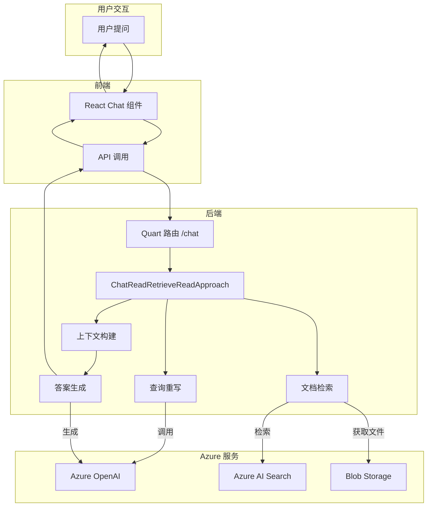

# Azure Search OpenAI Demo — 代码逻辑分析报告

## 1. 执行摘要

| 维度 | 内容 |
|------|------|
| **项目名称** | Azure Search OpenAI Demo |
| **项目定位** | 基于 RAG (Retrieval Augmented Generation) 模式的智能文档问答系统，允许用户基于自有文档进行 ChatGPT 风格的对话 |
| **技术栈** | Python 3.10+ (后端) + React/TypeScript (前端) + Azure OpenAI + Azure AI Search |
| **架构模式** | 分层架构 + 策略模式 (Approach Pattern)，支持多种检索和生成策略 |
| **代码规模** | 后端约 41 个 Python 文件，前端约 70 个 TS/TSX 文件 |
| **核心入口** | `app/backend/main.py` |

> **一段话总结**: 本项目是微软官方提供的 RAG 示例应用，展示了如何结合 Azure OpenAI 和 Azure AI Search 构建企业级文档问答系统。核心亮点包括：支持多轮对话、向量检索与语义排序、多模态图像理解、智能体化检索 (Agentic Retrieval)、以及可选的用户认证和访问控制。架构设计清晰，采用策略模式支持不同的检索生成策略，代码质量高且文档完善。

---

## 2. 目录结构解析

```
azure-search-openai-demo/
├── app/                          # 应用代码 (核心)
│   ├── backend/                  # 后端服务 (Python/Quart)
│   │   ├── approaches/           # 检索生成策略 (core)
│   │   ├── prepdocslib/          # 文档处理库 (core)
│   │   ├── chat_history/         # 聊天历史管理 (core)
│   │   ├── core/                 # 核心工具类 (util)
│   │   ├── app.py                # Flask/Quart 应用主文件 (api)
│   │   ├── main.py               # 入口文件 (entry)
│   │   ├── config.py             # 配置常量 (config)
│   │   ├── prepdocs.py           # 文档预处理脚本 (scripts)
│   │   └── requirements.txt      # Python 依赖
│   ├── frontend/                 # 前端应用 (React/TypeScript)
│   │   ├── src/
│   │   │   ├── pages/            # 页面组件
│   │   │   ├── components/       # UI 组件
│   │   │   ├── api/              # API 调用封装
│   │   │   ├── i18n/             # 国际化
│   │   │   └── index.tsx         # 前端入口
│   │   └── package.json
│   └── functions/                # Azure Functions (可选)
├── scripts/                      # 部署和配置脚本 (scripts)
├── infra/                        # Azure 基础设施定义 (Bicep)
├── docs/                         # 文档 (docs)
├── data/                         # 示例数据
├── tests/                        # 测试代码 (test)
└── evals/                        # 评估脚本和工具
```

**关键观察**: 项目采用清晰的分层架构，后端按功能模块组织 (`approaches/` 处理检索策略, `prepdocslib/` 处理文档摄取)，前端采用现代 React 组件化设计。基础设施即代码 (IaC) 使用 Bicep 定义，便于 Azure 部署。

---

## 3. 架构与模块依赖

### 3.1 架构概览

本项目采用**分层架构**结合**策略模式**设计：

1. **API 层** (`app.py`): 基于 Quart (异步 Flask) 提供 HTTP 端点，处理请求路由、认证、静态文件服务
2. **业务逻辑层** (`approaches/`): 实现不同的 RAG 策略，核心是 `ChatReadRetrieveReadApproach`
3. **数据处理层** (`prepdocslib/`): 文档解析、分块、嵌入生成和索引管理
4. **存储层**: Azure AI Search (向量数据库)、Azure Blob Storage (文件存储)、Cosmos DB (可选的聊天历史)

架构支持**插件化扩展**，通过环境变量启用/禁用功能（多模态、语音、认证等）。

### 3.2 模块依赖图

```mermaid
graph TD
    subgraph entryLayer [入口层]
        Main[main.py] --> App[app.py create_app]
    end

    subgraph apiLayer [API 层]
        App --> Blueprint[routes Blueprint]
        Blueprint --> ChatEndpoint[/chat]
        Blueprint --> ChatStream[/chat/stream]
        Blueprint --> Config[/config]
        Blueprint --> Upload[/upload]
    end

    subgraph coreLayer [核心业务层]
        ChatEndpoint --> Approach[Approach 基类]
        Approach --> CRR[ChatReadRetrieveReadApproach]
        CRR --> PromptMgr[PromptManager]
        CRR --> SearchClient[Azure AI Search Client]
        CRR --> OpenAIClient[Azure OpenAI Client]
    end

    subgraph dataLayer [数据处理层]
        PrepDocs[prepdocs.py] --> FileStrategy[FileStrategy]
        FileStrategy --> FileProcessor[FileProcessor]
        FileProcessor --> Parser[Parser 解析器]
        FileProcessor --> TextSplitter[TextSplitter 分块器]
        PrepDocs --> SearchManager[SearchManager]
        SearchManager --> Embeddings[OpenAIEmbeddings]
    end

    subgraph storageLayer [存储层]
        SearchClient --> AzureSearch[(Azure AI Search)]
        OpenAIClient --> AzureOpenAI[(Azure OpenAI)]
        BlobMgr[BlobManager] --> BlobStorage[(Blob Storage)]
        CosmosDB[chat_history] --> Cosmos[(Cosmos DB)]
    end

    CRR --> BlobMgr
    Approach --> SearchClient
    Approach --> OpenAIClient
```

### 3.3 核心模块详解

#### approaches/ - 检索生成策略模块

- **路径**: `app/backend/approaches/`
- **职责**: 实现 RAG 的不同策略模式，处理从查询到生成的完整流程
- **关键文件**:
  - `approach.py` — 定义抽象基类 `Approach`，包含通用检索、查询重写、Agentic 检索逻辑
  - `chatreadretrieveread.py` — 核心实现 `ChatReadRetrieveReadApproach`，支持多轮对话
  - `promptmanager.py` — 提示词模板管理，使用 Jinja2 模板引擎
- **对外暴露**: `Approach` 基类及其实现类
- **依赖关系**: 依赖 `prepdocslib/` 进行数据检索，依赖 Azure SDK 进行外部服务调用

#### prepdocslib/ - 文档处理库

- **路径**: `app/backend/prepdocslib/`
- **职责**: 文档摄取管道的完整实现，包括解析、分块、嵌入生成和索引
- **关键文件**:
  - `parser.py` — 文档解析器基类及实现 (PDF、HTML、CSV 等)
  - `textsplitter.py` — 文本分块算法，支持语义分块和重叠
  - `embeddings.py` — OpenAI 嵌入服务封装，支持批量处理
  - `searchmanager.py` — Azure AI Search 索引管理
  - `blobmanager.py` — Azure Blob Storage 操作封装
- **对外暴露**: `FileProcessor`、`SearchManager`、`BlobManager` 等
- **依赖关系**: 依赖 Azure SDK、OpenAI SDK、PyPDF 等第三方库

#### chat_history/ - 聊天历史管理

- **路径**: `app/backend/chat_history/`
- **职责**: 持久化存储用户对话历史，支持 Cosmos DB
- **关键文件**:
  - `cosmosdb.py` — Cosmos DB 实现

---

## 4. 核心业务流程与数据流

### 4.1 主流程描述

**聊天问答流程** (Chat Flow) 是系统的核心业务流程：

1. **用户提问**: 前端发送用户消息到 `/chat` 或 `/chat/stream` 端点
2. **查询重写**: 使用 OpenAI 将用户问题优化为搜索查询（可选）
3. **文档检索**: 
   - 标准模式: 使用 Azure AI Search 进行向量/文本/混合检索
   - Agentic 模式: 使用 Knowledge Base 智能体进行多源检索（支持 Web、SharePoint）
4. **上下文构建**: 将检索结果作为上下文，结合系统提示词构建完整消息
5. **答案生成**: 调用 Azure OpenAI GPT 模型生成回答
6. **响应返回**: 返回带引用来源的回答，支持流式输出

**文档摄取流程** (Ingestion Flow)：

1. **文件上传**: 用户上传文件到 Blob Storage
2. **文档解析**: 使用 Azure Document Intelligence 或本地解析器提取文本
3. **文本分块**: 将长文档分割为适当大小的块 (chunks)
4. **嵌入生成**: 使用 OpenAI Embedding API 生成向量表示
5. **索引创建**: 将文本块和向量存入 Azure AI Search

### 4.2 流程图



### 4.3 数据模型

**核心数据类**（定义于 `approach.py`）：

```python
@dataclass
class Document:
    id: Optional[str]
    content: Optional[str]
    sourcepage: Optional[str]  # 引用来源页
    sourcefile: Optional[str]  # 引用源文件
    oids: Optional[list[str]]  # 用户对象ID (ACL)
    groups: Optional[list[str]]  # 用户组 (ACL)
    score: Optional[float]  # 搜索分数
    reranker_score: Optional[float]  # 语义重排序分数
    images: Optional[list[dict]]  # 关联图片（多模态）

@dataclass
class DataPoints:
    text: Optional[list[str]]  # 文本来源
    images: Optional[list]  # 图片来源
    citations: Optional[list[str]]  # 引用列表

@dataclass
class ThoughtStep:
    title: str  # 思考步骤标题
    description: Optional[Any]  # 详细内容
    props: Optional[dict]  # 元数据（模型、token 使用等）
```

---

## 5. 关键 API 接口与调用链路

### 5.1 API 总览

| 方法 | 路径 | 说明 | 所在文件 |
|------|------|------|----------|
| POST | `/chat` | 非流式聊天 | `app.py:225` |
| POST | `/chat/stream` | 流式聊天 (SSE) | `app.py:245` |
| GET | `/config` | 获取前端配置 | `app.py:271` |
| POST | `/upload` | 用户文件上传 | `app.py:355` |
| POST | `/speech` | 语音合成 | `app.py:312` |
| GET | `/content/<path>` | 获取文档内容 | `app.py:115` |
| GET | `/auth_setup` | 获取认证配置 | `app.py:265` |

### 5.2 核心 API 调用链路分析

#### `/chat/stream` 流式聊天接口

**调用链**:
```
chat_stream (app.py:245)
  → Approach.run_stream (approach.py)
    → ChatReadRetrieveReadApproach.run_with_streaming (chatreadretrieveread.py:151)
      → run_until_final_call (chatreadretrieveread.py:285)
        → run_search_approach 或 run_agentic_retrieval_approach
          → search (approach.py:180) [检索文档]
          → create_chat_completion (approach.py:410) [生成答案]
```

**关键代码片段**:

```python
# chatreadretrieveread.py:151-200
async def run_with_streaming(
    self,
    messages: list[ChatCompletionMessageParam],
    overrides: dict[str, Any],
    auth_claims: dict[str, Any],
    session_state: Any = None,
) -> AsyncGenerator[dict, None]:
    extra_info, chat_coroutine = await self.run_until_final_call(
        messages, overrides, auth_claims, should_stream=True
    )
    yield {"delta": {"role": "assistant"}, "context": extra_info, "session_state": session_state}

    followup_questions_started = False
    followup_content = ""
    chat_result = await chat_coroutine

    if isinstance(chat_result, ChatCompletion):
        # 非流式处理逻辑
        ...
    else:
        # 流式处理逻辑
        chat_result = cast(AsyncStream[ChatCompletionChunk], chat_result)
        async for event_chunk in chat_result:
            event = event_chunk.model_dump()
            if event["choices"]:
                completion = {
                    "delta": {
                        "content": event["choices"][0]["delta"].get("content"),
                        "role": event["choices"][0]["delta"]["role"],
                    }
                }
                yield completion
```

**逻辑说明**: 该方法首先调用 `run_until_final_call` 执行检索和上下文构建，然后根据是否为流式模式分别处理。流式模式下，它遍历 OpenAI 的流式响应，逐个 yield 事件块给前端，实现 SSE (Server-Sent Events) 实时更新。

#### `/chat` 非流式聊天接口

**调用链**:
```
chat (app.py:225)
  → Approach.run (approach.py)
    → ChatReadRetrieveReadApproach.run_without_streaming (chatreadretrieveread.py:85)
      → run_until_final_call (同上)
        → create_chat_completion (同步调用)
```

**关键代码片段**:

```python
# chatreadretrieveread.py:85-110
async def run_without_streaming(
    self,
    messages: list[ChatCompletionMessageParam],
    overrides: dict[str, Any],
    auth_claims: dict[str, Any],
    session_state: Any = None,
) -> dict[str, Any]:
    extra_info, chat_coroutine = await self.run_until_final_call(
        messages, overrides, auth_claims, should_stream=False
    )
    chat_completion_response: ChatCompletion = await cast(Awaitable[ChatCompletion], chat_coroutine)
    content = chat_completion_response.choices[0].message.content
    role = chat_completion_response.choices[0].message.role
    
    # 处理后续问题建议
    if overrides.get("suggest_followup_questions"):
        content, followup_questions = self.extract_followup_questions(content)
        extra_info.followup_questions = followup_questions
        
    return {
        "message": {"content": content, "role": role},
        "context": {
            "thoughts": extra_info.thoughts,
            "data_points": {key: value for key, value in asdict(extra_info.data_points).items() if value is not None},
            "followup_questions": extra_info.followup_questions,
        },
        "session_state": session_state,
    }
```

**逻辑说明**: 非流式接口等待完整的 OpenAI 响应后一次性返回，包含回答内容、思考步骤、数据点（引用来源）和后续问题建议。

---

## 6. 算法与关键函数实现

### 6.1 查询重写算法

- **位置**: `approach.py` 第 150 行
- **用途**: 将用户原始问题优化为更适合搜索的查询
- **复杂度**: 时间 O(1) / 空间 O(1) (依赖于 LLM 调用)

**核心代码**:

```python
# approach.py:150-180
def extract_rewritten_query(
    self,
    chat_completion: ChatCompletion,
    user_query: str,
    no_response_token: Optional[str] = None,
) -> str:
    response_message = chat_completion.choices[0].message

    if response_message.tool_calls:
        for tool_call in response_message.tool_calls:
            if tool_call.type != "function":
                continue
            arguments_payload = cast(ChatCompletionMessageFunctionToolCall, tool_call).function.arguments or "{}"
            try:
                parsed_arguments = json.loads(arguments_payload)
            except json.JSONDecodeError:
                continue
            search_query = parsed_arguments.get("search_query")
            if search_query and (no_response_token is None or search_query != no_response_token):
                return search_query

    if response_message.content:
        candidate = response_message.content.strip()
        if candidate and (no_response_token is None or candidate != no_response_token):
            return candidate

    return user_query
```

**逐步解析**:

1. **工具调用检查**: 首先检查 LLM 是否通过 function calling 返回了结构化的搜索查询
2. **JSON 解析**: 尝试解析工具调用的参数，提取 `search_query` 字段
3. **内容回退**: 如果没有工具调用，则直接使用 LLM 的文本响应作为搜索查询
4. **原始查询回退**: 如果以上都失败，则回退到用户原始查询

### 6.2 文本分块算法

- **位置**: `prepdocslib/textsplitter.py` 第 50 行
- **用途**: 将长文档分割为适合嵌入和检索的块
- **复杂度**: 时间 O(n) / 空间 O(n) (n 为文档长度)

**核心代码**:

```python
# textsplitter.py: 安全连接函数
def _safe_concat(a: str, b: str) -> str:
    """Concatenate two non-empty segments, inserting a space only when both sides
    end/start with alphanumerics and no natural boundary exists.
    """
    assert a and b, "_safe_concat expects non-empty strings"
    a_last = a[-1]
    b_first = b[0]

    # Check if we need to insert a space
    if (
        a_last.isalnum() and b_first.isalnum() and
        a_last not in STANDARD_WORD_BREAKS and
        b_first not in STANDARD_WORD_BREAKS
    ):
        return a + " " + b
    else:
        return a + b
```

**逐步解析**:

1. **边界检查**: 确保两个字符串都不为空
2. **字符类型判断**: 检查末尾和开头字符是否为字母数字
3. **断点检查**: 确认字符不是标准的单词断点（如空格、标点）
4. **智能连接**: 只有在需要时才插入空格，避免破坏原有格式

### 6.3 Agentic 检索算法

- **位置**: `approach.py` 第 250 行
- **用途**: 使用 Azure AI Search 的 Knowledge Base 功能进行智能体化多源检索
- **复杂度**: 时间 O(k) / 空间 O(k) (k 为检索结果数量)

**核心代码**:

```python
# approach.py:250-350
async def run_agentic_retrieval(
    self,
    messages: list[ChatCompletionMessageParam],
    knowledgebase_client: KnowledgeBaseRetrievalClient,
    search_index_name: str,
    filter_add_on: Optional[str] = None,
    minimum_reranker_score: Optional[float] = None,
    access_token: Optional[str] = None,
    use_web_source: bool = False,
    use_sharepoint_source: bool = False,
    retrieval_reasoning_effort: Optional[str] = None,
    should_rewrite_query: bool = True,
) -> AgenticRetrievalResults:
    # STEP 1: 构建知识源参数
    knowledge_source_params = [
        SearchIndexKnowledgeSourceParams(
            knowledge_source_name=search_index_name,
            filter_add_on=filter_add_on,
            include_references=True,
            include_reference_source_data=True,
            always_query_source=False,
            reranker_threshold=minimum_reranker_score,
        )
    ]
    
    # 添加 Web 和 SharePoint 源（如果启用）
    if use_web_source:
        knowledge_source_params.append(WebKnowledgeSourceParams(...))
    if use_sharepoint_source:
        knowledge_source_params.append(RemoteSharePointKnowledgeSourceParams(...))
    
    # STEP 2: 构建检索请求
    agentic_retrieval_input = {}
    if retrieval_reasoning_effort == "minimal" and should_rewrite_query:
        # 最小推理模式下先重写查询
        rewrite_result = await self.rewrite_query(...)
        agentic_retrieval_input["intents"] = [KnowledgeRetrievalSemanticIntent(search=rewrite_result.query)]
    else:
        # 其他模式下传递完整对话历史
        kb_messages = [KnowledgeBaseMessage(...) for msg in messages if msg["role"] != "system"]
        agentic_retrieval_input["messages"] = kb_messages
    
    # STEP 3: 执行检索
    response = await knowledgebase_client.retrieve(
        retrieval_request=KnowledgeBaseRetrievalRequest(**request_kwargs),
        x_ms_query_source_authorization=access_token,
    )
    
    # STEP 4: 处理结果
    # ... 解析活动记录、引用、答案等
    return AgenticRetrievalResults(...)
```

**逐步解析**:

1. **多源配置**: 支持同时检索索引文档、Web 内容和 SharePoint 文档
2. **智能查询**: 根据推理努力级别选择查询重写或完整对话历史
3. **统一检索**: 通过单个 API 调用执行跨源检索
4. **结果整合**: 将不同来源的结果统一格式化，便于后续处理

---

## 7. 架构评价与建议

### 优势

- **模块化设计**: 清晰的分层架构和策略模式，便于扩展和维护
- **企业级特性**: 完整支持 ACL、多租户、监控、安全等企业需求
- **灵活部署**: 支持 Azure Container Apps 和 App Service 两种部署模式
- **丰富功能**: 集成多模态、语音、Agentic 检索等前沿功能
- **优秀文档**: 完善的文档和示例，降低使用门槛

### 潜在问题

- **复杂性**: 功能丰富但也增加了学习和配置成本，对小型项目可能过于重量级
- **Azure 依赖**: 深度绑定 Azure 生态，迁移到其他云平台需要大量重构
- **性能考量**: 文档摄取流程涉及多个 Azure 服务调用，可能成为性能瓶颈

### 进一步阅读建议

如果您想深入了解某个模块，建议从以下文件开始：

1. `app/backend/approaches/chatreadretrieveread.py` — 核心 RAG 逻辑实现
2. `app/backend/prepdocslib/searchmanager.py` — Azure AI Search 索引管理
3. `app/backend/app.py` — API 路由和应用配置
4. `docs/architecture.md` — 完整架构文档
5. `app/frontend/src/pages/chat/Chat.tsx` — 前端交互逻辑