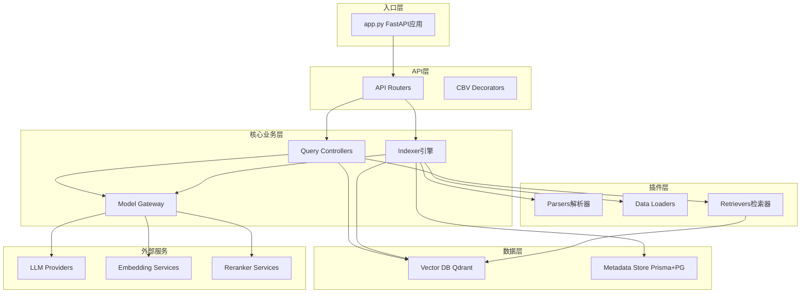
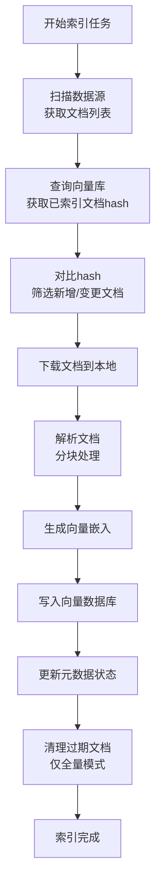
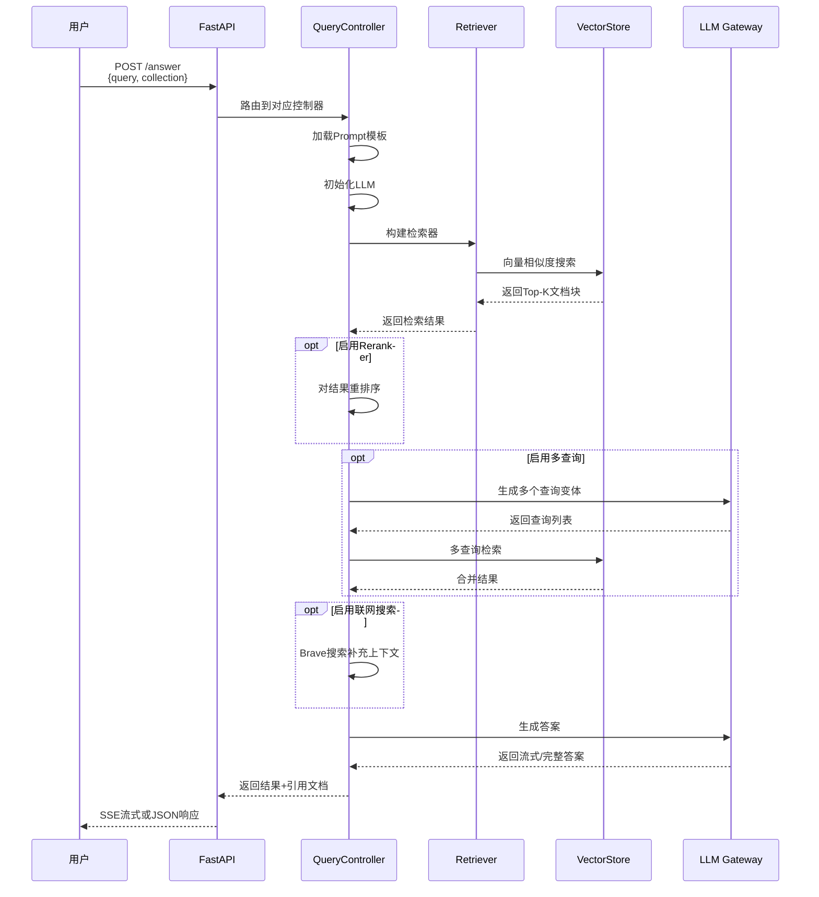
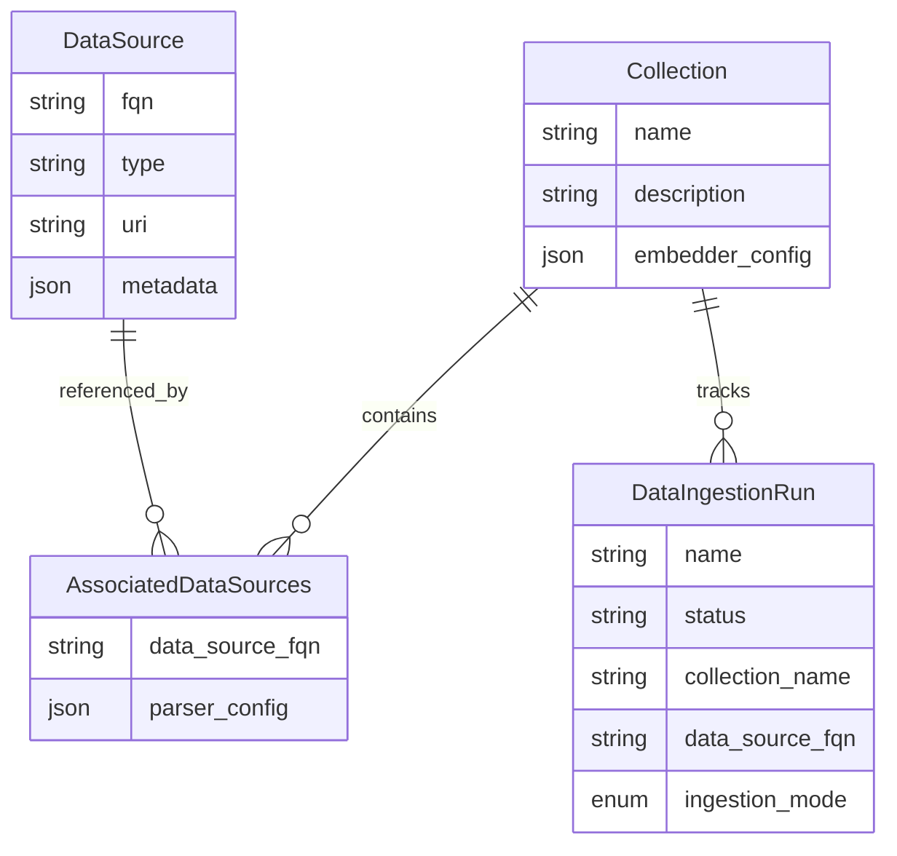

# Cognita (TrueFoundry) — 代码逻辑分析报告

## 1. 执行摘要

| 维度 | 内容 |
|------|------|
| **项目名称** | Cognita |
| **项目定位** | 模块化的生产级 RAG (Retrieval-Augmented Generation) 框架，用于构建可扩展的文档问答系统 |
| **技术栈** | Python + FastAPI + LangChain + Prisma ORM + Qdrant 向量数据库 |
| **架构模式** | 模块化插件架构 + 分层架构 (API层/业务逻辑层/数据层) |
| **代码规模** | 约 76 个 Python 文件，总计约 8,500 行代码 |
| **核心入口** | `backend/server/app.py` |

> **一句话总结**: Cognita 是一个面向生产环境的 RAG 框架，解决了从 Jupyter Notebook 原型到生产部署的鸿沟。它采用模块化设计，将数据加载、解析、嵌入、检索和问答解耦为独立组件，每个组件都可通过注册机制扩展。框架内置支持多种数据源、解析器、向量数据库和检索策略，并提供完整的 REST API 和 Web UI。其核心亮点包括：增量索引、多模态支持（图文音视频）、可插拔的模型网关（支持 OpenAI、Ollama、TrueFoundry 等）以及基于 LCEL 的灵活问答链编排。

---

## 2. 目录结构解析

```
cognita/
├── backend/                    # 核心后端代码
│   ├── server/                 # API 服务层 (FastAPI)
│   │   ├── app.py             # FastAPI 应用入口
│   │   ├── decorators.py      # 控制器装饰器 (CBV模式)
│   │   └── routers/           # API 路由模块
│   │       ├── collection.py  # 集合管理 API
│   │       ├── data_source.py # 数据源管理 API
│   │       └── ...
│   ├── modules/               # 核心业务模块
│   │   ├── query_controllers/ # 查询控制器 (RAG 实现)
│   │   │   ├── base.py       # 查询控制器基类
│   │   │   ├── example/      # 基础 RAG 示例
│   │   │   └── multimodal/   # 多模态 RAG 实现
│   │   ├── model_gateway/     # 模型网关 (LLM/Embedding/Reranker)
│   │   ├── metadata_store/    # 元数据存储 (Prisma + PostgreSQL)
│   │   ├── vector_db/         # 向量数据库抽象 (Qdrant等)
│   │   ├── parsers/           # 文档解析器模块
│   │   └── dataloaders/       # 数据加载器模块
│   ├── indexer/               # 数据索引引擎
│   │   └── indexer.py        # 增量索引核心逻辑
│   ├── database/              # 数据库 Schema 定义
│   ├── types.py              # Pydantic 类型定义
│   ├── settings.py           # 配置管理
│   └── constants.py          # 常量定义
├── frontend/                  # React 前端应用
├── deployment/               # 部署配置
├── docs/                     # 文档
└── docker-compose.yaml       # 本地开发环境编排
```

**关键观察**: 目录组织采用**按功能分包**策略，清晰分离了 API 层、业务逻辑层和数据层。`modules` 目录下的各组件通过注册机制实现插件化，便于扩展。

---

## 3. 架构与模块依赖

### 3.1 架构概览

Cognita 采用**分层架构 + 插件化设计**:

1. **API 层** (`server/`): FastAPI 提供 RESTful API，支持自动文档生成
2. **业务逻辑层** (`modules/`): 包含查询控制器、模型网关、索引器等核心模块
3. **数据层** (`modules/vector_db/`, `modules/metadata_store/`): 向量数据库和元数据存储抽象

框架通过**注册模式**实现组件扩展：
- `PARSER_REGISTRY`: 文档解析器注册表
- `LOADER_REGISTRY`: 数据加载器注册表  
- `QUERY_CONTROLLER_REGISTRY`: 查询控制器注册表

### 3.2 模块依赖图



### 3.3 核心模块详解

#### Model Gateway (模型网关)

- **路径**: `backend/modules/model_gateway/`
- **职责**: 统一管理 LLM、Embedding、Reranker、Audio 模型的访问
- **关键文件**:
  - `model_gateway.py` — 网关主类，实现模型实例缓存和配置管理
  - `reranker_svc.py` — Reranker 服务封装
  - `audio_processing_svc.py` — 音频处理服务
- **对外暴露**: `model_gateway` 单例实例
- **依赖关系**: 依赖 `models_config.yaml` 配置，被 QueryController、Indexer 依赖

#### Query Controllers (查询控制器)

- **路径**: `backend/modules/query_controllers/`
- **职责**: 实现 RAG 问答逻辑，支持多种检索策略
- **关键文件**:
  - `base.py` — 基类，封装通用检索逻辑
  - `example/controller.py` — 基础 RAG 实现
  - `multimodal/controller.py` — 多模态 RAG 实现
- **对外暴露**: 通过 `@query_controller` 装饰器注册为 FastAPI 路由
- **依赖关系**: 依赖 ModelGateway、VectorDB、MetadataStore

#### Indexer (索引引擎)

- **路径**: `backend/indexer/`
- **职责**: 数据摄取和增量索引
- **关键文件**:
  - `indexer.py` — 核心索引逻辑，支持全量和增量模式
- **对外暴露**: `ingest_data()` 函数
- **依赖关系**: 依赖 Parsers、DataLoaders、VectorDB、MetadataStore

---

## 4. 核心业务流程与数据流

### 4.1 数据索引流程

Cognita 支持**增量索引**，通过对比数据源的 `data_point_hash` 与向量库中存储的 hash，只处理新增或变更的文档。



### 4.2 问答检索流程



### 4.3 数据模型



---

## 5. 关键 API 接口与调用链路

### 5.1 API 总览

| 方法 | 路径 | 说明 | 所在文件 |
|------|------|------|----------|
| GET | `/v1/collections` | 列出所有集合 | `routers/collection.py` |
| POST | `/v1/collections` | 创建集合 | `routers/collection.py` |
| POST | `/v1/collections/ingest` | 触发数据摄取 | `routers/collection.py` |
| POST | `/retrievers/basic-rag/answer` | 基础 RAG 问答 | `query_controllers/example/controller.py` |
| POST | `/retrievers/multimodal-rag/answer` | 多模态 RAG 问答 | `query_controllers/multimodal/controller.py` |

### 5.2 核心 API 调用链路分析

#### `POST /v1/collections/ingest` — 数据摄取

**调用链**:
```
Router (collection.py) → indexer.ingest_data() → sync_data_source_to_collection()
  → DataLoader.load_filtered_data() → Parser.get_chunks() → ModelGateway.get_embedder()
  → VectorDB.upsert_documents() → MetadataStore.update_status()
```

**关键代码片段** (1:50:backend/indexer/indexer.py):

```python
async def sync_data_source_to_collection(inputs: DataIngestionConfig):
    """
    同步数据源到集合的核心函数
    1. 获取向量库中现有文档的 hash 快照
    2. 调用 _sync_data_source_to_collection 执行实际摄取
    3. 全量模式下清理过期文档
    """
    client = await get_client()
    # 更新状态：获取现有向量
    await client.aupdate_data_ingestion_run_status(
        data_ingestion_run_name=inputs.data_ingestion_run_name,
        status=DataIngestionRunStatus.FETCHING_EXISTING_VECTORS,
    )
    
    existing_data_point_vectors = VECTOR_STORE_CLIENT.list_data_point_vectors(...)
    previous_snapshot = get_data_point_fqn_to_hash_map(existing_data_point_vectors)
    
    # 执行数据摄取
    await _sync_data_source_to_collection(inputs=inputs, previous_snapshot=previous_snapshot)
    
    # 全量模式下删除过期文档
    if inputs.data_ingestion_mode == DataIngestionMode.FULL:
        VECTOR_STORE_CLIENT.delete_data_point_vectors(...)
```

**逻辑说明**: 该函数实现了增量索引的核心逻辑。首先获取向量库中已存在的文档 hash 快照，然后调用 `_sync_data_source_to_collection` 处理新增/变更的文档。如果是全量索引模式，最后会清理向量库中的过期文档。

#### `POST /retrievers/basic-rag/answer` — 基础 RAG 问答

**调用链**:
```
BasicRAGQueryController.answer() → BaseQueryController._get_retriever() 
  → VectorStoreRetriever.retrieve() → LLM.generate_answer()
```

**关键代码片段** (1:30:backend/modules/query_controllers/example/controller.py):

```python
@post("/answer")
async def answer(self, request: ExampleQueryInput = Body(...)):
    # 获取向量存储
    vector_store = await self._get_vector_store(request.collection_name)
    
    # 创建 QA Prompt 模板
    QA_PROMPT = self._get_prompt_template(
        input_variables=["context", "question"],
        template=request.prompt_template,
    )
    
    # 获取 LLM
    llm = self._get_llm(request.model_configuration, request.stream)
    
    # 获取检索器
    retriever = await self._get_retriever(
        vector_store=vector_store,
        retriever_name=request.retriever_name,
        retriever_config=request.retriever_config,
    )
    
    # 使用 LCEL 构建 RAG 链
    rag_chain_from_docs = (
        RunnablePassthrough.assign(
            context=lambda x: self._format_docs(x["context"])
        )
        | QA_PROMPT
        | llm
        | StrOutputParser()
    )
    
    rag_chain_with_source = RunnableParallel(
        {"context": retriever, "question": RunnablePassthrough()}
    ).assign(answer=rag_chain_from_docs)
    
    if request.stream:
        return StreamingResponse(...)
    else:
        outputs = await rag_chain_with_source.ainvoke(request.query)
        return {"answer": outputs["answer"], "docs": ...}
```

**逻辑说明**: 该方法使用 LangChain Expression Language (LCEL) 构建 RAG 链。首先初始化向量存储、LLM 和检索器，然后通过 `RunnableParallel` 并行执行检索和问答，支持流式和非流式两种响应模式。

---

## 6. 算法与关键函数实现

### 6.1 增量索引算法

- **位置**: `backend/indexer/indexer.py` 第 45 行
- **用途**: 实现高效的增量文档索引，避免重复处理未变更的文档
- **复杂度**: 时间 O(n+m)，空间 O(n)，其中 n 为新文档数，m 为已有文档数

**核心代码** (45:95:backend/indexer/indexer.py):

```python
async def _sync_data_source_to_collection(
    inputs: DataIngestionConfig, previous_snapshot: Dict[str, str] = None
):
    with tempfile.TemporaryDirectory() as tmp_dirname:
        # 加载数据源到临时目录
        data_source_loader = get_loader_for_data_source(inputs.data_source.type)
        loaded_data_points_batch_iterator = data_source_loader.load_filtered_data(
            data_source=inputs.data_source,
            dest_dir=tmp_dirname,
            previous_snapshot=previous_snapshot,
            batch_size=inputs.batch_size,
            data_ingestion_mode=inputs.data_ingestion_mode,
        )

        async for loaded_data_points_batch in loaded_data_points_batch_iterator:
            try:
                await ingest_data_points(
                    inputs=inputs,
                    loaded_data_points=loaded_data_points_batch,
                    documents_ingested_count=documents_ingested_count,
                )
                documents_ingested_count += len(loaded_data_points_batch)
            except Exception as e:
                logger.exception(e)
                if inputs.raise_error_on_failure:
                    raise e
                failed_data_point_fqns.extend([doc.data_point_fqn for doc in loaded_data_points_batch])
```

**逐步解析**:

1. **创建临时目录**: 使用 `tempfile.TemporaryDirectory()` 创建安全的临时工作目录
2. **获取数据加载器**: 通过 `get_loader_for_data_source()` 获取对应数据源类型的加载器
3. **增量过滤**: `load_filtered_data()` 方法会根据 `previous_snapshot` 过滤出需要处理的文档
4. **批处理**: 以批处理方式处理文档，避免内存溢出
5. **错误处理**: 支持配置是否在失败时抛出异常，提高系统健壮性

### 6.2 多模态问答算法

- **位置**: `backend/modules/query_controllers/multimodal/controller.py` 第 25 行
- **用途**: 处理包含图像的多模态 RAG 问答
- **复杂度**: 取决于图像数量和 LLM 推理时间

**核心代码** (25:50:backend/modules/query_controllers/multimodal/controller.py):

```python
def _generate_payload_for_vlm(self, prompt: str, images_set: set):
    content = [{"type": "text", "text": prompt}]
    
    for b64_image in images_set:
        content.append({
            "type": "image_url",
            "image_url": {
                "url": f"data:image/jpeg;base64,{b64_image}",
                "detail": "high",
            },
        })
    return [HumanMessage(content=content)]
```

**逐步解析**:

1. **构建消息内容**: 初始化包含文本提示的消息内容
2. **添加图像**: 遍历图像集合，将每个 base64 编码的图像添加到消息中
3. **高细节模式**: 设置 `detail: "high"` 以获得更好的图像理解效果
4. **返回消息**: 封装为 LangChain 的 `HumanMessage` 格式

---

## 7. 架构评价与建议

### 优势

- **模块化设计**: 各组件高度解耦，易于扩展和维护
- **生产就绪**: 支持增量索引、异步处理、错误恢复等生产环境必需特性
- **多模态支持**: 原生支持文本、图像、音频、视频等多种数据类型
- **灵活的检索策略**: 支持向量检索、重排序、多查询等多种检索组合
- **完善的 API 设计**: RESTful API + 流式响应，适合各种客户端集成

### 潜在问题

- **依赖复杂**: 依赖多个外部服务（Qdrant、PostgreSQL、Unstructured.io 等），部署复杂度较高
- **配置繁琐**: 模型网关需要复杂的 YAML 配置，对新手不够友好
- **性能瓶颈**: 单进程处理可能成为高并发场景的瓶颈，虽然有进程池但扩展性有限
- **文档不足**: 虽然有 README，但缺乏详细的架构文档和最佳实践指南

### 进一步阅读建议

如果您想深入了解某个模块，建议从以下文件开始：

1. `backend/server/app.py` — 了解整体应用启动和路由注册机制
2. `backend/indexer/indexer.py` — 深入理解增量索引的核心算法
3. `backend/modules/query_controllers/base.py` — 掌握 RAG 查询控制器的通用实现
4. `backend/modules/model_gateway/model_gateway.py` — 学习模型网关的设计模式
5. `backend/types.py` — 理解整个系统的数据模型和类型定义