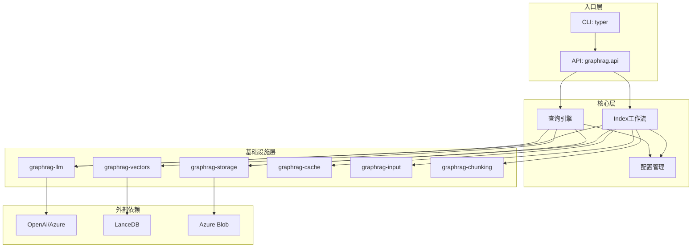
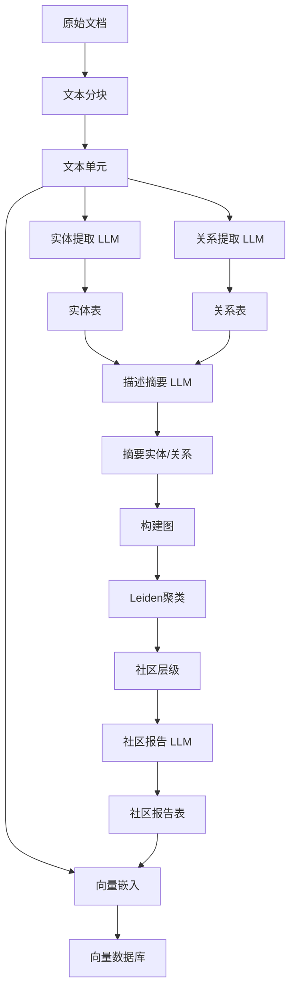
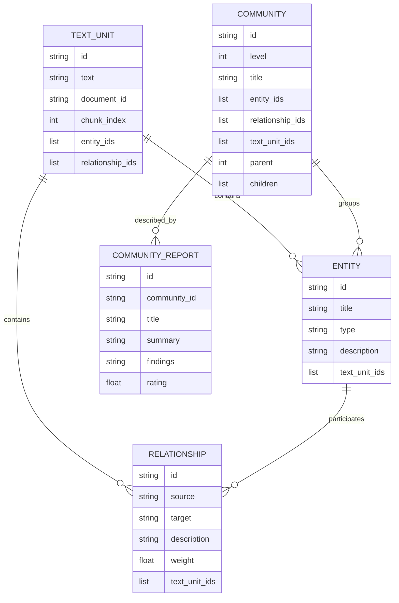

# Microsoft GraphRAG — 代码逻辑分析报告

## 1. 执行摘要

| 维度 | 内容 |
|------|------|
| **项目名称** | Microsoft GraphRAG |
| **项目定位** | 基于知识图谱的检索增强生成(RAG)系统，使用图结构增强LLM对私有数据的推理能力 |
| **技术栈** | Python 3.11+、Pandas、NetworkX、Graspologic、Typer、Pydantic |
| **架构模式** | 模块化流水线架构 + 插件化存储/向量/LLM抽象层 |
| **代码规模** | ~419个Python文件，采用Monorepo多包结构 |
| **核心入口** | `packages/graphrag/graphrag/cli/main.py` |

> **一段话总结**: GraphRAG是微软研究院开源的先进RAG系统，通过构建知识图谱（实体-关系-社区层级）来增强LLM的推理能力。其核心创新在于使用**Leiden算法**进行社区检测，支持**全局搜索**（基于社区摘要的Map-Reduce）和**本地搜索**（基于实体邻居的上下文检索）两种模式。系统采用模块化设计，将存储、向量、LLM、分块等能力拆分为独立包，支持增量索引和多种索引方法（标准/NLP混合）。

---

## 2. 目录结构解析

```
graphrag/
├── packages/                    # 核心: 模块化Monorepo结构
│   ├── graphrag/               # core: 主业务逻辑（索引+查询）
│   │   ├── cli/                # api: 命令行接口
│   │   ├── index/              # core: 索引流水线
│   │   ├── query/              # core: 查询引擎
│   │   ├── config/             # config: 配置模型
│   │   ├── graphs/             # core: 图算法（Leiden聚类）
│   │   ├── data_model/         # model: 数据模型定义
│   │   └── prompts/            # config: LLM提示词模板
│   ├── graphrag-llm/           # core: LLM抽象层（完成+嵌入）
│   ├── graphrag-storage/       # core: 存储抽象（Blob/文件/Cosmos）
│   ├── graphrag-vectors/       # core: 向量存储抽象（LanceDB/Azure AI Search）
│   ├── graphrag-cache/         # util: 缓存实现
│   ├── graphrag-input/         # core: 输入解析（文本/CSV/JSON）
│   ├── graphrag-chunking/      # core: 文本分块策略
│   └── graphrag-common/        # util: 共享工具类
├── docs/                        # docs: 文档和示例Notebook
├── tests/                       # test: 单元/集成/冒烟测试
├── unified-search-app/          # other: 统一搜索应用
└── scripts/                     # scripts: 构建脚本
```

**关键观察**: 采用**功能垂直拆分**的Monorepo架构，每个子包独立发布，通过`uv.workspace`管理依赖。这种设计允许用户按需安装（如仅需`graphrag-chunking`），但也增加了跨包重构的复杂性。

---

## 3. 架构与模块依赖

### 3.1 架构概览

GraphRAG采用**分层流水线架构**，核心分为两大阶段：

1. **索引阶段（Indexing）**: 将非结构化文本转换为结构化知识图谱
   - 文本分块 → 实体/关系提取 → 图谱构建 → 社区检测 → 社区摘要生成 → 向量嵌入

2. **查询阶段（Query）**: 基于构建的图谱回答用户问题
   - **Global Search**: 基于社区摘要的全局推理（Map-Reduce模式）
   - **Local Search**: 基于实体邻居的局部检索
   - **DRIFT Search**: 动态推理迭代搜索
   - **Basic Search**: 传统向量相似度搜索

架构亮点：
- **存储抽象**: 通过`graphrag-storage`支持文件系统、Azure Blob、Cosmos DB
- **LLM抽象**: 通过`graphrag-llm`支持OpenAI、Azure OpenAI等多种模型
- **可插拔流水线**: 工作流通过`PipelineFactory`动态组装，支持自定义工作流

### 3.2 模块依赖图



### 3.3 核心模块详解

#### graphrag.index (索引模块)

- **路径**: `packages/graphrag/graphrag/index/`
- **职责**: 实现从原始文本到知识图谱的完整转换流水线
- **关键文件**:
  - `run/run_pipeline.py` — 流水线执行引擎
  - `workflows/factory.py` — 工作流工厂，注册所有工作流
  - `workflows/extract_graph.py` — 图提取工作流
  - `workflows/create_communities.py` — 社区检测工作流
  - `operations/extract_graph/graph_extractor.py` — 实体/关系提取核心
  - `operations/cluster_graph.py` — Leiden聚类算法
- **对外暴露**: `build_index()` API函数
- **依赖关系**: 依赖`graphrag-llm`、`graphrag-storage`、`graphrag-cache`

#### graphrag.query (查询模块)

- **路径**: `packages/graphrag/graphrag/query/`
- **职责**: 实现四种搜索模式（Global/Local/DRIFT/Basic）
- **关键文件**:
  - `structured_search/global_search/search.py` — 全局搜索实现
  - `structured_search/local_search/search.py` — 本地搜索实现
  - `context_builder/builders.py` — 上下文构建器
- **对外暴露**: `GlobalSearch`、`LocalSearch`类
- **依赖关系**: 依赖`graphrag-llm`进行文本生成

#### graphrag-llm (LLM抽象层)

- **路径**: `packages/graphrag-llm/`
- **职责**: 封装LLM调用，支持完成和嵌入
- **关键文件**:
  - `completion/` — 文本完成接口
  - `embedding/` — 嵌入接口
  - `config/` — 模型配置
- **对外暴露**: `create_completion()`、`create_embedding()`工厂函数

---

## 4. 核心业务流程与数据流

### 4.1 索引流程描述

GraphRAG的索引流程是一个**多阶段流水线**，将非结构化文本转换为可查询的知识图谱：

1. **文档加载**: 从文件系统或Blob存储读取原始文本
2. **文本分块**: 使用token或句子策略将文档切分为文本单元
3. **图提取**: 使用LLM从每个文本单元提取实体和关系
4. **描述摘要**: 对实体和关系的描述进行LLM摘要
5. **社区检测**: 使用Leiden算法对实体进行层次聚类
6. **社区报告**: 为每个社区生成摘要报告
7. **向量嵌入**: 对文本单元和社区报告生成向量嵌入

### 4.2 索引流程图



### 4.3 查询流程对比

| 搜索模式 | 数据流 | 适用场景 |
|---------|--------|---------|
| **Global** | 查询→社区报告筛选→Map阶段(并行LLM)→Reduce阶段(综合答案) | 全局性问题（"总结主题X的主要观点"） |
| **Local** | 查询→实体识别→邻居扩展→上下文构建→单LLM调用 | 局部细节问题（"实体A和B的关系"） |
| **DRIFT** | 查询→迭代探索→动态路径选择→多轮推理 | 探索性问题（需要多跳推理） |
| **Basic** | 查询→向量相似度→Top-K检索→LLM生成 | 简单事实性问题 |

### 4.4 数据模型



---

## 5. 关键 API 接口与调用链路

### 5.1 CLI 命令总览

| 命令 | 功能 | 所在文件 |
|------|------|----------|
| `graphrag init` | 初始化项目配置 | `cli/initialize.py` |
| `graphrag index` | 构建知识图谱索引 | `cli/index.py` |
| `graphrag update` | 增量更新索引 | `cli/index.py` |
| `graphrag query` | 执行查询 | `cli/query.py` |
| `graphrag prompt-tune` | 提示词自动调优 | `cli/prompt_tune.py` |

### 5.2 核心 API 调用链路分析

#### `build_index` (索引构建)

**调用链**:
```
CLI (index_cli) → api.build_index() → run_pipeline() → PipelineFactory.create_pipeline() → 各Workflow
```

**关键代码片段** (`packages/graphrag/graphrag/api/index.py`):
```python
async def build_index(config, method, ...):
    method = _get_method(method, is_update_run)
    pipeline = PipelineFactory.create_pipeline(config, method)
    
    async for output in run_pipeline(pipeline, config, ...):
        outputs.append(output)
```

**逻辑说明**: 
1. 根据方法名（Standard/Fast/Update）从工厂获取工作流列表
2. 创建流水线上下文（存储、缓存、回调）
3. 顺序执行每个工作流，支持错误处理和状态持久化

#### `extract_graph` (图提取)

**调用链**:
```
Workflow (extract_graph) → GraphExtractor.__call__() → _process_document() → LLM.completion_async()
```

**关键代码片段** (`packages/graphrag/graphrag/index/operations/extract_graph/graph_extractor.py`):
```python
async def __call__(self, text, entity_types, source_id):
    """Extract entities and relationships from the supplied text."""
    try:
        result = await self._process_document(text, entity_types)
    except Exception as e:
        logger.exception("error extracting graph")
        return _empty_entities_df(), _empty_relationships_df()
    return self._process_result(result, source_id, TUPLE_DELIMITER, RECORD_DELIMITER)

async def _process_document(self, text, entity_types):
    messages_builder = CompletionMessagesBuilder().add_user_message(
        self._extraction_prompt.format(**{
            INPUT_TEXT_KEY: text,
            ENTITY_TYPES_KEY: ",".join(entity_types),
        })
    )
    response = await self._model.completion_async(messages=messages_builder.build())
    results = response.content
    
    # Gleanings: 迭代提取更多实体
    if self._max_gleanings > 0:
        for i in range(self._max_gleanings):
            messages_builder.add_user_message(CONTINUE_PROMPT)
            response = await self._model.completion_async(messages=messages_builder.build())
            results += response.content
    return results
```

**逻辑说明**:
1. 使用提示词模板构造LLM请求，包含输入文本和实体类型
2. 调用LLM提取实体和关系，返回结构化文本
3. **Gleanings机制**: 如果配置了`max_gleanings`，会迭代询问LLM是否还有更多实体，直到达到上限或LLM表示没有新实体
4. 解析LLM输出，转换为DataFrame格式

#### `GlobalSearch.search` (全局搜索)

**调用链**:
```
GlobalSearch.search() → context_builder.build_context() → _map_response_single_batch() (并行) → _reduce_response()
```

**关键代码片段** (`packages/graphrag/graphrag/query/structured_search/global_search/search.py`):
```python
async def search(self, query, conversation_history=None, **kwargs):
    # Step 1: Map - 并行生成各社区的中间答案
    context_result = await self.context_builder.build_context(query=query, ...)
    map_responses = await asyncio.gather(*[
        self._map_response_single_batch(context_data=data, query=query, ...)
        for data in context_result.context_chunks
    ])
    
    # Step 2: Reduce - 综合所有中间答案生成最终答案
    reduce_response = await self._reduce_response(map_responses=map_responses, query=query, ...)
    return GlobalSearchResult(response=reduce_response.response, ...)
```

**逻辑说明**:
1. **Map阶段**: 将社区报告分批次，并行调用LLM生成每批次的中间答案（带重要性评分）
2. **Reduce阶段**: 收集所有中间答案，按重要性排序，在token限制内选择最重要的答案，生成最终综合答案
3. 这种Map-Reduce模式允许处理大规模图谱，不受限于LLM上下文窗口

---

## 6. 算法与关键函数实现

### 6.1 层次Leiden社区检测

- **位置**: `packages/graphrag/graphrag/graphs/hierarchical_leiden.py`
- **用途**: 对实体关系图进行层次聚类，构建社区结构
- **复杂度**: 时间 O(V+E)，空间 O(V)

**核心代码**:
```python
def hierarchical_leiden(edges, max_cluster_size=10, random_seed=0xDEADBEEF):
    """Run hierarchical leiden on an edge list."""
    return gn.hierarchical_leiden(
        edges=edges,
        max_cluster_size=max_cluster_size,
        seed=random_seed,
        starting_communities=None,
        resolution=1.0,
        randomness=0.001,
        use_modularity=True,
        iterations=1,
    )
```

**逐步解析**:
1. 使用`graspologic-native`库的C++实现进行高性能图聚类
2. `max_cluster_size`控制最大社区大小，超过会触发层级分裂
3. 返回层次化的社区结构，每个节点可能属于多个层级的不同社区
4. 社区层级从0开始，数值越大社区越小越具体

### 6.2 图提取结果解析

- **位置**: `packages/graphrag/graphrag/index/operations/extract_graph/graph_extractor.py` 第125-165行
- **用途**: 解析LLM返回的结构化文本，提取实体和关系
- **复杂度**: 时间 O(N)，N为记录数

**核心代码**:
```python
def _process_result(self, result, source_id, tuple_delimiter, record_delimiter):
    entities, relationships = [], []
    records = [r.strip() for r in result.split(record_delimiter)]
    
    for raw_record in records:
        record = re.sub(r"^\(|\)$", "", raw_record.strip())
        if not record or record == COMPLETION_DELIMITER:
            continue
        
        record_attributes = record.split(tuple_delimiter)
        record_type = record_attributes[0]
        
        if record_type == '"entity"' and len(record_attributes) >= 4:
            entities.append({
                "title": clean_str(record_attributes[1].upper()),
                "type": clean_str(record_attributes[2].upper()),
                "description": clean_str(record_attributes[3]),
                "source_id": source_id,
            })
        
        if record_type == '"relationship"' and len(record_attributes) >= 5:
            relationships.append({
                "source": clean_str(record_attributes[1].upper()),
                "target": clean_str(record_attributes[2].upper()),
                "description": clean_str(record_attributes[3]),
                "weight": float(record_attributes[-1]) if possible else 1.0,
                "source_id": source_id,
            })
    return pd.DataFrame(entities), pd.DataFrame(relationships)
```

**逐步解析**:
1. 使用特定的分隔符（`##`记录分隔符，`<|>`元组分隔符）分割LLM输出
2. 识别记录类型：`"entity"`或`"relationship"`
3. 标准化实体名称（转大写）以确保一致性
4. 将提取结果转换为Pandas DataFrame便于后续处理

### 6.3 社区构建与关系聚合

- **位置**: `packages/graphrag/graphrag/index/workflows/create_communities.py` 第75-120行
- **用途**: 基于Leiden聚类结果构建社区数据结构
- **复杂度**: 时间 O(C*R)，C为社区数，R为关系数

**核心代码**:
```python
async def create_communities(communities_table, entities_table, relationships, 
                             max_cluster_size, use_lcc, seed):
    # 1. 运行Leiden聚类
    clusters = cluster_graph(relationships, max_cluster_size, use_lcc, seed)
    
    # 2. 构建实体标题到ID的映射
    title_to_entity_id = {}
    async for row in entities_table:
        title_to_entity_id[row["title"]] = row["id"]
    
    # 3. 聚合每个社区的实体ID和关系ID
    for level in communities["level"].unique():
        level_comms = communities[communities["level"] == level]
        # 只保留社区内部的关系（source和target在同一社区）
        intra = with_both[with_both["community_x"] == with_both["community_y"]]
        grouped = intra.groupby(["community_x", "parent_x"]).agg(
            relationship_ids=("id", list),
            text_unit_ids=("text_unit_ids", list),
        )
    
    # 4. 写入社区表
    for row in rows:
        await communities_table.write(row)
```

**逐步解析**:
1. 调用`cluster_graph`执行Leiden聚类，获取层次化社区
2. 遍历实体表建立标题到ID的映射
3. 对每个层级，筛选出社区内部的关系（避免跨社区边）
4. 聚合每个社区的关系ID和文本单元ID
5. 生成社区标题、ID、父子关系等元数据
6. 流式写入社区表（支持大规模数据）

---

## 7. 架构评价与建议

### 优势

1. **模块化设计优秀**: 存储、LLM、向量等基础设施通过独立包抽象，便于替换和测试
2. **流水线架构清晰**: 索引过程拆分为独立工作流，易于理解和扩展
3. **社区检测创新**: 使用Leiden算法构建层次化社区，支持多粒度查询
4. **Map-Reduce查询**: Global Search的Map-Reduce模式有效解决了大规模图谱的上下文限制问题
5. **增量索引支持**: 支持增量更新，降低大规模数据的维护成本
6. **多种搜索模式**: 提供Global/Local/DRIFT/Basic四种模式，适应不同查询场景

### 潜在问题

1. **LLM依赖过重**: 索引阶段大量调用LLM（实体提取、摘要、社区报告），成本较高且存在延迟
2. **Monorepo复杂性**: 8个子包之间的依赖关系复杂，版本同步需要小心管理
3. **错误处理分散**: 各工作流自行处理错误，缺乏统一的错误恢复机制
4. **配置复杂度高**: 配置项众多（`GraphRagConfig`有30+字段），新用户上手门槛较高
5. **文档与代码同步**: 快速迭代可能导致文档滞后

### 进一步阅读建议

如果您想深入了解某个模块，建议从以下文件开始：

1. **`packages/graphrag/graphrag/index/workflows/factory.py`** — 理解所有工作流的注册和组合方式
2. **`packages/graphrag/graphrag/index/operations/extract_graph/graph_extractor.py`** — 理解LLM如何提取实体和关系
3. **`packages/graphrag/graphrag/query/structured_search/global_search/search.py`** — 理解Map-Reduce搜索的核心逻辑
4. **`packages/graphrag/graphrag/graphs/hierarchical_leiden.py`** — 理解社区检测算法
5. **`packages/graphrag/graphrag/config/models/graph_rag_config.py`** — 理解完整的配置体系
