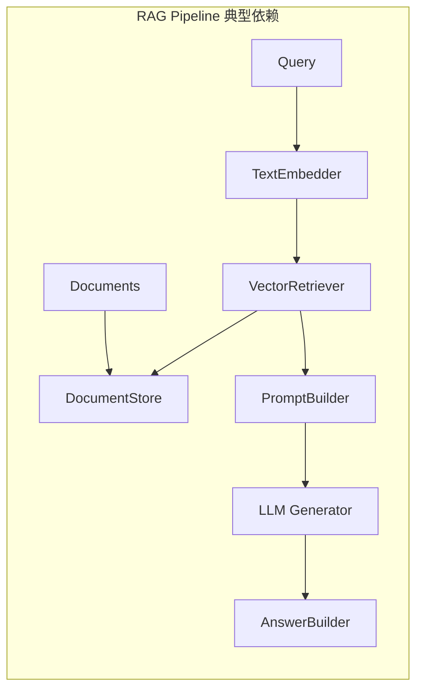
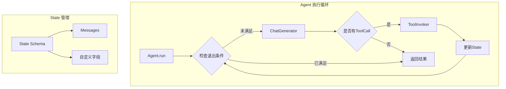
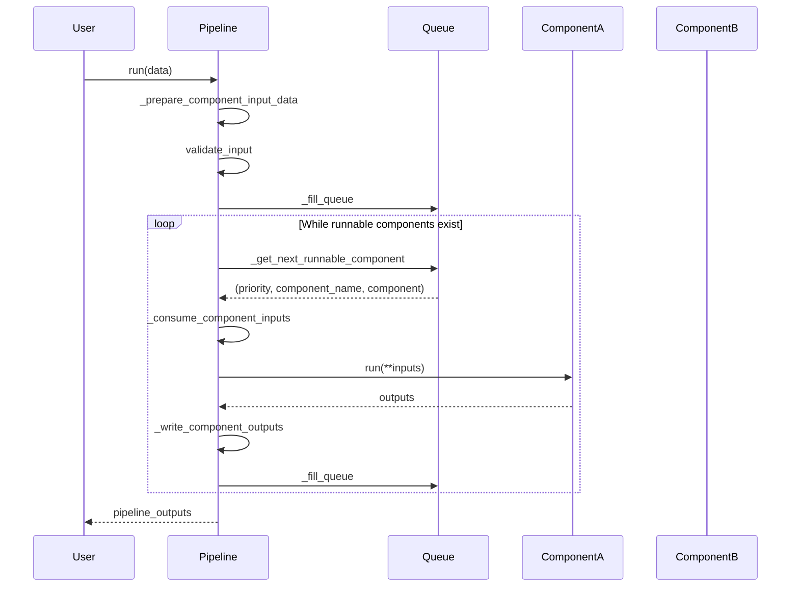
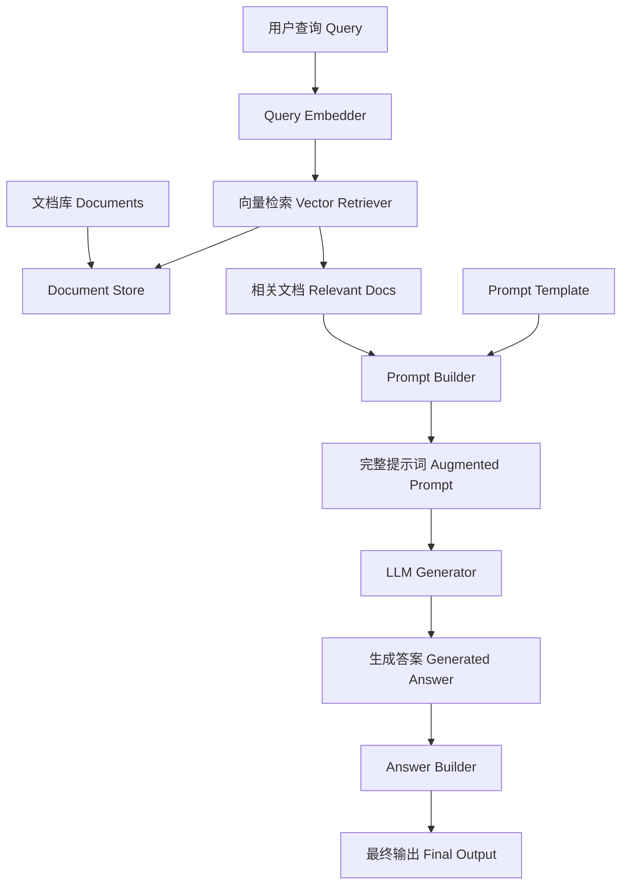
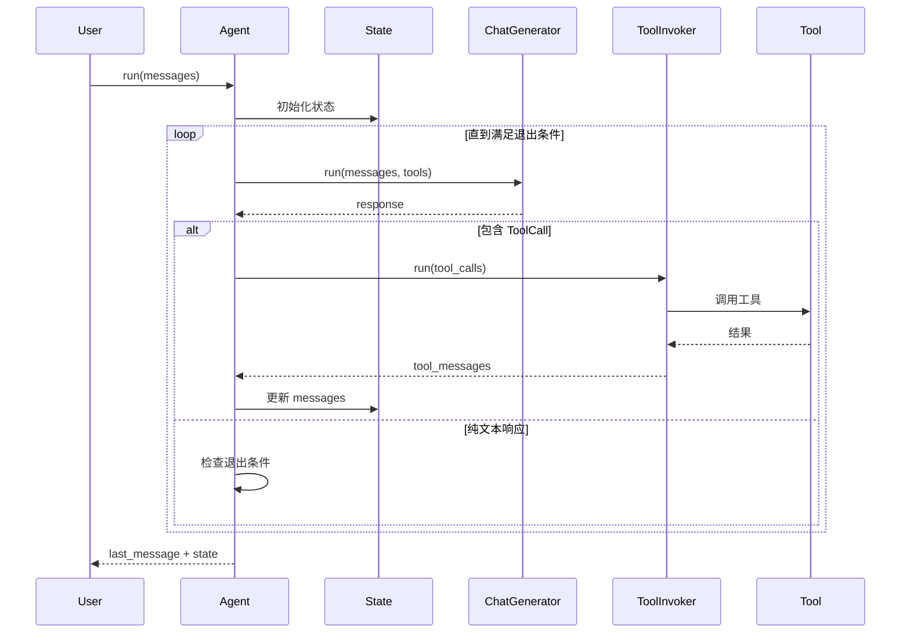
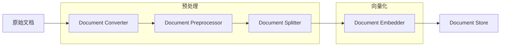

# Haystack 开源项目深度分析报告

## 执行摘要

**Haystack** 是由 deepset 开发的端到端开源 AI 编排框架，专为构建生产级 LLM（大语言模型）应用而设计。它采用模块化管道（Pipeline）架构，支持构建 RAG（检索增强生成）系统、多模态应用、语义搜索、问答系统和自主代理（Agent）。

### 核心特点
- **模型无关**: 支持 OpenAI、Anthropic、Hugging Face、Azure OpenAI、AWS Bedrock 等多种 LLM 提供商
- **模块化设计**: 通过组件（Component）和管道（Pipeline）构建灵活的工作流
- **Agent 支持**: 内置工具调用（Tool Calling）和自主代理能力
- **生产就绪**: 支持断点调试、状态快照、追踪和监控

---

## 目录结构解析

```
haystack/
├── haystack/                    # 核心源代码
│   ├── components/              # 组件库（26+ 类别）
│   │   ├── agents/             # 代理组件
│   │   ├── audio/              # 音频处理
│   │   ├── builders/           # 构建器（Prompt、Answer）
│   │   ├── caching/            # 缓存组件
│   │   ├── classifiers/        # 分类器
│   │   ├── connectors/         # 连接器
│   │   ├── converters/         # 文档转换器
│   │   ├── embedders/          # 嵌入模型（OpenAI、HuggingFace等）
│   │   ├── evaluators/         # 评估器
│   │   ├── extractors/         # 提取器
│   │   ├── fetchers/           # 数据获取
│   │   ├── generators/         # 生成器（LLM）
│   │   ├── joiners/            # 结果合并
│   │   ├── preprocessors/      # 预处理器
│   │   ├── query/              # 查询处理
│   │   ├── rankers/            # 排序器
│   │   ├── readers/            # 阅读器
│   │   ├── retrievers/         # 检索器
│   │   ├── routers/            # 路由器
│   │   ├── samplers/           # 采样器
│   │   ├── tools/              # 工具组件
│   │   ├── validators/         # 验证器
│   │   ├── websearch/          # 网页搜索
│   │   └── writers/            # 写入器
│   ├── core/                    # 核心框架
│   │   ├── component/          # 组件基础架构
│   │   ├── pipeline/           # 管道引擎
│   │   ├── super_component/    # 超级组件
│   │   ├── errors.py           # 错误定义
│   │   ├── serialization.py    # 序列化
│   │   └── type_utils.py       # 类型工具
│   ├── dataclasses/             # 数据类
│   │   ├── document.py         # 文档模型
│   │   ├── chat_message.py     # 聊天消息
│   │   ├── answer.py           # 答案模型
│   │   ├── image_content.py    # 图像内容
│   │   └── ...
│   ├── document_stores/         # 文档存储
│   │   ├── in_memory/          # 内存存储
│   │   └── types/              # 存储类型定义
│   ├── tools/                   # 工具定义
│   │   ├── tool.py             # Tool 数据类
│   │   ├── component_tool.py   # 组件工具
│   │   └── toolset.py          # 工具集
│   ├── tracing/                 # 追踪支持
│   ├── telemetry/               # 遥测
│   ├── evaluation/              # 评估框架
│   ├── human_in_the_loop/       # 人机交互
│   ├── marshal/                 # 数据编组
│   ├── utils/                   # 工具函数
│   └── testing/                 # 测试工具
├── test/                        # 测试代码
├── e2e/                         # 端到端测试
├── docs-website/                # 文档网站
├── docker/                      # Docker 配置
├── examples/                    # 示例代码
└── scripts/                     # 脚本工具
```

### 目录分类说明

| 目录 | 类别 | 说明 |
|------|------|------|
| `haystack/components/` | 组件库 | 26+ 类别的可复用组件，每个组件都是独立的处理单元 |
| `haystack/core/` | 核心框架 | 管道引擎、组件装饰器、序列化等核心机制 |
| `haystack/dataclasses/` | 数据模型 | Document、ChatMessage、Answer 等核心数据类 |
| `haystack/document_stores/` | 存储层 | 文档存储抽象和内存实现 |
| `haystack/tools/` | 工具系统 | Tool 定义、Toolset、ComponentTool |
| `test/` | 测试 | 单元测试和集成测试 |

---

## 架构与模块依赖图

### 整体架构

```mermaid
graph TB
    subgraph "Haystack 架构"
        direction TB
        
        subgraph "Core Layer"
            Pipeline[Pipeline 引擎]
            Component[@component 装饰器]
            Serialization[序列化系统]
            TypeUtils[类型系统]
        end
        
        subgraph "Data Layer"
            Document[Document]
            ChatMessage[ChatMessage]
            Answer[Answer/GeneratedAnswer]
            ToolCall[ToolCall/ToolCallResult]
        end
        
        subgraph "Component Layer"
            Generators[Generators<br/>LLM生成器]
            Retrievers[Retrievers<br/>检索器]
            Embedders[Embedders<br/>嵌入器]
            Builders[Builders<br/>构建器]
            Agents[Agents<br/>代理]
            Tools[Tools<br/>工具调用]
        end
        
        subgraph "Storage Layer"
            InMemoryStore[InMemoryDocumentStore]
            FilterSystem[过滤系统]
            BM25[BM25检索]
            Embedding[向量检索]
        end
        
        subgraph "Integration Layer"
            OpenAI[OpenAI]
            HuggingFace[HuggingFace]
            Azure[Azure]
            Anthropic[Anthropic]
        end
    end
    
    Pipeline --> Component
    Component --> Document
    Component --> ChatMessage
    
    Generators --> ChatMessage
    Retrievers --> Document
    Embedders --> Document
    Agents --> Tools
    Tools --> ToolCall
    
    Retrievers --> InMemoryStore
    InMemoryStore --> BM25
    InMemoryStore --> Embedding
    
    Generators --> OpenAI
    Generators --> HuggingFace
    Embedders --> OpenAI
    Embedders --> HuggingFace
```

### 组件依赖关系



### Agent 架构



---

## 核心业务流程与数据流

### 1. Pipeline 执行流程



### 2. RAG 完整数据流



### 3. Agent 工具调用流程



### 4. 文档索引流程



---

## 关键 API 接口与调用链路

### 核心接口

#### 1. Pipeline API
- **`Pipeline()`**: 创建同步管道实例
- **`AsyncPipeline()`**: 创建异步管道实例  
- **`add_component(name, instance)`**: 添加组件到管道
- **`connect(sender, receiver)`**: 连接组件
- **`run(data, include_outputs_from=None)`**: 执行管道
- **`to_dict()/from_dict()`**: 序列化/反序列化

#### 2. Component 装饰器
- **`@component`**: 将类标记为组件
- **`@component.output_types(**types)`**: 定义输出类型
- **`component.set_input_type()`**: 动态设置输入类型

#### 3. Document API
- **`Document(content, meta, embedding, ...)`**: 文档数据类
- **`to_dict()/from_dict()`**: 序列化方法
- **`__eq__()`**: 文档比较

#### 4. Agent API
- **`Agent(chat_generator, tools, ...)`**: 创建代理
- **`run(messages, **kwargs)`**: 执行代理
- **`to_dict()/from_dict()`**: 序列化支持

#### 5. Tool API
- **`Tool(name, description, parameters, function)`**: 工具定义
- **`Toolset(tools)`**: 工具集合

### 主要调用链路

#### RAG Pipeline 调用链
```
Pipeline.run()
├─→ TextEmbedder.run(query) → [embedding]
├─→ VectorRetriever.run(embedding) → [documents]  
├─→ PromptBuilder.run(documents, query) → [prompt]
├─→ OpenAIGenerator.run(prompt) → [replies, meta]
└─→ AnswerBuilder.run(replies) → [answers]
```

#### Agent 执行调用链
```
Agent.run()
├─→ ChatGenerator.run(messages, tools) → [response]
│   ├─→ 如果包含 ToolCall:
│   │   └─→ ToolInvoker.run(tool_calls) → [tool_messages]
│   │       └─→ Tool.function(**args) → [result]
│   └─→ 如果纯文本: 返回结果
└─→ 检查退出条件 → 循环或返回
```

#### Document 处理调用链
```
DocumentStore.write_documents()
├─→ Document(content="...") → 文档对象
├─→ (可选) DocumentSplitter.split(documents) → [chunks]
├─→ (可选) DocumentEmbedder.run(chunks) → [embedded_docs]
└─→ 存储到 DocumentStore
```

---

## 算法与关键函数实现

### 1. Pipeline 执行算法

**核心逻辑**: 基于优先级队列的拓扑排序执行

```python
def run(self, data: dict[str, Any], ...) -> dict[str, Any]:
    # 1. 准备输入数据
    data = self._prepare_component_input_data(data)
    self.validate_input(data)
    
    # 2. 初始化执行状态
    ordered_component_names = sorted(self.graph.nodes.keys())
    component_visits = dict.fromkeys(ordered_component_names, 0)
    inputs = self._convert_to_internal_format(pipeline_inputs=data)
    priority_queue = self._fill_queue(ordered_component_names, inputs, component_visits)
    
    # 3. 主执行循环
    while True:
        candidate = self._get_next_runnable_component(priority_queue, component_visits)
        if candidate is None:
            break
            
        priority, component_name, component = candidate
        
        # 4. 消费输入并执行组件
        component_inputs = self._consume_component_inputs(component_name, component, inputs)
        component_outputs = self._run_component(component_name, component, component_inputs, component_visits)
        
        # 5. 写入输出并更新队列
        self._write_component_outputs(component_name, component_outputs, inputs, receivers)
        if self._is_queue_stale(priority_queue):
            priority_queue = self._fill_queue(ordered_component_names, inputs, component_visits)
    
    return pipeline_outputs
```

**关键优化**:
- **优先级队列**: 使用 `FIFOPriorityQueue` 确保正确的执行顺序
- **输入消费**: `_consume_component_inputs()` 管理数据流
- **状态跟踪**: `component_visits` 防止无限循环

### 2. BM25 检索算法

**实现位置**: `haystack/document_stores/in_memory/document_store.py`

```python
def _score_bm25l(self, query: str, documents: list[Document]) -> list[tuple[Document, float]]:
    """Calculate BM25L scores for the given query and filtered documents."""
    # 1. Tokenize query
    query_tokens = self._tokenize_bm25(query)
    
    # 2. Calculate IDF for each token
    idf_scores = {}
    for token in set(query_tokens):
        df = self._freq_vocab_for_idf[token]  # document frequency
        idf = math.log((len(self.storage) - df + 0.5) / (df + 0.5))
        idf_scores[token] = idf
    
    # 3. Calculate BM25L score for each document
    results = []
    for doc_id, doc in self.storage.items():
        if doc not in documents:
            continue
            
        doc_stats = self._bm25_attr[doc_id]
        doc_score = 0.0
        
        # 4. Calculate term frequency and apply BM25L formula
        for token in query_tokens:
            if token in doc_stats.freq_token:
                tf = doc_stats.freq_token[token]
                # BM25L scoring formula with delta parameter
                numerator = idf_scores[token] * (tf * (1.0 + 1.2) / (1.2 * (1.0 - 0.75 + 0.75 * doc_stats.doc_len / self._avg_doc_len) + tf))
                doc_score += numerator
                
        results.append((doc, doc_score))
    
    # 5. Sort by score and return top-k
    results.sort(key=lambda x: x[1], reverse=True)
    return results[:self.top_k]
```

### 3. Agent 状态管理

**实现位置**: `haystack/components/agents/state/state.py`

```python
class State:
    def __init__(self, schema: dict[str, Any], data: dict[str, Any] | None = None):
        """Initialize state with schema validation."""
        self._schema = schema
        self._data = {}
        
        # Validate and set initial data
        for key, value in (data or {}).items():
            self._validate_and_set(key, value)
    
    def set(self, key: str, value: Any) -> None:
        """Set a value in the state with schema validation."""
        self._validate_and_set(key, value)
    
    def get(self, key: str) -> Any:
        """Get a value from the state."""
        return self._data.get(key)
    
    def _validate_and_set(self, key: str, value: Any) -> None:
        """Validate value against schema and set it."""
        if key not in self._schema:
            raise ValueError(f"Key '{key}' not in state schema")
            
        expected_type = self._schema[key]["type"]
        if not isinstance(value, expected_type):
            raise TypeError(f"Expected {expected_type}, got {type(value)}")
            
        self._data[key] = value
```

### 4. 组件装饰器实现

**实现位置**: `haystack/core/component/component.py`

```python
def component(cls: type[T]) -> type[T]:
    """Decorator to mark a class as a Haystack component."""
    
    # 1. Validate the class has required methods
    if not hasattr(cls, "run"):
        raise ComponentError(f"{cls.__name__} must have a 'run' method")
    
    # 2. Create input/output socket descriptors
    input_sockets = _create_input_sockets(cls)
    output_sockets = _create_output_sockets(cls)
    
    # 3. Attach metadata to the class
    cls.__haystack_input__ = Sockets(input_sockets)
    cls.__haystack_output__ = Sockets(output_sockets)
    cls.__haystack_component__ = True
    
    # 4. Register in global registry
    component.registry[f"{cls.__module__}.{cls.__qualname__}"] = cls
    
    return cls

def output_types(**types: type) -> Callable:
    """Decorator to define output types for a component's run method."""
    def decorator(func: Callable) -> Callable:
        func.__haystack_output_types__ = types
        return func
    return decorator
```

---

## 架构评价与建议

### 架构优势

1. **高度模块化**
   - 组件完全解耦，易于扩展和替换
   - 26+ 组件类别覆盖了 RAG 和 Agent 的所有需求
   - 清晰的接口契约（`@component` 装饰器）

2. **生产就绪特性**
   - 完善的错误处理和异常传播
   - 断点调试和状态快照支持
   - 追踪和遥测集成
   - 严格的类型检查和验证

3. **灵活性与扩展性**
   - 支持同步和异步管道
   - 模型无关设计，轻松切换 LLM 提供商
   - 自定义组件开发简单直观
   - 丰富的内置组件库

4. **开发者体验**
   - 清晰的文档和示例
   - 直观的 API 设计
   - 完善的测试覆盖
   - Mermaid 可视化支持

### 潜在改进点

1. **性能优化**
   - 当前的管道执行是单线程的，可以考虑并行执行无依赖的组件
   - 内存文档存储的 BM25 实现可以进一步优化大规模场景

2. **分布式支持**
   - 目前主要面向单机部署，缺乏原生的分布式执行支持
   - 可以考虑添加 Ray 或 Dask 集成用于大规模部署

3. **缓存机制**
   - 组件级别的缓存支持有限，可以增强智能缓存策略
   - 向量检索结果的缓存可以显著提升重复查询性能

4. **监控和可观测性**
   - 虽然有基本的追踪支持，但缺乏完整的监控仪表板
   - 可以集成 Prometheus/Grafana 进行生产环境监控

### 使用建议

1. **组件选择最佳实践**
   - 对于简单 RAG：使用 `OpenAITextEmbedder` + `InMemoryBM25Retriever` + `OpenAIGenerator`
   - 对于复杂 Agent：使用 `Agent` 组件配合自定义 `Tool` 实现
   - 文档预处理：合理使用 `DocumentSplitter` 和 `Preprocessor` 组件

2. **性能调优**
   - 合理设置 `top_k` 参数避免过度检索
   - 使用 `SentenceWindowRetriever` 提升上下文质量
   - 考虑使用 `Caching` 组件减少重复计算

3. **生产部署**
   - 启用 `tracing` 和 `telemetry` 进行监控
   - 使用 `Pipeline` 的序列化功能进行配置管理
   - 考虑使用 `Hayhooks` 进行 API 服务化

### 总结

Haystack 展现了一个成熟、生产就绪的 LLM 应用框架应有的特质。其模块化设计、丰富的组件生态、完善的错误处理和调试支持，使其成为构建复杂 RAG 和 Agent 系统的理想选择。虽然在分布式和性能方面还有提升空间，但其当前的架构已经能够满足大多数企业级应用场景的需求。