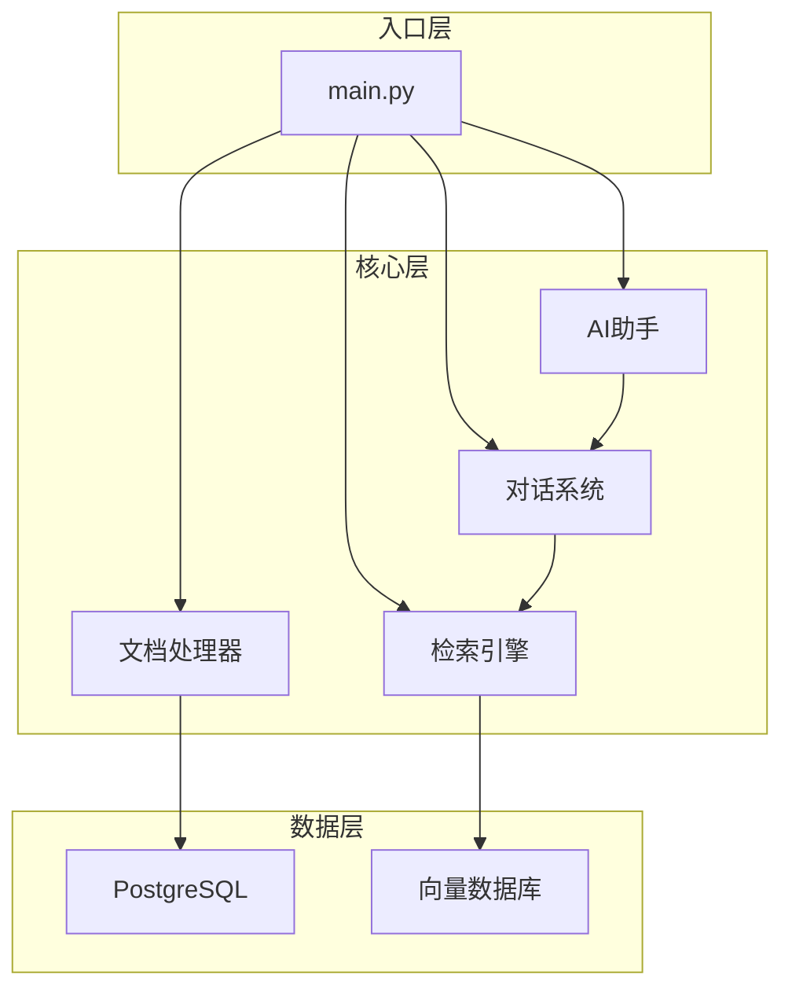
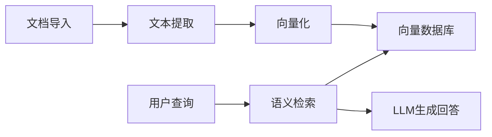

# Khoj — 代码逻辑分析报告

## 1. 执行摘要

| 维度 | 内容 |
|------|------|
| **项目名称** | Khoj |
| **项目定位** | 自托管的AI第二大脑，支持多种LLM和自定义代理 |
| **技术栈** | Python + Django/FastAPI + PostgreSQL |
| **架构模式** | 模块化设计，插件化扩展 |
| **代码规模** | 中型项目，约数万行代码 |
| **核心入口** | `src/khoj/main.py` |

> **一段话总结**: Khoj是一个自托管的AI个人知识管理工具，支持多种LLM模型和自定义代理。它可以帮助用户整理笔记、文档，通过自然语言进行检索和问答，是个人知识管理的强大助手。

---

## 2. 目录结构解析

```
khoj/
├── src/khoj/              # core: 核心代码
│   ├── main.py           # 主应用入口
│   ├── database/         # 数据访问层
│   ├── processor/        # 文档处理模块
│   ├── search/           # 检索模块
│   ├── conversation/     # 对话模块
│   └── assistant/        # AI助手模块
├── tests/                 # test: 测试套件
├── docs/                  # docs: 文档
└── docker/                # config: Docker配置
```

**关键观察**: Khoj采用模块化设计，核心功能包括文档处理、检索、对话和AI助手。

---

## 3. 架构与模块依赖

### 3.1 架构概览

Khoj采用模块化架构设计，主要包含：
- **文档处理**: 支持多种格式的文档导入和处理
- **检索引擎**: 提供高效的语义检索能力
- **对话系统**: 支持自然语言交互
- **AI助手**: 可自定义的AI代理

### 3.2 模块依赖图



### 3.3 核心模块详解

#### 文档处理器

- **路径**: `src/khoj/processor/`
- **职责**: 处理各种格式的文档导入
- **关键文件**:
  - 文档解析器
  - 文本提取器
- **对外暴露**: 文档处理接口

#### 检索引擎

- **路径**: `src/khoj/search/`
- **职责**: 提供语义检索能力
- **关键文件**:
  - 向量检索实现
  - 混合检索策略
- **对外暴露**: 检索接口

#### AI助手

- **路径**: `src/khoj/assistant/`
- **职责**: 提供AI对话和任务执行能力
- **关键文件**:
  - 代理实现
  - 工具调用
- **对外暴露**: 助手接口

---

## 4. 核心业务流程与数据流

### 4.1 主流程描述

Khoj的核心业务流程：
1. **文档导入**: 用户导入笔记、文档
2. **文档处理**: 提取文本并生成向量表示
3. **索引构建**: 将向量存储到向量数据库
4. **检索问答**: 接收用户查询，检索相关内容，生成回答

### 4.2 流程图



---

## 5. 关键 API 接口与调用链路

### 5.1 API 总览

| 方法 | 路径 | 说明 | 所在文件 |
|------|------|------|----------|
| POST | /api/documents | 上传文档 | `src/khoj/routers/documents.py` |
| POST | /api/chat | 对话接口 | `src/khoj/routers/chat.py` |
| GET | /api/search | 检索接口 | `src/khoj/routers/search.py` |

---

## 6. 算法与关键函数实现

### 6.1 语义检索算法

- **位置**: `src/khoj/search/` 模块
- **用途**: 基于向量相似度的语义检索
- **特点**: 支持混合检索策略

### 6.2 文档向量化

- **位置**: `src/khoj/processor/` 模块
- **用途**: 将文档转换为向量表示
- **特点**: 支持多种嵌入模型

---

## 7. 架构评价与建议

### 优势

- **自托管**: 数据隐私可控
- **多模型支持**: 支持多种LLM
- **自定义代理**: 可扩展的AI助手
- **个人知识管理**: 专注于个人使用场景

### 潜在问题

- **功能相对简单**: 相比企业级RAG系统功能较少
- **社区规模**: 相对较小的开发者社区

### 进一步阅读建议

1. `src/khoj/main.py` — 主应用入口
2. `src/khoj/processor/` — 文档处理模块
3. `src/khoj/search/` — 检索引擎
4. `docs/` — 官方文档

---

*报告生成时间: 2026-04-01*
