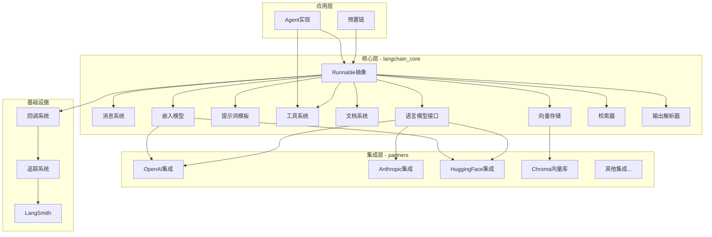
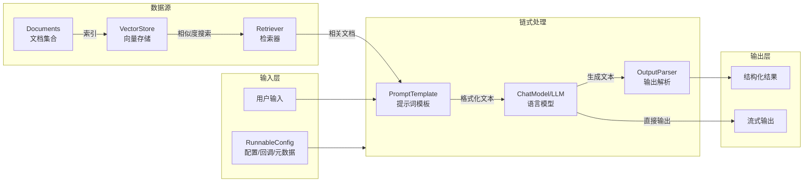
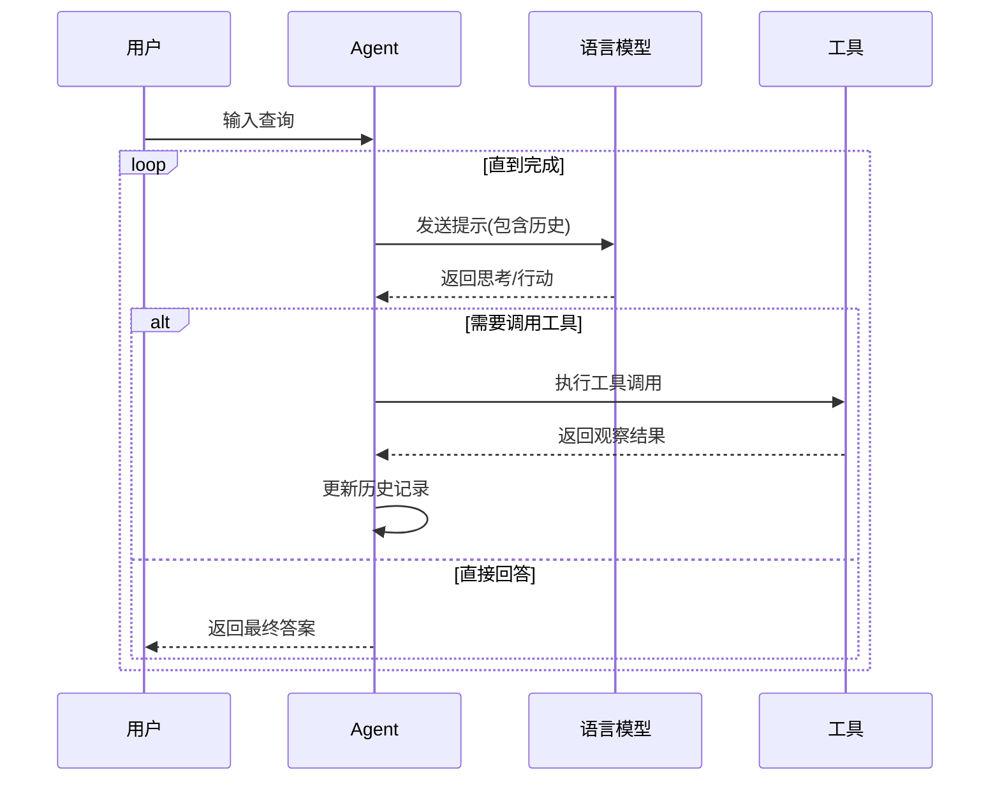

# LangChain — 代码逻辑分析报告

## 1. 执行摘要

| 维度 | 内容 |
|------|------|
| **项目名称** | LangChain |
| **项目定位** | Agent工程平台，提供完整的RAG组件和集成生态系统，用于构建基于LLM的应用程序 |
| **技术栈** | Python 3.10+ / Pydantic / LangSmith / Tenacity / PyYAML |
| **架构模式** | 分层插件架构 + Runnable组合模式 + 抽象接口驱动 |
| **代码规模** | 约2448个Python文件，核心库175个文件，15+官方合作伙伴集成包 |
| **核心入口** | `langchain_core.runnables.base.Runnable` |

> **一段话总结**: LangChain是一个用于构建LLM驱动应用程序的Python框架，采用分层架构设计。核心层(`langchain-core`)提供Runnable抽象、消息系统、模型接口、文档处理等基础能力；通过LCEL(LangChain Expression Language)实现组件的声明式组合；合作伙伴包提供与OpenAI、Anthropic等主流AI服务的集成。架构亮点在于其统一的Runnable接口设计，使得同步/异步、批处理、流式处理等模式可以无缝切换，同时保持类型安全。

---

## 2. 目录结构解析

```
langchain/
├── libs/
│   ├── core/                    # 核心库: 基础抽象和接口定义
│   │   ├── langchain_core/
│   │   │   ├── runnables/       # core: Runnable基类与LCEL实现
│   │   │   ├── messages/        # core: 消息类型系统(多模态支持)
│   │   │   ├── language_models/ # core: LLM/Chat模型抽象
│   │   │   ├── prompts/         # core: 提示词模板系统
│   │   │   ├── tools/           # core: 工具定义与调用
│   │   │   ├── documents/       # core: 文档抽象(RAG)
│   │   │   ├── embeddings/      # core: 嵌入模型接口
│   │   │   ├── vectorstores/    # core: 向量存储抽象
│   │   │   ├── retrievers.py    # core: 检索器接口
│   │   │   ├── output_parsers/  # core: 输出解析器
│   │   │   ├── callbacks/       # util: 回调系统
│   │   │   ├── tracers/         # util: 追踪与调试
│   │   │   └── load/            # util: 序列化/反序列化
│   │   └── tests/
│   ├── langchain/               # 经典LangChain(高层封装)
│   ├── langchain_v1/            # v1兼容层
│   ├── text-splitters/          # 文本分割工具
│   ├── standard-tests/          # 标准测试套件
│   ├── model-profiles/          # 模型配置文件
│   └── partners/                # 合作伙伴集成包
│       ├── openai/              # OpenAI集成
│       ├── anthropic/           # Anthropic集成
│       ├── azure/               # Azure OpenAI集成
│       ├── huggingface/         # HuggingFace集成
│       └── ... (15+个集成包)
├── .github/                     # CI/CD工作流
└── docs/                        # 文档
```

**关键观察**: 采用"核心-扩展"架构模式，`langchain-core`保持轻量级依赖，所有第三方集成通过独立的partner包实现，避免核心库臃肿。这种设计使得用户只需安装所需的集成包。

---

## 3. 架构与模块依赖

### 3.1 架构概览

LangChain采用**分层插件架构**，核心设计理念是：

1. **统一接口**: 所有组件都继承自`Runnable`，提供一致的`invoke`/`ainvoke`/`batch`/`stream`接口
2. **组合优先**: 通过LCEL(LangChain Expression Language)使用`|`操作符组合组件
3. **类型安全**: 基于Pydantic的强类型系统，支持泛型输入/输出类型
4. **可观测性**: 内置回调系统和LangSmith集成，支持全链路追踪

架构分为三层：
- **核心层(Core)**: 定义基础抽象，无第三方依赖
- **集成层(Partners)**: 具体实现，如OpenAI、Anthropic等
- **应用层(LangChain)**: 高层封装和预置链

### 3.2 模块依赖图



### 3.3 核心模块详解

#### Runnable 系统

- **路径**: `libs/core/langchain_core/runnables/`
- **职责**: 定义所有可执行组件的统一接口，是LangChain的核心抽象
- **关键文件**:
  - `base.py` — Runnable基类定义(6000+行)，包含invoke/ainvoke/batch/stream等核心方法
  - `config.py` — RunnableConfig配置管理
  - `fallbacks.py` — 降级处理
  - `history.py` — 消息历史管理
- **对外暴露**: `Runnable`, `RunnableSequence`, `RunnableParallel`, `RunnableLambda`, `RunnableConfig`
- **依赖关系**: 依赖callbacks、tracers、outputs等模块；被所有其他模块依赖

#### 消息系统

- **路径**: `libs/core/langchain_core/messages/`
- **职责**: 定义LLM对话中的消息类型，支持多模态内容
- **关键文件**:
  - `base.py` — BaseMessage基类
  - `ai.py` — AIMessage及其变体
  - `human.py` — HumanMessage
  - `system.py` — SystemMessage
  - `tool.py` — ToolMessage和ToolCall
  - `content.py` — 内容块类型(文本、图像、音频等)
- **对外暴露**: `BaseMessage`, `AIMessage`, `HumanMessage`, `SystemMessage`, `ToolMessage`, `ToolCall`
- **依赖关系**: 被language_models、agents、prompts等模块依赖

#### 语言模型接口

- **路径**: `libs/core/langchain_core/language_models/`
- **职责**: 定义LLM和Chat模型的抽象接口
- **关键文件**:
  - `base.py` — BaseLanguageModel基类
  - `llms.py` — LLM接口(文本补全)
  - `chat_models.py` — Chat模型接口(对话)
- **对外暴露**: `BaseLanguageModel`, `BaseLLM`, `BaseChatModel`
- **依赖关系**: 依赖messages、prompts、outputs；被partners实现

#### 文档与RAG系统

- **路径**: `libs/core/langchain_core/documents/` 和 `vectorstores/`
- **职责**: 支持检索增强生成(RAG)的数据处理流程
- **关键文件**:
  - `documents/base.py` — Document类定义
  - `embeddings/embeddings.py` — Embeddings接口
  - `vectorstores/base.py` — VectorStore抽象
  - `retrievers.py` — BaseRetriever接口
- **对外暴露**: `Document`, `Embeddings`, `VectorStore`, `BaseRetriever`
- **依赖关系**: 构成RAG流程的数据层

---

## 4. 核心业务流程与数据流

### 4.1 主流程描述

LangChain最核心的流程是**Runnable链式调用**，典型场景包括：

1. **简单链**: Prompt → LLM → OutputParser
2. **RAG流程**: Query → Retriever → Prompt → LLM → Output
3. **Agent流程**: Input → LLM → Tool选择 → Tool执行 → Observation → LLM → Final Answer

数据流特点：
- 所有组件统一通过`invoke()`方法调用
- 使用`|`操作符进行组件组合(LCEL)
- 支持同步/异步、批处理、流式处理无缝切换
- 配置通过`RunnableConfig`传递，支持回调、元数据、标签等

### 4.2 流程图



### 4.3 Agent执行流程



### 4.4 数据模型

**核心数据模型关系**:

- **Runnable**: 所有组件的基类，定义通用接口
- **BaseMessage**: 消息基类，派生出HumanMessage、AIMessage、SystemMessage、ToolMessage
- **Document**: 文档对象，用于RAG流程
- **PromptValue**: 提示词值，可以是字符串或消息列表
- **Generation/ChatGeneration**: 模型生成结果

---

## 5. 关键 API 接口与调用链路

### 5.1 API 总览

| 方法 | 路径/接口 | 说明 | 所在文件 |
|------|-----------|------|----------|
| `invoke` | `Runnable.invoke()` | 同步单输入执行 | `runnables/base.py` |
| `ainvoke` | `Runnable.ainvoke()` | 异步单输入执行 | `runnables/base.py` |
| `batch` | `Runnable.batch()` | 批量同步执行 | `runnables/base.py` |
| `stream` | `Runnable.stream()` | 流式输出 | `runnables/base.py` |
| `bind` | `Runnable.bind()` | 绑定参数 | `runnables/base.py` |
| `__or__` | `r1 | r2` | 顺序组合(LCEL) | `runnables/base.py` |

### 5.2 核心 API 调用链路分析

#### `Runnable.invoke()`

**调用链**:

```
Runnable.invoke() → _call_with_config() → 具体实现逻辑
                    ↓
              CallbackManager.on_chain_start()
                    ↓
              CallbackManager.on_chain_end()/on_chain_error()
```

**关键代码片段** (libs/core/langchain_core/runnables/base.py):

```python
# 1:201:libs/core/langchain_core/runnables/base.py
class Runnable(ABC, Generic[Input, Output]):
    """A unit of work that can be invoked, batched, streamed, transformed and composed."""
    
    def invoke(self, input: Input, config: RunnableConfig | None = None, **kwargs) -> Output:
        # 实际实现在子类中
        ...
    
    def _call_with_config(
        self,
        func: Callable[[Input], Output],
        input_: Input,
        config: RunnableConfig | None,
        run_type: str | None = None,
        **kwargs
    ) -> Output:
        config = ensure_config(config)
        callback_manager = get_callback_manager_for_config(config)
        run_manager = callback_manager.on_chain_start(...)
        try:
            output = func(input_, ...)
            run_manager.on_chain_end(output)
            return output
        except BaseException as e:
            run_manager.on_chain_error(e)
            raise
```

**逻辑说明**: 
1. `invoke()`是入口方法，子类需要实现具体逻辑
2. `_call_with_config()`提供统一的配置管理和回调处理
3. 通过CallbackManager实现生命周期事件的追踪

#### `RunnableSequence` (链式组合)

**调用链**:

```
RunnableSequence.invoke() → 遍历所有Runnable → 前一个的输出作为后一个的输入
```

**关键代码片段**:

```python
# 顺序执行链中的每个Runnable
def invoke(self, input: Input, config: RunnableConfig | None = None, **kwargs) -> Output:
    config = ensure_config(config)
    # 遍历所有步骤
    for step in self.steps:
        input = step.invoke(input, config, **kwargs)
    return input
```

**逻辑说明**: 
- `RunnableSequence`通过`|`操作符或显式构造创建
- 数据流是顺序的，前一个组件的输出直接传递给下一个组件
- 支持类型推断，链的输入类型是第一个组件的输入，输出类型是最后一个组件的输出

#### `BaseChatModel.invoke()`

**调用链**:

```
BaseChatModel.invoke() → generate() → _generate() (子类实现)
                       → 构建ChatResult → 返回AIMessage
```

**关键代码片段** (libs/core/langchain_core/language_models/chat_models.py):

```python
# 1:200:libs/core/langchain_core/language_models/chat_models.py
def generate(
    self,
    messages: list[list[BaseMessage]],
    stop: list[str] | None = None,
    callbacks: Callbacks = None,
    **kwargs
) -> LLMResult:
    """批量生成响应。"""
    # 处理回调和配置
    # 调用具体实现_generate
    ...

def invoke(
    self,
    input: LanguageModelInput,
    config: RunnableConfig | None = None,
    **kwargs
) -> AIMessage:
    """单条消息调用。"""
    # 格式化输入为消息列表
    # 调用generate
    # 提取并返回AIMessage
    ...
```

**逻辑说明**: 
1. `invoke`处理单条输入，内部转换为批量调用
2. `generate`是批量生成接口，实际调用`_generate`(子类必须实现)
3. 支持缓存、回调、流式等多种特性

---

## 6. 算法与关键函数实现

### 6.1 Runnable组合算法 (LCEL)

- **位置**: `libs/core/langchain_core/runnables/base.py` 第 600-800 行
- **用途**: 实现Runnable的声明式组合
- **复杂度**: 时间 O(n) / 空间 O(n)，n为链中组件数量

**核心代码**:

```python
# 1:600:libs/core/langchain_core/runnables/base.py
def __or__(
    self,
    other: Runnable[Any, Other] | Callable[..., Other] | Mapping[str, Any]
) -> RunnableSerializable[Input, Other]:
    """Runnable "or" 操作符 - 顺序组合。
    
    使用 | 操作符将两个Runnable组合成RunnableSequence。
    例如: chain = prompt | model | parser
    """
    return RunnableSequence(self, coerce_to_runnable(other))
```

**逐步解析**:

1. **类型转换**: `coerce_to_runnable()`将函数、字典等转换为Runnable
2. **创建序列**: `RunnableSequence`接收两个Runnable，形成链
3. **惰性执行**: 组合时只构建结构，实际执行在`invoke()`时进行
4. **类型推断**: 使用泛型保持输入/输出类型的连贯性

### 6.2 消息历史管理

- **位置**: `libs/core/langchain_core/runnables/history.py`
- **用途**: 管理对话历史，支持多轮对话
- **复杂度**: 时间 O(1) 每次查询 / 空间 O(n)，n为历史消息数

**核心逻辑**:

```python
# 加载历史消息 → 合并当前输入 → 执行 → 保存新消息
class RunnableWithMessageHistory(Runnable):
    def invoke(self, input: Input, config: RunnableConfig | None = None) -> Output:
        # 1. 从历史存储加载消息
        history = self.get_history(config)
        # 2. 合并历史与当前输入
        full_input = history + input
        # 3. 执行底层Runnable
        output = self.runnable.invoke(full_input, config)
        # 4. 更新历史
        history.add_message(output)
        return output
```

### 6.3 工具调用解析

- **位置**: `libs/core/langchain_core/tools/base.py` 第 200-400 行
- **用途**: 解析LLM输出的工具调用请求
- **复杂度**: 时间 O(m)，m为工具调用数量

**核心代码**:

```python
# 1:200:libs/core/langchain_core/tools/base.py
def _parse_tool_call(raw_tool_call: dict) -> ToolCall:
    """解析工具调用字典为ToolCall对象。"""
    return ToolCall(
        name=raw_tool_call["function"]["name"],
        args=json.loads(raw_tool_call["function"]["arguments"]),
        id=raw_tool_call.get("id")
    )
```

### 6.4 向量相似度搜索

- **位置**: `libs/core/langchain_core/vectorstores/base.py`
- **用途**: 基于嵌入向量的相似文档检索
- **复杂度**: 时间 O(log n) 使用索引 / O(n) 暴力搜索，n为文档数

**核心逻辑**:

```python
# 1:100:libs/core/langchain_core/vectorstores/base.py
def similarity_search(
    self, 
    query: str, 
    k: int = 4,
    **kwargs
) -> list[Document]:
    """搜索与查询最相似的k个文档。"""
    # 1. 将查询文本转为嵌入向量
    query_embedding = self.embeddings.embed_query(query)
    # 2. 执行相似度搜索(具体实现由子类提供)
    return self.similarity_search_by_vector(query_embedding, k, **kwargs)
```

---

## 7. 架构评价与建议

### 优势

1. **优雅的抽象设计**: Runnable接口统一了所有组件的行为模式，学习成本低，扩展性强
2. **类型安全**: 基于Pydantic的强类型系统，IDE支持好，运行时错误少
3. **组合灵活性**: LCEL语法简洁直观，支持复杂的并行和条件流程
4. **可观测性**: 内置回调和追踪系统，与LangSmith深度集成，便于调试和监控
5. **生态丰富**: 15+官方合作伙伴包，覆盖主流AI服务提供商
6. **异步原生**: 所有接口都提供异步版本，适合高并发场景

### 潜在问题

1. **代码复杂度高**: `runnables/base.py`超过6000行，核心类职责过重，维护难度大
2. **动态导入陷阱**: 大量使用`__getattr__`动态导入，可能增加调试难度和运行时开销
3. **版本碎片化**: langchain/langchain-core/langchain-v1等多包结构增加了依赖管理的复杂性
4. **文档与代码同步**: 快速发展可能导致文档滞后

### 进一步阅读建议

如果您想深入了解某个模块，建议从以下文件开始：

1. `libs/core/langchain_core/runnables/base.py` — Runnable基类定义，理解核心抽象
2. `libs/core/langchain_core/language_models/chat_models.py` — Chat模型接口，了解LLM调用流程
3. `libs/core/langchain_core/messages/base.py` — 消息系统基础，理解多模态消息结构
4. `libs/core/langchain_core/tools/base.py` — 工具系统，理解Agent如何调用外部工具
5. `libs/partners/openai/langchain_openai/chat_models/base.py` — OpenAI集成实现，了解具体模型如何接入

---

*报告生成时间: 2026-04-01*
*分析版本: langchain-core v1.2.23*
