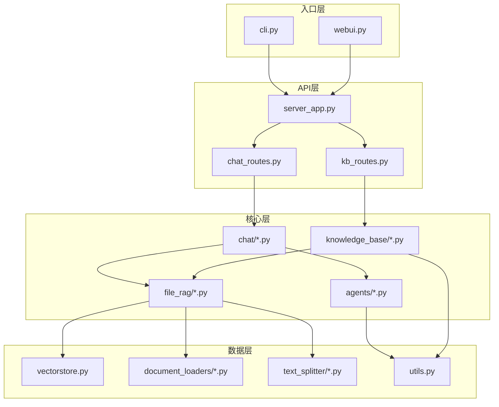
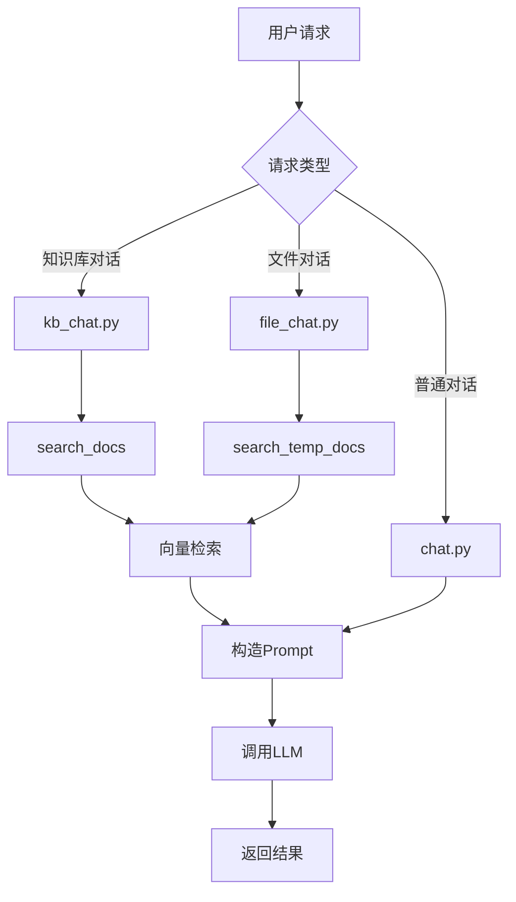

# Langchain-Chatchat — 代码逻辑分析报告

## 1. 执行摘要

| 维度 | 内容 |
|------|------|
| **项目名称** | Langchain-Chatchat |
| **项目定位** | 基于 Langchain 框架的本地知识库 RAG 应用，支持 ChatGLM、Qwen、Llama 等大语言模型 |
| **技术栈** | Python + FastAPI + Streamlit + Langchain + 向量数据库（FAISS/Milvus等） |
| **架构模式** | 分层架构（API层、业务逻辑层、数据访问层）+ Agent模式 |
| **代码规模** | 约280个Python文件，核心代码集中在libs/chatchat-server目录 |
| **核心入口** | `libs/chatchat-server/chatchat/cli.py` |

> **一段话总结**: Langchain-Chatchat 是一个功能丰富的本地知识库问答系统，采用模块化设计支持多种大语言模型和向量数据库。项目通过统一的OpenAI兼容API提供服务，同时提供WebUI界面。核心亮点包括完善的RAG实现、多工具Agent能力、灵活的模型接入框架（支持Xinference/Ollama等），以及对文件对话、数据库对话、多模态等高级功能的支持。架构上采用分层设计，但部分模块间耦合度较高，配置管理较为复杂。

---

## 2. 目录结构解析

```
Langchain-Chatchat/
├── libs/chatchat-server/          # core: 核心业务逻辑和服务实现
├── tools/                         # scripts/tools: 模型加载和管理工具
├── docker/                        # scripts/tools: Docker部署配置
├── docs/                          # docs: 项目文档和说明
├── markdown_docs/                 # docs: WebUI页面文档
├── README.md                      # 项目说明文档
└── pyproject.toml                 # 项目依赖配置
```

**关键观察**: 项目采用按功能分包的组织方式，核心逻辑集中在`libs/chatchat-server`目录下。该目录内部进一步按职责划分为`chatchat`（CLI和配置）、`langchain_chatchat`（Langchain扩展）和`server`（具体业务实现）三个主要模块。

---

## 3. 架构与模块依赖

### 3.1 架构概览

Langchain-Chatchat 采用分层架构设计，从上到下分为：
1. **入口层**: CLI命令行接口和WebUI界面
2. **API层**: FastAPI提供的RESTful API服务
3. **业务逻辑层**: 对话处理、知识库管理、Agent执行等核心功能
4. **数据访问层**: 向量数据库操作、文件处理、模型调用等底层实现

项目特别强调对多种模型推理框架的支持，通过抽象的模型配置层屏蔽不同框架（Xinference、Ollama、FastChat等）的差异，统一使用OpenAI兼容的API进行调用。

### 3.2 模块依赖图



### 3.3 核心模块详解

#### chatchat 模块

- **路径**: `libs/chatchat-server/chatchat/`
- **职责**: 提供CLI命令行接口、应用配置管理和服务器启动逻辑
- **关键文件**:
  - `cli.py` — 定义chatchat命令行工具，包含init、start、kb等子命令
  - `startup.py` — 服务器启动逻辑，管理API和WebUI进程
  - `settings.py` — 应用配置管理，支持YAML文件自动重载
- **对外暴露**: CLI命令行接口
- **依赖关系**: 依赖server模块，被用户直接调用

#### server 模块

- **路径**: `libs/chatchat-server/chatchat/server/`
- **职责**: 实现具体的业务逻辑，包括对话、知识库、文件处理等功能
- **关键文件**:
  - `api_server/` — FastAPI路由和接口实现
  - `chat/` — 各类对话逻辑（普通对话、知识库对话、文件对话）
  - `knowledge_base/` — 知识库管理和服务实现
  - `file_rag/` — RAG相关组件（文档加载、文本分割、检索器）
  - `agent/` — Agent工具和执行逻辑
- **对外暴露**: RESTful API接口
- **依赖关系**: 依赖langchain_chatchat模块，被chatchat模块调用

#### langchain_chatchat 模块

- **路径**: `libs/chatchat-server/chatchat/langchain_chatchat/`
- **职责**: 扩展Langchain框架，提供自定义的Agent、工具和回调处理器
- **关键文件**:
  - `agents/` — 自定义Agent实现（all_tools_agent.py等）
  - `agent_toolkits/` — 工具包定义和实现
  - `callbacks/` — 自定义回调处理器
- **对外暴露**: Langchain组件接口
- **依赖关系**: 依赖Langchain核心库，被server模块调用

---

## 4. 核心业务流程与数据流

### 4.1 主流程描述

Langchain-Chatchat 的核心业务流程是基于RAG的知识库问答：

1. **文档预处理**: 用户上传文档 → 文档加载器解析内容 → 中文文本分割器切分 → 向量化存储到FAISS等向量数据库
2. **查询处理**: 用户提问 → 问题向量化 → 在向量库中检索相似文档 → 构造包含上下文的Prompt → 调用LLM生成回答
3. **Agent扩展**: 当启用Agent模式时，系统会根据问题自动选择合适的工具（知识库搜索、网络搜索、数据库查询等）执行

对于文件对话场景，系统使用临时向量库存储上传文件的内容，实现会话级别的文档问答。

### 4.2 流程图



### 4.3 数据模型

核心数据结构包括：

- **Document**: Langchain标准文档对象，包含page_content和metadata
- **KnowledgeFile**: 知识库文件对象，封装文件路径和处理逻辑
- **History**: 对话历史记录，包含role和content字段
- **BaseToolOutput**: 工具输出封装，支持结构化数据和字符串格式化

数据库使用SQLite存储知识库元信息，包括知识库配置、文件列表和文档统计信息。

---

## 5. 关键 API 接口与调用链路

### 5.1 API 总览

| 方法 | 路径/接口 | 说明 | 所在文件 |
|------|-----------|------|----------|
| POST | /chat/kb_chat | 知识库对话 | `chat_routes.py` |
| POST | /chat/file_chat | 文件对话 | `chat_routes.py` |
| POST | /chat/chat/completions | 兼容OpenAI的统一接口 | `chat_routes.py` |
| POST | /knowledge_base/* | 知识库管理 | `kb_routes.py` |

### 5.2 核心 API 调用链路分析

#### `kb_chat` 知识库对话

**调用链**:

```
kb_chat (chat_routes.py) → kb_chat (kb_chat.py) → search_docs (kb_doc_api.py) → KBService.get_relevant_documents → VectorstoreRetrieverService.get_relevant_documents
```

**关键代码片段**:

```39:65:/root/.openclaw/workspace/Langchain-Chatchat/libs/chatchat-server/chatchat/server/chat/kb_chat.py
async def kb_chat(query: str = Body(..., description="用户输入", examples=["你好"]),
                mode: Literal["local_kb", "temp_kb", "search_engine"] = Body("local_kb", description="知识来源"),
                kb_name: str = Body("", description="mode=local_kb时为知识库名称；temp_kb时为临时知识库ID，search_engine时为搜索引擎名称", examples=["samples"]),
                top_k: int = Body(Settings.kb_settings.VECTOR_SEARCH_TOP_K, description="匹配向量数"),
                score_threshold: float = Body(
                    Settings.kb_settings.SCORE_THRESHOLD,
                    description="知识库匹配相关度阈值，取值范围在0-1之间，SCORE越小，相关度越高，取到1相当于不筛选，建议设置在0.5左右",
                    ge=0,
                    le=2,
                ),
```

**逻辑说明**: kb_chat函数接收用户查询和知识库参数，根据mode参数决定使用本地知识库、临时知识库还是搜索引擎。通过search_docs函数检索相关文档，构造包含上下文的Prompt，最后调用LLM生成回答。

#### `file_chat` 文件对话

**调用链**:

```
file_chat (chat_routes.py) → file_chat (file_chat.py) → memo_faiss_pool.acquire → similarity_search_with_score_by_vector
```

**关键代码片段**:

```78:102:/root/.openclaw/workspace/Langchain-Chatchat/libs/chatchat-server/chatchat/server/chat/file_chat.py
async def file_chat(
    query: str = Body(..., description="用户输入", examples=["你好"]),
    knowledge_id: str = Body(..., description="临时知识库ID"),
    top_k: int = Body(Settings.kb_settings.VECTOR_SEARCH_TOP_K, description="匹配向量数"),
    score_threshold: float = Body(
        Settings.kb_settings.SCORE_THRESHOLD,
        description="知识库匹配相关度阈值，取值范围在0-1之间，SCORE越小，相关度越高，取到1相当于不筛选，建议设置在0.5左右",
        ge=0,
        le=2,
    ),
    history: List[History] = Body(
        [],
        description="历史对话",
        examples=[
            [
                {"role": "user", "content": "我们来玩成语接龙，我先来，生龙活虎"},
                {"role": "assistant", "content": "虎头虎脑"},
            ]
        ],
    ),
```

**逻辑说明**: file_chat函数使用临时向量库（memo_faiss_pool）存储用户上传的文件内容。查询时直接在临时向量库中进行相似度搜索，获取相关文档后构造Prompt调用LLM。

---

## 6. 算法与关键函数实现

### 6.1 中文文本分割算法

- **位置**: `libs/chatchat-server/chatchat/server/file_rag/text_splitter/chinese_recursive_text_splitter.py` 第15行
- **用途**: 针对中文文本特点优化的递归文本分割算法
- **复杂度**: 时间 O(n) / 空间 O(n)

**核心代码**:

```15:45:/root/.openclaw/workspace/Langchain-Chatchat/libs/chatchat-server/chatchat/server/file_rag/text_splitter/chinese_recursive_text_splitter.py
class ChineseRecursiveTextSplitter(RecursiveCharacterTextSplitter):
    def __init__(
        self,
        separators: Optional[List[str]] = None,
        keep_separator: bool = True,
        is_separator_regex: bool = True,
        **kwargs: Any,
    ) -> None:
        """Create a new TextSplitter."""
        super().__init__(keep_separator=keep_separator, **kwargs)
        self._separators = separators or [
            "\n\n",
            "\n",
            "。|！|？",
            "\.\s|\!\s|\?\s",
            "；|;\s",
            "，|,\s",
        ]
        self._is_separator_regex = is_separator_regex
```

**逐步解析**:

1. **自定义分隔符**: 针对中文特点设置了专门的分隔符列表，包括中文标点符号（。！？；，）和英文标点符号
2. **正则表达式支持**: 通过is_separator_regex参数支持正则表达式分隔符，能更好地处理中文文本
3. **递归分割**: 继承Langchain的RecursiveCharacterTextSplitter，实现递归分割逻辑，确保文本块大小符合要求

### 6.2 PDF文档加载与OCR

- **位置**: `libs/chatchat-server/chatchat/server/file_rag/document_loaders/mypdfloader.py` 第8行
- **用途**: 支持带OCR的PDF文档加载，处理扫描版PDF
- **复杂度**: 时间 O(n*m) / 空间 O(n)，其中n为页数，m为每页图片数

**核心代码**:

```8:45:/root/.openclaw/workspace/Langchain-Chatchat/libs/chatchat-server/chatchat/server/file_rag/document_loaders/mypdfloader.py
class RapidOCRPDFLoader(UnstructuredFileLoader):
    def _get_elements(self) -> List:
        def rotate_img(img, angle):
            """
            img   --image
            angle --rotation angle
            return--rotated img
            """

            h, w = img.shape[:2]
            rotate_center = (w / 2, h / 2)
            # 获取旋转矩阵
            # 参数1为旋转中心点;
            # 参数2为旋转角度,正值-逆时针旋转;负值-顺时针旋转
            # 参数3为各向同性的比例因子,1.0原图，2.0变成原来的2倍，0.5变成原来的0.5倍
            M = cv2.getRotationMatrix2D(rotate_center, angle, 1.0)
            # 计算图像新边界
            new_w = int(h * np.abs(M[0, 1]) + w * np.abs(M[0, 0]))
            new_h = int(h * np.abs(M[0, 0]) + w * np.abs(M[0, 1]))
            # 调整旋转矩阵以考虑平移
            M[0, 2] += (new_w - w) / 2
            M[1, 2] += (new_h - h) / 2

            rotated_img = cv2.warpAffine(img, M, (new_w, new_h))
            return rotated_img
```

**逐步解析**:

1. **页面文本提取**: 使用PyMuPDF提取PDF页面的文本内容
2. **图片OCR处理**: 对页面中的图片进行OCR识别，使用RapidOCR引擎
3. **图片旋转校正**: 处理带有旋转角度的PDF页面，通过OpenCV进行图像旋转校正
4. **尺寸过滤**: 根据配置的PDF_OCR_THRESHOLD参数过滤小尺寸图片，避免噪声干扰

### 6.3 Ensemble检索器

- **位置**: `libs/chatchat-server/chatchat/server/file_rag/retrievers/ensemble.py` 第12行
- **用途**: 结合BM25和向量检索的混合检索策略，提升检索效果
- **复杂度**: 时间 O(n*log n) / 空间 O(n)

**核心代码**:

```12:35:/root/.openclaw/workspace/Langchain-Chatchat/libs/chatchat-server/chatchat/server/file_rag/retrievers/ensemble.py
@staticmethod
def from_vectorstore(
    vectorstore: VectorStore,
    top_k: int,
    score_threshold: int | float,
):
    faiss_retriever = vectorstore.as_retriever(
        search_type="similarity_score_threshold",
        search_kwargs={"score_threshold": score_threshold, "k": top_k},
    )
    # TODO: 换个不用torch的实现方式
    # from cutword.cutword import Cutter
    import jieba

    # cutter = Cutter()
    docs = list(vectorstore.docstore._dict.values())
    bm25_retriever = BM25Retriever.from_documents(
        docs,
        preprocess_func=jieba.lcut_for_search,
    )
    bm25_retriever.k = top_k
    ensemble_retriever = EnsembleRetriever(
        retrievers=[bm25_retriever, faiss_retriever], weights=[0.5, 0.5]
    )
    return EnsembleRetrieverService(retriever=ensemble_retriever, top_k=top_k)
```

**逐步解析**:

1. **向量检索器**: 从向量存储创建FAISS检索器，使用相似度阈值过滤
2. **BM25检索器**: 使用jieba分词对文档进行预处理，创建BM25检索器
3. **混合检索**: 使用Langchain的EnsembleRetriever组合两种检索器，权重各0.5
4. **结果融合**: 最终结果结合了语义相似度和关键词匹配的优势

---

## 7. 架构评价与建议

### 优势

- **模型兼容性强**: 通过统一的OpenAI API接口支持多种模型推理框架，降低了模型接入成本
- **功能丰富**: 不仅支持基础的RAG问答，还提供了Agent、多模态、数据库对话等高级功能
- **部署灵活**: 支持pip安装、源码部署和Docker部署多种方式，适应不同环境需求
- **中文优化**: 针对中文场景进行了专门优化，如中文文本分割、标题增强等

### 潜在问题

- **配置复杂**: YAML配置文件较多，新手容易混淆各个配置项的作用和关系
- **模块耦合**: 部分模块间存在较高的耦合度，如chat模块直接依赖knowledge_base模块的具体实现
- **错误处理**: 部分地方缺少完善的错误处理和用户友好的错误提示
- **性能瓶颈**: 文件对话使用内存中的临时向量库，大量文件可能导致内存压力

### 进一步阅读建议

如果您想深入了解某个模块，建议从以下文件开始：

1. `libs/chatchat-server/chatchat/server/chat/kb_chat.py` — 知识库对话的核心实现逻辑
2. `libs/chatchat-server/chatchat/server/file_rag/retrievers/ensemble.py` — 混合检索策略的实现
3. `libs/chatchat-server/chatchat/server/api_server/chat_routes.py` — API接口的统一入口和路由逻辑
4. `libs/chatchat-server/chatchat/settings.py` — 配置管理系统的实现原理