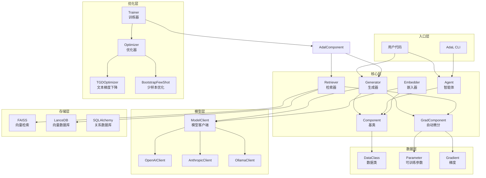
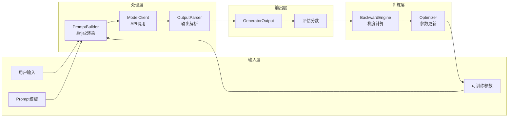

# AdalFlow (原 LightRAG) — 代码逻辑分析报告

## 1. 执行摘要

| 维度 | 内容 |
|------|------|
| **项目名称** | AdalFlow (原 LightRAG) |
| **项目定位** | 一个 PyTorch 风格的库，用于构建和自动优化 LLM 工作流，包括 Chatbot、RAG、Agent 等 |
| **技术栈** | Python 3.9+、Poetry、Jinja2、Pydantic、NumPy、FAISS、OpenAI API 等 |
| **架构模式** | 组件化架构 (Component-based)，类似 PyTorch nn.Module 的层级设计 |
| **代码规模** | 约 187 个 Python 文件，总计约 55,000+ 行代码 |
| **核心入口** | `adalflow/__init__.py` |

> **一句话总结**: AdalFlow 是一个面向 LLM 应用开发的 Python 框架，采用 PyTorch 风格的组件化设计，将 LLM 工作流抽象为可组合、可训练、可自动优化的组件图。其核心创新在于引入了"文本梯度下降"(Textual Gradient Descent)机制，允许通过自动微分来优化提示词(Prompt)和少样本示例(Demonstrations)，无需手动调整提示。框架支持多种模型提供商(OpenAI、Anthropic、Groq 等)、检索器(FAISS、LanceDB 等)和 Agent 模式，提供了完整的训练、评估和追踪能力。

---

## 2. 目录结构解析

```
LightRAG/
├── adalflow/                    # 核心库代码 (package)
│   ├── adalflow/               # 主模块
│   │   ├── core/               # core: 核心抽象层 (Component, Generator, DataClass)
│   │   ├── components/         # core: 功能组件 (Agent, Retriever, ModelClient)
│   │   ├── optim/              # core: 自动优化系统 (Trainer, Parameter, Gradient)
│   │   ├── tracing/            # util: 追踪与可观测性
│   │   ├── eval/               # util: 评估指标
│   │   ├── datasets/           # util: 数据集加载
│   │   ├── utils/              # util: 工具函数
│   │   └── apps/               # other: 应用程序
│   └── tests/                  # test: 单元测试
├── tutorials/                  # docs: 教程示例代码
├── use_cases/                  # docs: 使用案例
├── notebooks/                  # docs: Jupyter 笔记本
├── benchmarks/                 # other: 基准测试
├── docs/                       # docs: 文档源码
└── pyproject.toml              # config: Poetry 依赖配置
```

**关键观察**: 项目采用清晰的分层架构，核心逻辑集中在 `adalflow/core/` 和 `adalflow/components/`，优化系统独立在 `adalflow/optim/` 中。这种设计与 PyTorch 的结构类似，便于用户理解和扩展。

---

## 3. 架构与模块依赖

### 3.1 架构概览

AdalFlow 采用**组件化架构 (Component-based Architecture)**，核心设计哲学借鉴 PyTorch 的 `nn.Module`：

1. **Component 基类**: 所有功能模块的基类，支持层级嵌套、状态管理和序列化
2. **GradComponent**: 支持自动微分的组件，定义了 `forward`/`backward` 接口
3. **Parameter 系统**: 类似 PyTorch 的 Parameter，但用于存储可优化的提示词和示例
4. **Generator**: 核心编排组件，整合 Prompt、ModelClient 和输出处理器
5. **Trainer**: 训练器，支持文本梯度下降和少样本学习的联合优化

### 3.2 模块依赖图



### 3.3 核心模块详解

#### Component 模块

- **路径**: `adalflow/core/component.py`
- **职责**: 所有组件的基类，提供组件树管理、状态序列化、训练/评估模式切换
- **关键文件**:
  - `component.py:1-200` — Component 基类定义
  - `component.py:100-150` — 子组件注册和管理
- **对外暴露**: `Component`, `DataComponent`, `Sequential`, `ComponentList`
- **依赖关系**: 被所有功能组件依赖，是框架的根基

#### Generator 模块

- **路径**: `adalflow/core/generator.py`
- **职责**: LLM 调用的统一接口，编排 Prompt、ModelClient 和输出处理器
- **关键文件**:
  - `generator.py:1-100` — Generator 类定义和初始化
  - `generator.py:100-200` — `call`/`acall` 方法实现
  - `generator.py:200-300` — `forward`/`backward` 自动微分支持
- **对外暴露**: `Generator`, `BackwardEngine`
- **依赖关系**: 依赖 Component、GradComponent、ModelClient、Prompt

#### Agent 模块

- **路径**: `adalflow/components/agent/`
- **职责**: 支持工具调用的智能体实现，包括 ReAct Agent
- **关键文件**:
  - `agent.py` — Agent 组件定义
  - `runner.py` — Agent 执行器，管理运行循环
- **对外暴露**: `Agent`, `Runner`, `ReActAgent`
- **依赖关系**: 依赖 Generator、ToolManager、FunctionTool

#### Retriever 模块

- **路径**: `adalflow/core/retriever.py`, `adalflow/components/retriever/`
- **职责**: 文档检索的抽象接口和具体实现(FAISS、LanceDB)
- **关键文件**:
  - `retriever.py` — Retriever 基类
  - `faiss_retriever.py` — FAISS 实现
- **对外暴露**: `Retriever`, `FAISSRetriever`
- **依赖关系**: 依赖 GradComponent、Embedder

#### 优化系统 (Optim)

- **路径**: `adalflow/optim/`
- **职责**: 自动提示词优化和少样本学习
- **关键文件**:
  - `parameter.py` — Parameter 定义，支持可训练参数
  - `grad_component.py` — GradComponent 基类
  - `trainer/trainer.py` — Trainer 训练器
  - `text_grad/tgd_optimizer.py` — 文本梯度下降优化器
- **对外暴露**: `Trainer`, `Parameter`, `Optimizer`, `TGDOptimizer`, `BootstrapFewShot`
- **依赖关系**: 依赖 Generator、Evaluator

---

## 4. 核心业务流程与数据流

### 4.1 主流程描述

AdalFlow 支持三种主要使用模式：

1. **推理模式 (Inference)**: 直接使用预定义的组件进行 LLM 调用
2. **训练模式 (Training)**: 启用自动微分，优化提示词和少样本示例
3. **Agent 模式**: 使用工具调用和多步推理

**标准推理流程**:
1. 用户创建 Generator/Agent 组件，配置 ModelClient 和 Prompt 模板
2. 调用 `call()` 或 `acall()` 传入输入参数
3. Prompt 使用 Jinja2 模板渲染完整的提示文本
4. ModelClient 调用 LLM API 获取响应
5. 输出处理器解析响应为结构化数据
6. 返回 `GeneratorOutput` 包含输出数据和元信息

**训练流程**:
1. 将 Prompt 中的关键部分标记为 `Parameter` 类型
2. 使用 `AdalComponent` 包装任务管道，定义损失函数
3. `Trainer` 执行训练循环，计算评估分数
4. 对错误样本，BackwardEngine 生成文本梯度反馈
5. `TGDOptimizer` 根据梯度更新 Prompt
6. `BootstrapFewShot` 从正确样本中选择少样本示例

### 4.2 流程图



### 4.3 数据模型

**核心数据类**:

| 数据类 | 用途 | 关键字段 |
|--------|------|----------|
| `GeneratorOutput` | LLM 生成输出 | `data`, `raw_response`, `usage` |
| `Parameter` | 可训练参数 | `data`, `param_type`, `gradients` |
| `Gradient` | 文本梯度 | `context`, `score`, `gradient` |
| `RetrieverOutput` | 检索结果 | `documents`, `query` |
| `EmbedderOutput` | 嵌入结果 | `data` (List[Embedding]) |
| `DataClass` | 数据基类 | 支持序列化、Schema 生成 |

---

## 5. 关键 API 接口与调用链路

### 5.1 API 总览

| 方法 | 路径/接口 | 说明 | 所在文件 |
|------|-----------|------|----------|
| `Generator.__call__` | `generator(prompt_kwargs)` | 同步调用生成器 | `core/generator.py` |
| `Generator.call` | `generator.call(prompt_kwargs)` | 同步推理 | `core/generator.py` |
| `Generator.acall` | `await generator.acall(prompt_kwargs)` | 异步推理 | `core/generator.py` |
| `Agent.__call__` | `agent(prompt_kwargs)` | Agent 同步调用 | `components/agent/agent.py` |
| `Runner.call` | `runner.call(prompt_kwargs)` | Agent 运行器同步调用 | `components/agent/runner.py` |
| `Retriever.call` | `retriever.call(query)` | 检索文档 | `core/retriever.py` |
| `Trainer.fit` | `trainer.fit()` | 开始训练 | `optim/trainer/trainer.py` |
| `Component.train` | `component.train(mode=True)` | 设置训练模式 | `core/component.py` |

### 5.2 核心 API 调用链路分析

#### `Generator.call` 调用链

**调用链**:
```
Generator.call() → Generator._pre_call() → ModelClient.call() → ModelClient.parse_chat_completion() → OutputParser.call()
```

**关键代码片段**:

```python
# core/generator.py:100-200
def call(self, prompt_kwargs: Dict = {}, ...) -> GeneratorOutput:
    """Call the generator with the given prompt kwargs."""
    # 1. 渲染 Prompt
    prompt_str = self._pre_call(prompt_kwargs)
    
    # 2. 准备 API 参数
    api_kwargs = self.model_client.convert_inputs_to_api_kwargs(
        input=prompt_str, model_kwargs=self.model_kwargs, model_type=self.model_type
    )
    
    # 3. 调用模型
    output: GeneratorOutput = self.model_client.call(api_kwargs=api_kwargs, model_type=self.model_type)
    
    # 4. 后处理输出
    if self.output_processors:
        output.data = self.output_processors(output.data)
    
    return output
```

**逻辑说明**: Generator 是核心编排组件，负责协调 Prompt 渲染、模型调用和输出解析三个步骤。在训练模式下，它会调用 `forward()` 方法返回 Parameter 对象以支持自动微分。

#### `Agent` 工具调用链

**调用链**:
```
Runner.call() → Agent._step() → Generator.call() → ToolManager.execute() → ToolOutput
```

**关键代码片段**:

```python
# components/agent/runner.py:100-200
async def _run_step(self, agent: Agent, ...) -> StepOutput:
    """Execute a single step of the agent."""
    # 1. 调用 Generator 获取 LLM 响应
    output: GeneratorOutput = await agent._step(...)
    
    # 2. 解析工具调用
    tool_calls = self._parse_tool_calls(output.data)
    
    # 3. 执行工具
    tool_outputs = []
    for tool_call in tool_calls:
        tool_output = await self._execute_tool(tool_call)
        tool_outputs.append(tool_output)
    
    # 4. 返回步骤输出
    return StepOutput(tool_outputs=tool_outputs, ...)
```

**逻辑说明**: Agent 通过 Runner 管理多步执行循环，支持工具调用、流式输出和错误恢复。每一步都会调用 LLM，解析响应中的工具调用请求，执行工具，并将结果反馈给 LLM。

---

## 6. 算法与关键函数实现

### 6.1 文本梯度下降 (Textual Gradient Descent)

- **位置**: `adalflow/optim/text_grad/tgd_optimizer.py`
- **用途**: 通过 LLM 生成梯度反馈来优化提示词
- **复杂度**: 时间 O(N * L)，其中 N 是样本数，L 是 LLM 调用次数

**核心代码**:

```python
# optim/text_grad/tgd_optimizer.py
class TGDOptimizer(Optimizer):
    """Textual Gradient Descent Optimizer."""
    
    def step(self, parameter: Parameter):
        """Perform one optimization step."""
        # 1. 收集梯度
        gradients = parameter.gradients
        
        # 2. 构建优化上下文
        context = self._build_optimization_context(parameter, gradients)
        
        # 3. 调用 LLM 生成新的提示词
        new_prompt = self.backward_engine(context)
        
        # 4. 更新参数
        parameter.data = new_prompt
```

**逐步解析**:

1. **梯度收集**: 从 Parameter 的 `gradients` 属性中获取所有梯度反馈，每个梯度包含上下文、分数和改进建议
2. **上下文构建**: 将多个梯度聚合成一个统一的优化上下文，包括当前提示词、错误示例和改进方向
3. **LLM 优化**: 使用 BackwardEngine (本质是一个 Generator) 调用 LLM 生成优化后的提示词
4. **参数更新**: 将新生成的提示词赋值给 Parameter 的 `data` 属性

### 6.2 FAISS 向量检索

- **位置**: `adalflow/components/retriever/faiss_retriever.py`
- **用途**: 基于 FAISS 的语义相似度检索
- **复杂度**: 时间 O(log N)，空间 O(N * D)，其中 N 是文档数，D 是向量维度

**核心代码**:

```python
# components/retriever/faiss_retriever.py:150-200
def call(self, input: str, top_k: int = 5) -> RetrieverOutput:
    """Retrieve top-k documents using FAISS."""
    # 1. 将查询转换为向量
    query_embedding = self.embedder(input).data[0].embedding
    query_embedding = np.array(query_embedding).astype('float32')
    
    # 2. FAISS 检索
    distances, indices = self.index.search(query_embedding.reshape(1, -1), top_k)
    
    # 3. 构建输出
    documents = []
    for idx, distance in zip(indices[0], distances[0]):
        if idx != -1:
            doc = self.documents[idx]
            doc.score = self._convert_distance_to_score(distance)
            documents.append(doc)
    
    return RetrieverOutput(documents=documents, query=input)
```

**逐步解析**:

1. **向量编码**: 使用 Embedder 将查询字符串转换为向量表示
2. **FAISS 搜索**: 调用 FAISS 的 `index.search()` 方法进行近似最近邻搜索
3. **结果转换**: 将 FAISS 返回的距离转换为相似度分数，并构建 RetrieverOutput
4. **返回结果**: 返回包含文档列表和查询的 RetrieverOutput 对象

### 6.3 Component 状态管理

- **位置**: `adalflow/core/component.py:50-150`
- **用途**: 管理组件树的状态，支持序列化和反序列化
- **复杂度**: 时间 O(N)，其中 N 是组件树中的组件数量

**核心代码**:

```python
# core/component.py:50-150
class Component:
    """Base class for all LLM task pipeline components."""
    
    def __init__(self):
        self._components = OrderedDict()  # 子组件
        self._parameters = OrderedDict()  # 可训练参数
        self.training = False
        self.teacher_mode = False
    
    def add_component(self, name: str, component: 'Component'):
        """Add a subcomponent."""
        self._components[name] = component
    
    def parameters(self, recurse: bool = True):
        """Get all parameters."""
        for name, param in self._parameters.items():
            yield param
        if recurse:
            for component in self._components.values():
                yield from component.parameters(recurse=True)
    
    def state_dict(self):
        """Get state dictionary for serialization."""
        state = {}
        for name, param in self._parameters.items():
            state[name] = param.data
        for name, component in self._components.items():
            state[name] = component.state_dict()
        return state
```

**逐步解析**:

1. **组件注册**: 使用 `OrderedDict` 存储子组件和参数，保证顺序和可遍历性
2. **递归遍历**: `parameters()` 方法递归遍历组件树，收集所有可训练参数
3. **状态导出**: `state_dict()` 方法递归导出所有组件和参数的状态，支持保存和加载
4. **模式切换**: 支持 `train()`/`eval()` 模式切换，控制是否启用自动微分

---

## 7. 架构评价与建议

### 优势

1. **PyTorch 风格设计**: 对于熟悉 PyTorch 的开发者非常友好，学习成本低
2. **自动提示优化**: 文本梯度下降机制是核心创新，能够自动优化提示词，减少人工调优
3. **模块化设计**: Component 基类设计良好，支持灵活组合和扩展
4. **多模型支持**: 统一 ModelClient 接口，支持 10+ 种 LLM 提供商
5. **完整的训练闭环**: 从数据加载、训练、评估到保存/加载的完整流程
6. **类型安全**: 广泛使用 Pydantic 和类型注解，提高代码可维护性

### 潜在问题

1. **代码复杂度较高**: 约 55,000+ 行代码，对于简单 RAG 场景可能过于复杂
2. **依赖较多**: 核心依赖包括 Jinja2、Pydantic、NumPy、FAISS 等，安装包体积较大
3. **文档与代码同步**: README 仍使用 "LightRAG" 名称，但项目已更名为 "AdalFlow"
4. **异步支持**: 虽然支持 async/await，但部分组件的异步实现可能不够完善
5. **训练成本**: 自动优化需要多次 LLM 调用，对于大规模数据集训练成本较高

### 进一步阅读建议

如果您想深入了解某个模块，建议从以下文件开始：

1. `adalflow/core/component.py:1-100` — Component 基类定义，理解组件生命周期
2. `adalflow/core/generator.py:1-150` — Generator 实现，理解 LLM 调用流程
3. `adalflow/optim/parameter.py:1-100` — Parameter 定义，理解可训练参数机制
4. `adalflow/components/agent/runner.py:1-100` — Agent Runner，理解多步执行流程
5. `adalflow/optim/trainer/trainer.py:1-100` — Trainer 训练器，理解训练循环

---

## 8. 附录：关键论文引用

AdalFlow 基于以下研究工作：

1. **[Auto-Differentiating Any LLM Workflow: A Farewell to Manual Prompting](https://arxiv.org/abs/2501.16673)** (Jan 2025)
   - LLM 应用作为自动微分图
   - Token 高效且性能优于 DSPy

2. **[Scaling Textual Gradients via Sampling-Based Momentum](https://arxiv.org/abs/2506.00400)** (Dec 2025)
   - 使用动量加权文本梯度实现稳定的提示优化
   - Gumbel-Top-k 采样改进探索

3. **[LAD-VF: LLM-Automatic Differentiation Enables Fine-Tuning-Free Robot Planning](https://arxiv.org/pdf/2509.18384)** (Sep 2025)
   - 无需微调的机器人规划
   - 形式化方法反馈集成

---

*报告生成时间: 2026-04-01*
*分析对象: https://github.com/SylphAI-Inc/LightRAG (AdalFlow)*