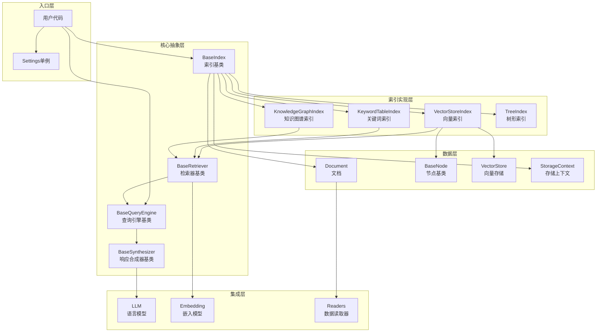
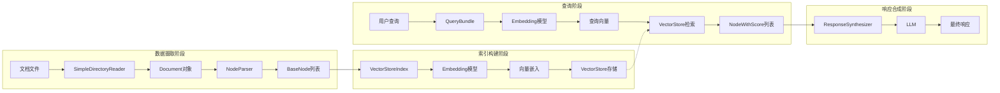
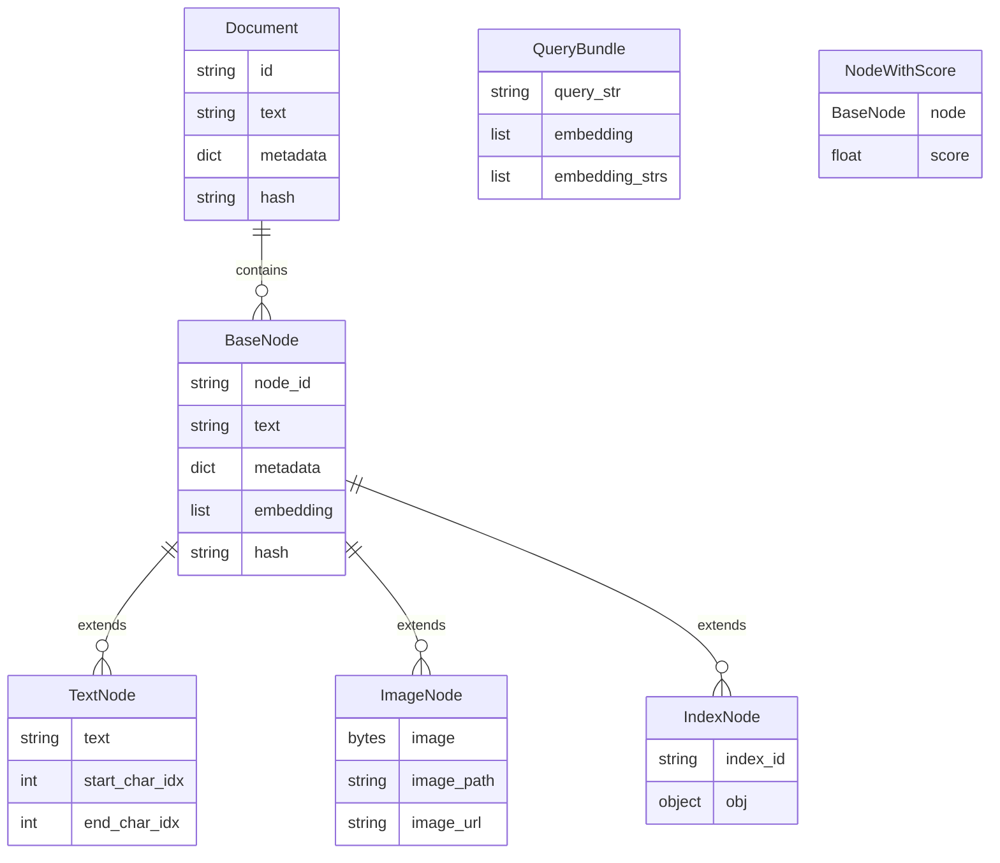

# LlamaIndex — 代码逻辑分析报告

## 1. 执行摘要

| 维度 | 内容 |
|------|------|
| **项目名称** | LlamaIndex (原 GPT Index) |
| **项目定位** | 专门的数据框架，用于构建 LLM 应用，提供数据连接器、索引和查询接口 |
| **技术栈** | Python 3.10+、Pydantic、Poetry、Hatchling、SQLAlchemy、NetworkX、asyncio |
| **架构模式** | 插件化分层架构 + 组件化设计 + 事件驱动回调系统 |
| **代码规模** | ~4,157 个 Python 文件，~10,930 个总文件，核心包约 400+ 文件 |
| **核心入口** | `llama_index/core/__init__.py` |

> **一段话总结**: LlamaIndex 是一个功能强大的 LLM 数据增强框架，采用模块化设计将数据摄取、索引构建、检索和响应生成解耦。核心架构围绕 `BaseIndex`、`BaseRetriever` 和 `BaseQueryEngine` 三大抽象基类展开，支持多种索引类型（向量索引、关键词表、知识图谱等）。框架通过 `Settings` 单例管理全局配置，使用插件化机制支持 300+ 集成，并通过事件回调系统实现可观测性。其设计哲学是"高内聚、低耦合"，既提供开箱即用的高级 API，又允许深度定制每个组件。

---

## 2. 目录结构解析

```
llama_index/
├── llama-index-core/              # 核心框架 (core)
│   ├── llama_index/core/
│   │   ├── agent/                 # 智能体系统 (Agent)
│   │   ├── base/                  # 基础抽象类 (api)
│   │   ├── callbacks/             # 回调与事件系统 (util)
│   │   ├── chat_engine/           # 对话引擎 (core)
│   │   ├── data_structs/          # 数据结构定义 (model)
│   │   ├── embeddings/            # 嵌入模型接口 (core)
│   │   ├── evaluation/            # 评估工具 (util)
│   │   ├── indices/               # 索引实现 (core)
│   │   ├── ingestion/             # 数据摄取管道 (core)
│   │   ├── llms/                  # LLM 接口 (core)
│   │   ├── node_parser/           # 节点解析器 (core)
│   │   ├── prompts/               # 提示词管理 (config)
│   │   ├── query_engine/          # 查询引擎 (core)
│   │   ├── readers/               # 数据读取器 (core)
│   │   ├── response_synthesizers/ # 响应合成器 (core)
│   │   ├── retrievers/            # 检索器 (core)
│   │   ├── schema.py              # 核心数据模型 (model)
│   │   ├── settings.py            # 全局配置 (config)
│   │   ├── storage/               # 存储抽象 (data)
│   │   ├── tools/                 # 工具定义 (core)
│   │   ├── vector_stores/         # 向量存储 (data)
│   │   └── workflow/              # 工作流引擎 (core)
│   └── tests/                     # 单元测试 (test)
├── llama-index-integrations/      # 集成插件包 (integrations)
│   ├── llms/                      # LLM 提供商集成 (160+)
│   ├── embeddings/                # 嵌入模型集成 (68+)
│   ├── vector_stores/             # 向量数据库集成 (80+)
│   ├── readers/                   # 数据读取器集成 (160+)
│   └── ...
├── llama-index-cli/               # 命令行工具 (tools)
├── llama-index-packs/             # 预配置工作流包 (packs)
├── llama-index-utils/             # 工具函数 (util)
├── docs/                          # 文档 (docs)
└── scripts/                       # 构建脚本 (scripts)
```

**关键观察**: 项目采用**多包 monorepo**结构，核心逻辑集中在 `llama-index-core`，而具体集成（LLM、向量存储等）分散在 `llama-index-integrations` 下的独立包中。这种设计实现了关注点分离，用户可按需安装依赖。

---

## 3. 架构与模块依赖

### 3.1 架构概览

LlamaIndex 采用**分层架构 + 组件化设计**，核心分为四层：

1. **接口层 (API Layer)**: `BaseIndex`、`BaseRetriever`、`BaseQueryEngine` 等抽象基类定义统一契约
2. **核心层 (Core Layer)**: 各种索引类型（VectorStoreIndex、KeywordTableIndex 等）的具体实现
3. **数据层 (Data Layer)**: Document、Node、VectorStore、StorageContext 等数据模型
4. **集成层 (Integration Layer)**: LLM、Embedding、VectorStore 等外部服务的适配器

框架通过 **Settings 单例** 管理全局配置，通过 **CallbackManager** 实现事件驱动，通过 **Pydantic** 实现配置验证和序列化。

### 3.2 模块依赖图



### 3.3 核心模块详解

#### BaseIndex (索引基类)

- **路径**: `llama_index/core/indices/base.py`
- **职责**: 定义所有索引类型的通用接口，包括文档插入、索引构建、持久化等
- **关键方法**:
  - `from_documents()` — 从文档构建索引
  - `insert_nodes()` — 插入节点
  - `as_retriever()` — 转换为检索器
  - `as_query_engine()` — 转换为查询引擎
- **依赖关系**: 依赖 `StorageContext`、`Document`、`BaseNode`，被具体索引类继承

#### VectorStoreIndex (向量索引)

- **路径**: `llama_index/core/indices/vector_store/base.py`
- **职责**: 基于向量存储的索引实现，支持语义检索
- **关键特性**:
  - 支持异步操作 (`use_async`)
  - 支持批量插入 (`insert_batch_size`)
  - 自动嵌入计算和缓存
- **对外暴露**: `from_vector_store()`、`as_retriever()` 等

#### BaseRetriever (检索器基类)

- **路径**: `llama_index/core/base/base_retriever.py`
- **职责**: 定义检索接口，支持递归检索和对象映射
- **关键方法**:
  - `retrieve()` — 检索节点
  - `_handle_recursive_retrieval()` — 递归检索处理
- **依赖关系**: 依赖 `QueryBundle`、`NodeWithScore`

#### RetrieverQueryEngine (检索查询引擎)

- **路径**: `llama_index/core/query_engine/retriever_query_engine.py`
- **职责**: 将检索器和响应合成器组合，实现完整 RAG 流程
- **关键流程**: `query()` → `retrieve()` → `synthesize()` → `Response`

---

## 4. 核心业务流程与数据流

### 4.1 主流程描述

LlamaIndex 的核心业务流程是 **RAG (Retrieval-Augmented Generation)** 流程：

1. **数据摄取**: 通过 `SimpleDirectoryReader` 等读取器加载文档，经过 `IngestionPipeline` 转换为节点
2. **索引构建**: 将节点添加到索引（如 `VectorStoreIndex`），计算嵌入并存储到向量存储
3. **查询处理**: 用户查询经过嵌入模型转换为向量，从向量存储检索相似节点
4. **响应生成**: 检索到的节点作为上下文，通过 LLM 生成最终响应

### 4.2 流程图



### 4.3 数据模型

核心数据模型关系如下：



---

## 5. 关键 API 接口与调用链路

### 5.1 API 总览

| 方法 | 路径/接口 | 说明 | 所在文件 |
|------|-----------|------|----------|
| `VectorStoreIndex.from
