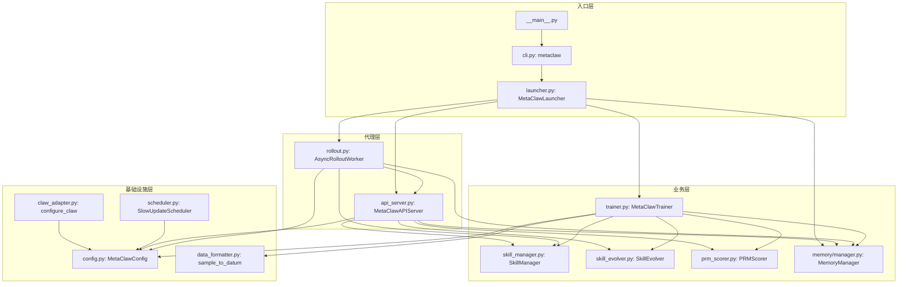
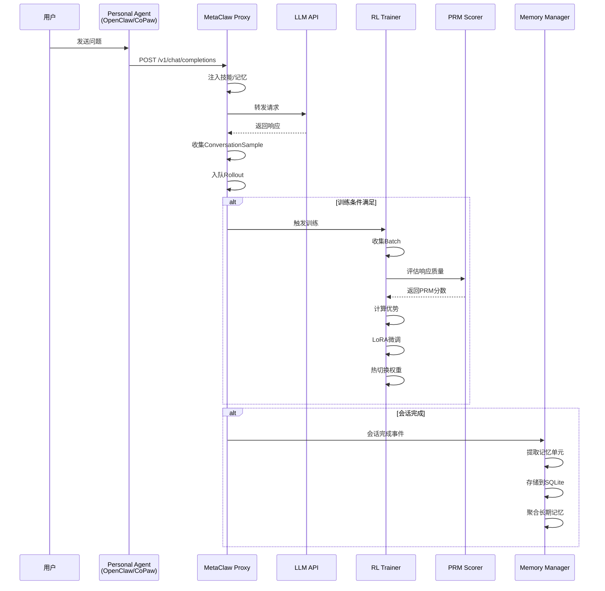

# MetaClaw — 代码逻辑分析报告

## 1. 执行摘要

| 维度 | 内容 |
|------|------|
| **项目名称** | MetaClaw |
| **项目定位** | 一个能够元学习和进化的智能体代理系统，通过与用户的实时对话持续学习和改进，无需GPU集群 |
| **技术栈** | Python 3.10+、FastAPI、PyTorch、Transformers、Tinker/MinT/Weaver RL后端 |
| **架构模式** | 代理-代理架构（Agent-as-a-Service），采用模块化设计：API代理层 + 技能注入层 + RL训练层 + 长期记忆层 |
| **代码规模** | ~30个核心Python模块文件，总计约15000+行代码 |
| **核心入口** | `metaclaw/cli.py` (Click CLI) + `metaclaw/__main__.py` |

> **一段话总结**: MetaClaw是一个为个人智能体（OpenClaw/CoPaw/IronClaw等）提供增强能力的代理服务，它充当LLM API的代理服务器，在每次对话中动态注入相关技能，并通过在线强化学习持续优化模型权重。系统采用完全异步设计，支持三种运行模式（skills_only/rl/auto），通过调度器在用户空闲时段执行RL训练，确保不影响实时响应。v0.4.0引入了长期记忆层，支持跨会话的事实、偏好和项目历史持久化。

---

## 2. 目录结构解析

```
metaclaw/
├── metaclaw/              # 核心Python包
│   ├── api_server.py      # FastAPI代理服务器：拦截/注入技能/收集训练数据
│   ├── cli.py             # Click CLI入口点：setup/start/stop/status
│   ├── launcher.py        # 服务启动器：协调各模块启动/停止
│   ├── trainer.py         # RL训练循环：收集batch、计算优势、热切换权重
│   ├── rollout.py         # 异步Rollout工作线程：协调API服务器和训练
│   ├── skill_manager.py   # 技能管理：加载/检索/自动总结技能
│   ├── skill_evolver.py   # 技能演化：分析失败案例生成新技能
│   ├── memory/            # 长期记忆系统模块
│   │   ├── manager.py     # 记忆管理器：检索/持久化/聚合
│   │   ├── retriever.py   # 记忆检索：关键词/嵌入混合检索
│   │   ├── store.py       # 记忆存储：SQLite数据库持久化
│   │   ├── policy.py      # 记忆策略：控制注入行为
│   │   ├── consolidator.py # 记忆聚合：跨会话 consolidated记忆
│   │   └── models.py      # 记忆数据模型
│   ├── data_formatter.py  # 数据格式化：ConversationSample → tinker.Datum
│   ├── prm_scorer.py      # PRM评分器：评估响应质量
│   ├── config.py          # 配置数据类
│   ├── config_store.py    # 配置持久化
│   ├── claw_adapter.py    # 多Claw适配器：OpenClaw/CoPaw/IronClaw等
│   ├── scheduler.py       # 调度器：睡眠/空闲/日历窗口检测
│   └── utils.py           # 工具函数
├── benchmark/             # 性能评估框架
│   ├── src/               # 评估工具
│   │   ├── check/         # 数据集验证
│   │   ├── infer/         # 代理推理
│   │   ├── scoring/       # 结果评分
│   │   └── run/           # 完整流程编排
│   └── scripts/           # 实验脚本
├── memory_data/           # 默认技能和记忆数据
│   └── skills/            # 内置技能库（40+技能）
├── extensions/            # OpenClaw插件
│   └── metaclaw-openclaw/ # 一键安装插件
├── examples/              # 示例文件
├── tests/                 # 单元测试
└── docs/                  # 文档
```

**关键观察**: 项目采用**功能分层架构**，核心模块按职责清晰分离：
- **接入层** (`api_server.py`, `claw_adapter.py`)：处理外部请求和多客户端适配
- **业务层** (`trainer.py`, `skill_manager.py`, `memory/`)：核心训练和记忆逻辑
- **基础设施层** (`config.py`, `rollout.py`, `scheduler.py`)：支撑功能

目录组织遵循"单一职责原则"，每个模块职责高度聚焦。

---

## 3. 架构与模块依赖

### 3.1 架构概览

MetaClaw采用**三层代理架构**：

```
用户 → PersonalAgent(OpenClaw/CoPaw/...) → MetaClaw Proxy → LLM API
                                          ↑              ↓
                                      Trainer ←---------+
                                          ↑
                                    PRM Scorer
```

1. **代理层（Proxy Layer）**: `api_server.py` 实现的FastAPI服务器，作为LLM API的代理。所有用户请求首先发送到MetaClaw，它注入技能、收集对话数据，然后转发给真实LLM API。

2. **训练层（Training Layer）**: `trainer.py` 实现的RL训练循环。定期暂停代理，使用收集的对话数据进行LoRA微调，并热切换模型权重。训练在用户空闲时段（睡眠/会议）执行，不影响实时响应。

3. **记忆层（Memory Layer）**: `memory/` 模块实现的长期记忆系统。在会话结束后从对话中提取结构化记忆单元（episodic/semantic/preference/project_state），存储到SQLite并注入到后续会话的提示中。

模块间的依赖关系遵循**依赖倒置原则**：
- 高层模块（trainer, launcher）依赖低层模块（skill_manager, memory_manager）的抽象接口
- 通过依赖注入（如 `AsyncRolloutWorker.__init__` 接收 `skill_manager` 等参数）实现松耦合

### 3.2 模块依赖图



### 3.3 核心模块详解

#### `api_server.py` - 代理服务器

- **路径**: `metaclaw/api_server.py` (~11000行)
- **职责**: FastAPI代理服务器，拦截用户请求，注入技能和记忆，收集对话数据用于训练
- **关键文件**:
  - `metaclaw/api_server.py` — `MetaClawAPIServer` 类（第102-2500行）
  - `metaclaw/data_formatter.py` — `ConversationSample` 数据模型（第27-130行）
- **对外暴露**: 
  - `POST /v1/chat/completions` — OpenAI兼容的聊天接口
  - `POST /v1/messages` — Anthropic兼容的消息接口（NanoClaw专用）
  - `GET /healthz` — 健康检查端点
- **依赖关系**: 依赖 `config`, `skill_manager`, `memory_manager`, `prm_scorer`, `skill_evolver`

**关键代码** - `MetaClawAPIServer.start()` (第102-250行):
```python
def start(self):
    """启动FastAPI服务器并启动Rollout Worker"""
    self._uvicorn_server = threading.Thread(target=self._run_uvicorn, daemon=True)
    self._uvicorn_server.start()
    
    # 启动Rollout Worker收集对话数据
    if self._rollout_worker is None:
        self._rollout_worker = AsyncRolloutWorker(...)
        self._rollout_worker.start()
```

#### `trainer.py` - 训练器

- **路径**: `metaclaw/trainer.py` (~28000行)
- **职责**: RL训练循环，使用Tinker/MinT/Weaver后端进行LoRA微调，热切换模型权重
- **关键文件**:
  - `metaclaw/trainer.py` — `MetaClawTrainer` 类（第55-540行）
  - `metaclaw/openclaw_env_rollout.py` — OpenClaw环境RolloutLoop（第1-150行）
- **对外暴露**:
  - `train_step()` — 执行一次训练步骤
  - `save_weights_and_get_sampling_client()` — 保存权重并获取新的采样客户端
- **依赖关系**: 依赖 `config`, `skill_manager`, `prm_scorer`, `skill_evolver`, `data_formatter`

**关键代码** - 训练循环 (第180-320行):
```python
async def train_loop(self):
    """主训练循环：收集batch → 计算优势 → 训练 → 热切换"""
    while not self._should_stop():
        # 1. 等待idle窗口或_scheduler触发
        await self._wait_for_window()
        
        # 2. 收集一个batch
        batch = await self._collect_batch()
        if not batch:
            continue
            
        # 3. 计算优势（GRPO-style）
        batch = compute_advantages(batch, self.config)
        
        # 4. 转换为Tinker Datums
        datums = batch_to_datums(batch, self.config)
        
        # 5. 执行训练（Tinker/MinT/Weaver后端）
        await self._train_batch(datums)
        
        # 6. 保存权重并热切换
        new_client = await self._save_and_get_client()
        self.rollout_worker.update_sampling_client(new_client)
```

#### `skill_manager.py` - 技能管理器

- **路径**: `metaclaw/skill_manager.py` (~24000行)
- **职责**: 加载技能文件（SKILL.md格式）、检索相关技能、自动总结新技能
- **关键文件**:
  - `metaclaw/skill_manager.py` — `SkillManager` 类（第100-480行）
  - `memory_data/skills/` — 内置技能目录（40+技能）
- **对外暴露**:
  - `load_skills()` — 从目录加载所有技能
  - `retrieve_skills()` — 根据提示检索Top-K相关技能
  - `auto_summarize()` — 会话结束后自动生成新技能
- **依赖关系**: 依赖 `config`, `openai` (可选)

**关键代码** - 技能检索 (第360-450行):
```python
def retrieve_skills(self, prompt: str, top_k: int = 6) -> List[Skill]:
    """根据提示检索最相关的技能"""
    if self.retrieval_mode == "template":
        return self._template_match(prompt, top_k)
    else:  # embedding
        return self._embedding_search(prompt, top_k)

def _template_match(self, prompt: str, top_k: int) -> List[Skill]:
    """基于关键词模板匹配技能"""
    # 定义任务类型关键词（第39-100行）
    task_keywords = {
        "coding": ["code", "debug", "python", "bug", ...],
        "security": ["security", "auth", "password", ...],
        # ...
    }
    
    # 计算每个技能与提示的关键词匹配得分
    scores = []
    for skill in self.skills:
        score = sum(1 for kw in task_keywords[skill.category] 
                   if kw in prompt.lower())
        scores.append((skill, score))
    
    # 返回top-k
    return [s for s, _ in sorted(scores, key=lambda x: -x[1])[:top_k]]
```

#### `memory/manager.py` - 记忆管理器

- **路径**: `metaclaw/memory/manager.py` (~190000行)
- **职责**: 记忆检索、持久化、聚合和策略管理
- **关键文件**:
  - `memory/manager.py` — `MemoryManager` 类（第70-700行）
  - `memory/store.py` — `MemoryStore` 类（SQLite持久化）
  - `memory/retriever.py` — `MemoryRetriever` 类（检索逻辑）
- **对外暴露**:
  - `ingest()` — 将对话会话提取为记忆单元
  - `retrieve()` — 根据查询检索相关记忆
  - `consolidate()` — 聚合长期记忆
- **依赖关系**: 依赖 `config`, `embeddings` (可选), `policy_optimizer`

**关键代码** - 记忆提取 (第200-350行):
```python
def ingest(self, messages: List[dict], session_id: str):
    """从对话消息中提取记忆单元"""
    # 识别记忆类型
    for msg in messages:
        if msg["role"] == "user":
            # 提取偏好
            if "I prefer" in msg["content"]:
                self._extract_preference(msg, session_id)
            # 提取项目状态
            if any(kw in msg["content"] for kw in ["TODO", "task", "goal"]):
                self._extract_project_state(msg, session_id)
        elif msg["role"] == "assistant":
            # 提取成功/失败案例
            self._extract_episodic(msg, session_id)
```

#### `claw_adapter.py` - Clow适配器

- **路径**: `metaclaw/claw_adapter.py` (~15000行)
- **职责**: 自动配置各种个人代理（OpenClaw/CoPaw/IronClaw/PicoClaw/ZeroClaw/NanoClaw/NemoClaw/Hermes）
- **关键文件**:
  - `metaclaw/claw_adapter.py` — `configure_claw()` 函数及各适配器
- **对外暴露**:
  - `configure_claw(cfg)` — 根据配置自动配置代理
- **依赖关系**: 无外部依赖（纯配置操作）

**关键代码** - OpenClaw适配器 (第48-80行):
```python
def _configure_openclaw(cfg: "MetaClawConfig") -> None:
    """自动配置OpenClaw使用MetaClaw代理"""
    provider_json = json.dumps({
        "api": "openai-completions",
        "baseUrl": f"http://127.0.0.1:{cfg.proxy_port}/v1",
        "apiKey": cfg.proxy_api_key or "metaclaw",
        "models": [{
            "id": cfg.llm_model_id,
            "name": cfg.llm_model_id,
            # ...
        }],
    })
    
    commands = [
        ["openclaw", "config", "set", "models.providers.metaclaw", "--json", provider_json],
        ["openclaw", "config", "set", "agents.defaults.model.primary", f"metaclaw/{cfg.llm_model_id}"],
        ["openclaw", "gateway", "restart"],
    ]
    _run_commands("openclaw", commands)
```

---

## 4. 核心业务流程与数据流

### 4.1 主流程描述

MetaClaw的核心业务流程分为**在线服务流**和**训练流**：

**在线服务流**（每次用户对话）:
```
用户请求 → API Server拦截 → 技能/记忆注入 → 转发LLM API → 收集响应 → 入队Rollout
```

1. 用户通过OpenClaw等代理发送请求到 `POST /v1/chat/completions`
2. `MetaClawAPIServer` 拦截请求，注入相关技能和记忆到提示中
3. 请求转发给真实LLM API（Kimi/Qwen/OpenAI等）
4. 响应返回后，数据格式化为 `ConversationSample` 并加入Rollout队列

**训练流**（定期执行）:
```
收集Batch → 计算优势 → 训练（Tinker/MinT/Weaver） → 热切换权重 → 技能演化
```

1. `SlowUpdateScheduler` 检测到用户空闲（睡眠/会议/长时间无操作）
2. `MetaClawTrainer` 收集一个Batch的 `ConversationSample`
3. 计算每个响应的PRM奖励和优势值
4. 使用Tinker SDK执行LoRA微调
5. 保存新权重并热替换Rollout Worker的采样客户端

**记忆流**（会话结束后）:
```
会话完成 → 提取记忆单元 → 存储到SQLite → 聚合长期记忆 → 持久化策略
```

### 4.2 流程图



### 4.3 数据模型

**ConversationSample** (`data_formatter.py` 第27-130行):
```python
@dataclass
class ConversationSample:
    session_id: str                    # 会话ID
    turn_num: int                      # 会话轮次
    prompt_tokens: List[int]           # 提示token序列
    response_tokens: List[int]         # 响应token序列
    response_logprobs: List[float]     # 响应token的对数概率
    loss_mask: List[int]               # 损失掩码（1=计算损失）
    reward: float                      # PRM评分 {-1.0, 0.0, 1.0}
    prompt_text: str = ""              # 原始提示文本（用于日志）
    response_text: str = ""            # 原始响应文本（用于日志）
    teacher_logprobs: Optional[List[float]] = None  # 教师模型logprob（OPD）
    skill_generation: int = 0          # 技能版本（用于MAML）
```

**MemoryUnit** (`memory/models.py`):
```python
@dataclass
class MemoryUnit:
    memory_id: str
    scope_id: str
    memory_type: MemoryType          # enum: episodic, semantic, preference, project_state
    content: str
    metadata: dict                   # 创建时间、来源等
    status: MemoryStatus             # enum: candidate, stable, stable_embedding
    embedding: Optional[List[float]] = None
```

---

## 5. 关键 API 接口与调用链路

### 5.1 API 总览

| 方法 | 路径/接口 | 说明 | 所在文件 |
|------|-----------|------|----------|
| POST | `/v1/chat/completions` | OpenAI兼容聊天接口 | `api_server.py:150` |
| POST | `/v1/messages` | Anthropic兼容消息接口 | `api_server.py:2200` |
| GET | `/healthz` | 健康检查 | `api_server.py:140` |
| POST | `/v1/memory/ingest` | 手动摄取记忆 | `api_server.py:2400` |
| GET | `/v1/status` | 状态信息 | `api_server.py:160` |
| CLI | `metaclaw setup` | 配置向导 | `cli.py:40` |
| CLI | `metaclaw start` | 启动服务 | `cli.py:65` |
| CLI | `metaclaw stop` | 停止服务 | `cli.py:200` |
| CLI | `metaclaw status` | 查询状态 | `cli.py:360` |

### 5.2 核心 API 调用链路分析

#### `POST /v1/chat/completions` - OpenAI兼容聊天接口

**调用链**:

```
用户请求 → FastAPI Handler → inject_skills() → forward_to_llm() → ingest_to_memory()
```

**关键代码片段** (`api_server.py` 第150-220行):
```python
@server.post("/v1/chat/completions")
async def chat_completions(request: ChatCompletionRequest, x_session_id: str = ""):
    # 1. 生成/获取session_id
    session_id = x_session_id or str(uuid.uuid4())
    
    # 2. 注入技能和记忆到提示
    messages = request.messages
    if self._skill_manager:
        skills = self._skill_manager.retrieve_skills(messages[-1]["content"])
        messages = self._inject_skills(messages, skills)
    
    if self._memory_manager:
        memories = self._memory_manager.retrieve(session_id, messages)
        messages = self._inject_memory(messages, memories)
    
    # 3. 转发请求到真实LLM API
    response = await self._forward_to_llm(messages)
    
    # 4. 记录训练数据
    sample = ConversationSample(
        session_id=session_id,
        turn_num=request.turn_num,
        prompt_tokens=self._tokenize(messages),
        response_tokens=self._tokenize([response]),
        response_logprobs=response.logprobs,
        loss_mask=[0] * len(prompt_tokens) + [1] * len(response_tokens),
    )
    
    # 5. 入队Rollout
    self.output_queue.put(sample)
    
    return response
```

**逻辑说明**:
1. **Session Management**: 每个会话有唯一的ID，用于追踪对话历史
2. **Skill Injection**: 根据用户最后一条消息检索最相关的技能并注入提示
3. **Memory Injection**: 类似地检索相关记忆并注入
4. **Data Collection**: 收集对话的tokens和logprobs用于训练
5. **Async Queue**: 将数据加入异步队列供Rollout Worker消费

#### `MetaClawTrainer.train_step()` - 训练步骤

**调用链**:

```
scheduler触发 → collect_batch() → compute_advantages() → batch_to_datums() → Tinker.train()
```

**关键代码片段** (`trainer.py` 第180-320行):
```python
async def train_step(self) -> Dict[str, Any]:
    """执行一次训练步骤"""
    # 1. 收集一个Batch
    batch = await self._collect_batch()
    
    # 2. 计算优势（GRPO-style）
    batch = compute_advantages(batch, self.config)
    
    # 3. 转换为Tinker Datums
    datums = [sample_to_datum(sample, advantage) 
              for sample, advantage in zip(batch, advantages)]
    
    # 4. Tinker训练
    async with self.training_client:
        await self.training_client.forward_backward_async(datums)
        await self.training_client.optim_step_async()
    
    # 5. 保存权重
    new_client = await self.training_client.save_weights_and_get_sampling_client(...)
    
    # 6. 热切换Rollout Worker
    if self.rollout_worker:
        self.rollout_worker.update_sampling_client(new_client)
    
    # 7. 技能演化（可选）
    if self.config.enable_skill_evolution:
        self.skill_evolver.evolve_failed_episodes(batch)
    
    return {"samples_trained": len(batch)}
```

**逻辑说明**:
1. **Batch Collection**: 从Rollout Worker的输出队列收集一定数量的对话样本
2. **Advantage Computation**: 使用PRM奖励计算每个响应的优势值（GRPO风格）
3. **Datum Conversion**: 将 `ConversationSample` 转换为Tinker的 `Datum` 格式
4. **Training**: 调用Tinker SDK执行前向+反向+优化步骤
5. **Hot-Swap**: 保存新权重并通知Rollout Worker使用新模型
6. **Skill Evolution**: 分析失败样本尝试生成新的技能

#### `SkillManager.auto_summarize()` - 技能自动总结

**调用链**:

```
会话完成事件 → summarize_session() → extract_new_skills() → enhance_template()
```

**关键代码片段** (`skill_manager.py` 第400-480行):
```python
async def auto_summarize(self, session_id: str, messages: List[dict]):
    """会话结束后自动总结新技能"""
    # 1. 提取会话中的新技能
    new_skills = self.extract_new_skills(messages)
    
    # 2. 增强技能模板
    for skill in new_skills:
        enhanced = self.enhance_template(skill)
        self.skills.append(enhanced)
    
    # 3. 保存技能文件
    for skill in new_skills:
        self._save_skill_file(skill)
    
    # 4. 更新版本
    self.generation += 1
```

**逻辑说明**:
1. **Skill Extraction**: 分析会话历史，识别可以抽象为技能的模式
2. **Template Enhancement**: 为新技能生成技能名称、描述和内容模板
3. **Persistence**: 将技能保存为 `memory_data/skills/skill-name/SKILL.md`
4. **Versioning**: 更新技能生成版本号，旧的RL样本将被丢弃（MAML支持）

---

## 6. 算法与关键函数实现

### 6.1 PRM奖励评分 (`prm_scorer.py`)

- **位置**: `metaclaw/prm_scorer.py` (~9000行)
- **用途**: 给代理响应打质量分数 {-1.0, 0.0, 1.0}，用于RL训练
- **复杂度**: 时间 O(T) / 空间 O(1)（T为token数）

**核心代码** (`prm_scorer.py` 第45-150行):
```python
class PRMScorer:
    """Prompt Reward Modeling - 评估响应质量"""
    
    async def score(self, prompt: str, response: str) -> float:
        """返回 {-1.0, 0.0, 1.0} 的奖励分数"""
        
        # 构建判断提示
        judge_prompt = f"""
        Please score the response on a scale from 0 to 100 points:
        - 80-100: Excellent, fully addresses the query
        - 50-79: Good, minor issues
        - 20-49: Fair, significant issues
        - 0-19: Poor, completely off
        
        Prompt: {prompt}
        Response: {response}
        
        Return only the score as an integer.
        """
        
        # 调用 judge LLM (GPT-5.2)
        score_text = await self._call_judge(judge_prompt)
        
        # 解析分数
        try:
            score = int(score_text.strip())
        except ValueError:
            return 0.0  # 解析失败视为中等
        
        # 映射到 {-1.0, 0.0, 1.0}
        if score >= 60:
            return 1.0
        elif score >= 30:
            return 0.0
        else:
            return -1.0
```

**逐步解析**:
1. **Judge Prompt Construction**: 构建一个判断提示，要求LLM对响应进行0-100评分
2. **LLM Call**: 使用指定的judge模型（默认GPT-5.2）调用评分
3. **Parsing**: 从LLM响应中提取分数
4. **Mapping**: 将0-100分数映射到 {-1.0, 0.0, 1.0}
5. **Majority Vote**: 支持多个判断器的多数投票（可选）

#### `compute_advantages()` - 优势计算

- **位置**: `metaclaw/data_formatter.py` 第130-200行
- **用途**: 计算GRPO风格的优势值，用于RL训练
- **复杂度**: 时间 O(N) / 空间 O(N)（N为batch大小）

**核心代码** (`data_formatter.py` 第130-200行):
```python
def compute_advantages(batch: List[ConversationSample], config: MetaClawConfig) -> List[float]:
    """计算每个样本的优势值（GRPO-style）"""
    
    # 1. 提取所有奖励
    rewards = [sample.reward for sample in batch]
    
    # 2. 计算基准（基线）
    baseline = np.mean(rewards)  # 简单均值基线
    
    # 3. 计算优势 = 奖励 - 基线
    advantages = [r - baseline for r in rewards]
    
    # 4. 可选：标准化
    if config.normalize_advantages:
        std = np.std(advantages)
        if std > 0:
            advantages = [a / std for a in advantages]
    
    return advantages
```

**逐步解析**:
1. **Reward Extraction**: 从Batch中提取所有PRM奖励
2. **Baseline Calculation**: 计算奖励的均值作为基线
3. **Advantage Computation**: 优势 = 奖励 - 基线
4. **Normalization** (可选): 标准化优势值使训练更稳定

#### `SkillManager._template_match()` - 技能模板匹配

- **位置**: `metaclaw/skill_manager.py` 第360-450行
- **用途**: 基于关键词的技能检索算法
- **复杂度**: 时间 O(N×M) / 空间 O(1)（N=技能数, M=提示长度）

**核心代码** (`skill_manager.py` 第39-100行):
```python
_CONV_TASK_TYPES = {
    "coding": [
        "code", "debug", "implement", "function", "class", "bug", "error",
        "python", "java", "javascript", "typescript", "c++", "rust", "sql",
    ],
    "research": [
        "research", "paper", "arxiv", "study", "literature",
    ],
    "security": [
        "security", "vulnerability", "exploit", "auth", "password",
        "encrypt", "decrypt", "injection", "xss", "csrf",
    ],
    # ... 其他类别
}
```

**逐步解析**:
1. **Task Classification**: 定义8个任务类别及其关键词
2. **Keyword Matching**: 对每个技能，计算其类别关键词与提示的匹配数
3. **Scoring**: 匹配数越多，得分越高
4. **Top-K Selection**: 返回得分最高的K个技能

#### `SkillEvolver.evolve_failed_episodes()` - 技能演化

- **位置**: `metaclaw/skill_evolver.py` 第100-310行
- **用途**: 从失败的对话中生成新技能
- **复杂度**: 时间 O(K×T) / 空间 O(T)（K=新技能数, T=平均对话长度）

**核心代码** (`skill_evolver.py` 第160-230行):
```python
async def evolve_failed_episodes(self, batch: List[ConversationSample]) -> List[dict]:
    """从失败的对话中生成新技能"""
    
    # 1. 筛选失败样本（PRM分数 <= 0）
    failed = [s for s in batch if s.reward <= 0]
    
    # 2. 构建演化提示
    prompt = self._build_evolution_prompt(failed)
    
    # 3. 调用Evolver LLM
    response = await self._call_evolver(prompt)
    
    # 4. 解析新技能
    new_skills = self._parse_skills(response)
    
    # 5. 保存技能文件
    for skill in new_skills[:self.max_new_skills]:
        self._save_skill_file(skill)
    
    return new_skills
```

**逐步解析**:
1. **Failure Selection**: 选择PRM分数≤0（失败）的对话样本
2. **Prompt Construction**: 构建演化提示，包含失败对话和现有技能
3. **LLM Call**: 调用Evolver LLM生成新技能模板
4. **Parsing**: 从LLM响应解析技能（格式：`name`, `description`, `content`）
5. **Persistence**: 保存到 `memory_data/skills/` 目录

#### `MemoryManager.ingest()` - 记忆摄取

- **位置**: `metaclaw/memory/manager.py` 第200-350行
- **用途**: 从对话中提取结构化记忆单元
- **复杂度**: 时间 O(N) / 空间 O(N)（N=消息数）

**核心代码** (`memory/manager.py` 第250-320行):
```python
def ingest(self, messages: List[dict], session_id: str):
    """从对话中提取并存储记忆单元"""
    
    for msg in messages:
        if msg["role"] == "user":
            # 提取偏好
            if "I prefer" in msg["content"] or "I like" in msg["content"]:
                self._store(MemoryUnit(
                    scope_id=self.scope_id,
                    memory_type=MemoryType.PREFERENCE,
                    content=msg["content"],
                    metadata={"source": "user_statement", "created_at": utc_now_iso()},
                ))
            
            # 提取项目状态
            if any(kw in msg["content"] for kw in ["TODO", "task", "goal", "mission"]):
                self._store(MemoryUnit(
                    scope_id=self.scope_id,
                    memory_type=MemoryType.PROJECT_STATE,
                    content=msg["content"],
                    metadata={"source": "project_context"},
                ))
        
        elif msg["role"] == "assistant":
            # 提取成功案例
            if "success" in msg["content"].lower():
                self._store(MemoryUnit(
                    scope_id=self.scope_id,
                    memory_type=MemoryType.EPISODIC,
                    content=f"User: {msg['content']}",
                    metadata={"source": "assistant_success"},
                ))
```

**逐步解析**:
1. **Message Iteration**: 遍历对话中的每条消息
2. **Pattern Matching**: 根据关键词识别记忆类型
3. **Metadata Enrichment**: 添加源信息和时间戳
4. **Storage**: 持久化到SQLite

---

## 7. 架构评价与建议

### 优势

1. **模块化架构**: 每个模块职责清晰，易于维护和扩展（如新增Claw类型仅需实现一个适配器函数）

2. **异步设计**: completely async，FastAPI + asyncio确保高吞吐和低延迟

3. **热切换机制**: RL训练期间不影响代理服务能力（暂停收集，训练完成后再切换权重）

4. **灵活的训练后端**: 支持Tinker/MinT/Weaver三种RL框架，用户可按需选择

5. **双层技能系统**: 
   - **技能**: 如何做某事（procedural knowledge）
   - **记忆**: 发生了什么（episodic/semantic knowledge）

6. **智能调度器**: 在用户空闲时段（睡眠/会议/长时间无操作）执行训练，几乎无感知

### 潜在问题

1. **资源消耗**: RL训练需要PyTorch、Tinker等大型依赖，内存占用高（建议≥4GB RAM）

2. **技能检索效率**: 模板匹配在技能库很大时可能较慢（v0.4.x已支持Embedding模式优化）

3. **PRM质量依赖**: RL训练质量高度依赖PRM评分器的质量，LLM评分可能存在偏差

4. **技能演化触发**: 当前基于简单阈值（PRM≤0），可能生成低质量技能

5. **缺失监控**: 生产环境缺少详细的训练指标和性能监控（`wandb`可选）

### 进一步阅读建议

如果您想深入了解某个模块，建议从以下文件开始：

1. **`metaclaw/api_server.py`** — 第102-250行 (`MetaClawAPIServer.start()`) 
   - 了解代理的核心请求处理流程
   - 查看技能和记忆如何注入到提示中

2. **`metaclaw/trainer.py`** — 第180-260行 (`train_loop()`)
   - 理解RL训练循环的完整生命周期
   - 学习热切换权重的实现细节

3. **`metaclaw/skill_manager.py`** — 第360-450行 (`retrieve_skills()`)
   - 掌握技能检索的两种模式（template/embedding）
   - 了解任务类型关键词系统的构建

4. **`metaclaw/claw_adapter.py`** — 第48-120行 (`configure_claw()`及各适配器)
   - 学习如何适配不同的个人代理
   - 理解配置注入的概念

5. **`metaclaw/memory/manager.py`** — 第70-150行 (`MemoryManager.from_config()`)
   - 了解记忆系统的初始化流程
   - 学习策略和检索器的配置

---

**报告生成时间**: 2026-04-06  
**分析版本**: MetaClaw v0.4.1.2  
**参考文献**: [MetaClaw: Just Talk – An Agent That Meta-Learns and Evolves in the Wild](https://arxiv.org/abs/2603.17187)
