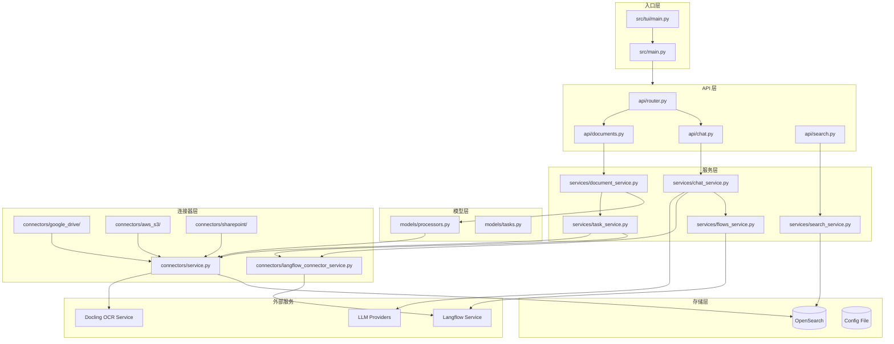
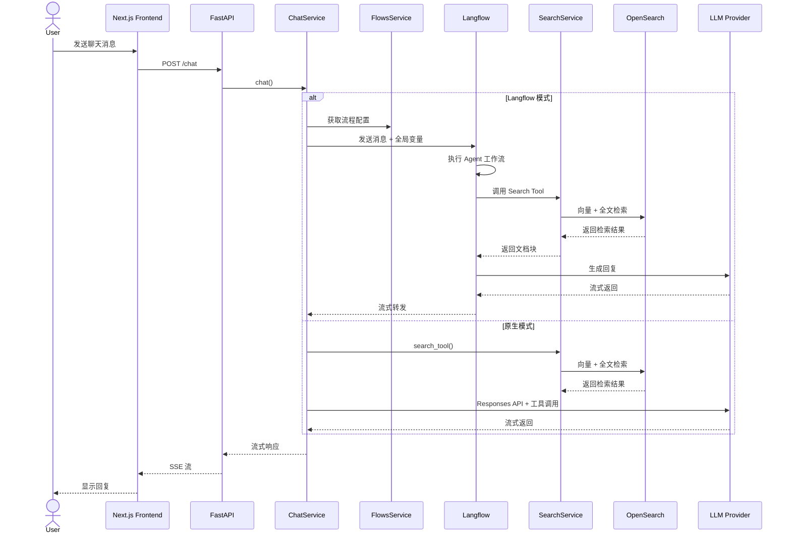
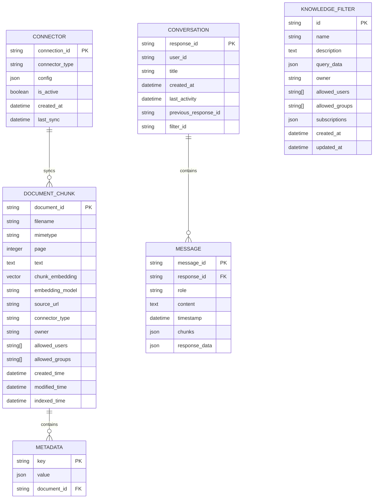

# OpenRAG — 代码逻辑分析报告

## 1. 执行摘要

| 维度 | 内容 |
|------|------|
| **项目名称** | OpenRAG |
| **项目定位** | 基于 Langflow、Docling 和 OpenSearch 的综合 RAG（检索增强生成）平台，支持智能文档搜索和 AI 对话 |
| **技术栈** | Python 3.13 + FastAPI + Next.js + OpenSearch + Langflow + Docling |
| **架构模式** | 微服务架构 + 插件化工作流编排 |
| **代码规模** | Python 后端约 139 个文件，前端约 212 个 TS/TSX 文件 |
| **核心入口** | `src/main.py` |

> **一段话总结**: OpenRAG 是一个企业级 RAG 平台，通过整合 Langflow 的可视化工作流编排、Docling 的文档解析能力和 OpenSearch 的向量检索，提供端到端的文档智能问答解决方案。系统采用模块化设计，支持多种 LLM 提供商（OpenAI、Anthropic、Ollama、WatsonX）和多种嵌入模型，具备完整的用户认证、文档权限管理和多租户支持能力。

---

## 2. 目录结构解析

```
OpenRAG/
├── src/                          # 核心后端代码
│   ├── api/                      # API 层: HTTP 端点定义
│   │   ├── v1/                   # Public API v1 版本
│   │   ├── chat.py               # 聊天端点
│   │   ├── documents.py          # 文档管理端点
│   │   ├── search.py             # 搜索端点
│   │   └── router.py             # 动态路由（传统/Langflow 摄取）
│   ├── services/                 # 业务逻辑层: 核心服务实现
│   │   ├── chat_service.py       # 聊天服务
│   │   ├── document_service.py   # 文档处理服务
│   │   ├── search_service.py     # 搜索服务
│   │   └── task_service.py       # 异步任务服务
│   ├── models/                   # 数据模型层
│   │   └── processors.py         # 文档处理处理器
│   ├── connectors/               # 连接器: 外部存储集成
│   │   ├── google_drive/         # Google Drive 集成
│   │   ├── sharepoint/           # SharePoint 集成
│   │   ├── onedrive/             # OneDrive 集成
│   │   ├── aws_s3/               # AWS S3 集成
│   │   └── ibm_cos/              # IBM COS 集成
│   ├── config/                   # 配置管理
│   │   └── settings.py           # 全局配置和客户端初始化
│   ├── tui/                      # 终端用户界面
│   │   ├── screens/              # TUI 屏幕组件
│   │   ├── managers/             # 容器/环境管理器
│   │   └── main.py               # TUI 入口
│   └── utils/                    # 工具函数
├── frontend/                     # Next.js 前端应用
│   ├── app/                      # 页面路由
│   ├── components/               # React 组件
│   └── lib/                      # 工具库
├── flows/                        # Langflow 工作流定义
│   ├── ingestion_flow.json       # 文档摄取流程
│   ├── openrag_agent.json        # Agent 对话流程
│   ├── openrag_nudges.json       # 智能提示流程
│   └── components/               # 自定义组件
├── sdks/                         # SDK 开发包
│   ├── python/                   # Python SDK
│   ├── typescript/               # TypeScript SDK
│   └── mcp/                      # Model Context Protocol
├── docs/                         # 文档站点
├── tests/                        # 测试套件
└── docker-compose.yml            # 容器编排配置
```

**关键观察**: 
- 采用清晰的分层架构：API 层 → Service 层 → Model 层 → Connector 层
- 支持多种文档来源连接器，便于企业集成
- Langflow 工作流与核心代码分离，便于可视化编辑和版本管理
- TUI（终端用户界面）提供本地部署的交互式体验

---

## 3. 架构与模块依赖

### 3.1 架构概览

OpenRAG 采用**微服务架构**结合**插件化工作流编排**的设计模式：

1. **服务层（Service Layer）**: 核心业务逻辑封装，包括文档处理、搜索、聊天、任务管理等
2. **API 层（API Layer）**: FastAPI 提供的 RESTful 接口，支持内部和 Public API
3. **工作流层（Flow Layer）**: Langflow 负责文档摄取、对话编排和智能提示的可视化工作流
4. **存储层（Storage Layer）**: OpenSearch 提供向量检索和全文搜索能力
5. **连接器层（Connector Layer）**: 支持多种外部存储源的文档同步

系统支持两种运行模式：
- **Langflow 模式**（默认）: 文档摄取和对话通过 Langflow 工作流编排
- **传统模式**: 直接使用 OpenRAG 原生处理器进行文档处理

### 3.2 模块依赖图



### 3.3 核心模块详解

#### ChatService（聊天服务）

- **路径**: `src/services/chat_service.py`
- **职责**: 处理用户对话请求，支持两种模式：
  1. **原生模式**: 使用 OpenAI Responses API 和函数调用
  2. **Langflow 模式**: 通过 Langflow 工作流进行对话编排
- **关键功能**:
  - 流式/非流式响应支持
  - 对话历史管理
  - 知识过滤器集成
  - 智能提示（Nudges）生成
- **依赖关系**: 依赖 FlowsService、SessionManager；被 API 层依赖

#### DocumentService（文档服务）

- **路径**: `src/services/document_service.py`
- **职责**: 文档上传、处理和索引管理
- **关键功能**:
  - 文件上传处理（支持流式读取）
  - 文档内容提取（通过 Docling）
  - 文本分块和嵌入生成
  - OpenSearch 索引操作
- **依赖关系**: 依赖 SessionManager、OpenSearch；被 TaskService 依赖

#### SearchService（搜索服务）

- **路径**: `src/services/search_service.py`
- **职责**: 语义搜索和全文检索
- **关键功能**:
  - 多模型嵌入支持（动态检测语料库中的嵌入模型）
  - 混合搜索（语义 + 关键词）
  - 多维度过滤（数据源、文档类型、所有者、连接器类型）
  - 聚合统计（面搜索）
- **依赖关系**: 依赖 SessionManager、OpenSearch；被 ChatService 依赖

#### TaskService（任务服务）

- **路径**: `src/services/task_service.py`
- **职责**: 异步任务管理和调度
- **关键功能**:
  - Langflow 文件上传任务
  - 文档摄取任务
  - 任务状态跟踪和取消
  - 定期清理调度
- **依赖关系**: 依赖 DocumentService、LangflowFileService

---

## 4. 核心业务流程与数据流

### 4.1 主流程描述

OpenRAG 的核心业务流程包括**文档摄取**和**对话检索**两大主流程：

**文档摄取流程**:
1. 用户通过前端上传文件或配置连接器同步
2. 文件通过 API 层路由到 Router（根据配置选择传统模式或 Langflow 模式）
3. Langflow 模式下，文件上传至 Langflow → 触发摄取工作流 → Docling 解析 → 嵌入生成 → OpenSearch 索引
4. 传统模式下，TaskProcessor 直接处理：Docling 解析 → 嵌入生成 → OpenSearch 索引

**对话检索流程**:
1. 用户发送聊天消息
2. ChatService 根据配置选择原生模式或 Langflow 模式
3. Langflow 模式下，消息发送至 Langflow 工作流，工作流内部调用 Search Tool 进行检索
4. 检索结果与对话历史一起送入 LLM 生成回复
5. 回复流式返回给前端

### 4.2 流程图



### 4.3 数据模型

**核心实体关系**:



**关键数据结构说明**:
- **DOCUMENT_CHUNK**: 文档分块存储单元，包含文本内容、嵌入向量、元数据和访问控制信息
- **CONVERSATION/MESSAGE**: 对话历史存储，支持会话上下文和函数调用结果持久化
- **CONNECTOR**: 外部存储连接器配置，支持定期同步和 webhook 订阅
- **KNOWLEDGE_FILTER**: 知识过滤器，用于按条件筛选检索结果

---

## 5. 关键 API 接口与调用链路

### 5.1 API 总览

| 方法 | 路径/接口 | 说明 | 所在文件 |
|------|-----------|------|----------|
| POST | `/chat` | 聊天对话接口 | `src/api/chat.py` |
| POST | `/search` | 文档搜索接口 | `src/api/search.py` |
| POST | `/upload` | 文件上传接口 | `src/api/upload.py` |
| GET | `/tasks/{task_id}` | 任务状态查询 | `src/api/tasks.py` |
| POST | `/v1/chat` | Public API 聊天 | `src/api/v1/chat.py` |
| POST | `/v1/search` | Public API 搜索 | `src/api/v1/search.py` |

### 5.2 核心 API 调用链路分析

#### `POST /chat` 聊天接口

**调用链**:
```
FastAPI (chat_endpoint) → ChatService.chat() → LangflowConnectorService.langflow_chat() → Langflow API
```

**关键代码片段**:

```1-15:src/api/chat.py
async def chat_endpoint(
    body: ChatBody,
    chat_service=Depends(get_chat_service),
    session_manager=Depends(get_session_manager),
    user: User = Depends(get_current_user),
):
    """Handle chat requests"""
    if not body.prompt:
        return JSONResponse({"error": "Prompt is required"}, status_code=400)

    jwt_token = user.jwt_token

    if body.filters:
        from auth_context import set_search_filters
        set_search_filters(body.filters)
```

**逻辑说明**: 聊天接口首先验证用户身份和输入参数，然后设置搜索过滤器上下文，最后委托 ChatService 处理实际的对话逻辑。支持流式和非流式响应模式。

#### `POST /search` 搜索接口

**调用链**:
```
FastAPI (search) → SearchService.search() → OpenSearch Client → OpenSearch Cluster
```

**关键代码片段**:

```1-20:src/api/search.py
async def search(
    query: str = Body(..., embed=True),
    filters: Optional[Dict[str, Any]] = Body(None, embed=True),
    limit: int = Body(10, embed=True),
    score_threshold: float = Body(0, embed=True),
    user: User = Depends(get_current_user),
    search_service: SearchService = Depends(get_search_service),
):
    """Search endpoint with filters and pagination"""
    result = await search_service.search(
        query=query,
        user_id=user.user_id,
        jwt_token=user.jwt_token,
        filters=filters,
        limit=limit,
        score_threshold=score_threshold,
    )
    return JSONResponse(result)
```

**逻辑说明**: 搜索接口接收查询字符串、过滤条件、分页参数等，通过 SearchService 执行混合搜索（语义 + 关键词），并返回带有聚合统计的检索结果。

---

## 6. 算法与关键函数实现

### 6.1 多模型嵌入动态检测算法

- **位置**: `src/services/search_service.py` 第 85 行
- **用途**: 动态检测语料库中可用的嵌入模型，支持多模型混合检索
- **复杂度**: 时间 O(N) / 空间 O(M)，其中 N 为文档数量，M 为模型数量

**核心代码**:

```85-120:src/services/search_service.py
# Get available embedding models from corpus
query_embeddings = {}
available_models = []

opensearch_client = self.session_manager.get_user_opensearch_client(
    user_id, jwt_token
)

if not is_wildcard_match_all:
    # Build aggregation query with filters applied
    agg_query = {
        "size": 0,
        "aggs": {
            "embedding_models": {
                "terms": {
                    "field": "embedding_model",
                    "size": 10
                }
            }
        }
    }

    # Apply filters to model detection if any exist
    if filter_clauses:
        agg_query["query"] = {
            "bool": {
                "filter": filter_clauses
            }
        }

    agg_result = await opensearch_client.search(
        index=get_index_name(), body=agg_query, params={"terminate_after": 0}
    )
    buckets = agg_result.get("aggregations", {}).get("embedding_models", {}).get("buckets", [])
    available_models = [b["key"] for b in buckets if b["key"]]
```

**逐步解析**:

1. **聚合查询构建**: 构建 OpenSearch 聚合查询，统计 `embedding_model` 字段的不同值
2. **过滤器应用**: 如果用户设置了搜索过滤器，将其应用到聚合查询中，确保只检测符合条件的文档使用的模型
3. **执行查询**: 向 OpenSearch 发送聚合查询，获取可用的嵌入模型列表
4. **结果提取**: 从聚合结果中提取模型名称，用于后续的多模型嵌入生成

### 6.2 混合搜索算法

- **位置**: `src/services/search_service.py` 第 200 行
- **用途**: 结合语义搜索和关键词搜索的混合检索算法
- **复杂度**: 时间 O(K×N) / 空间 O(N)，其中 K 为候选数量，N 为文档数量

**核心代码**:

```200-250:src/services/search_service.py
# Hybrid search query structure (semantic + keyword)
# Use dis_max to pick best score across multiple embedding fields
query_block = {
    "bool": {
        "should": [
            {
                "dis_max": {
                    "tie_breaker": 0.0,  # Take only the best match, no blending
                    "boost": 0.7,         # 70% weight for semantic search
                    "queries": knn_queries
                }
            },
            {
                "multi_match": {
                    "query": query,
                    "fields": ["text^2", "filename^1.5"],
                    "type": "best_fields",
                    "operator": "or",
                    "fuzziness": "AUTO:4,7",
                    "boost": 0.3,  # 30% weight for keyword search
                }
            },
            {
                # Prefix fallback for partial input (e.g. "vita" -> "vitamin").
                "match_phrase_prefix": {
                    "text": {
                        "query": query,
                        "max_expansions": 50,
                        "boost": 0.25,
                    }
                }
            },
        ],
        "minimum_should_match": 1,
        "filter": all_filters,
    }
}
```

**逐步解析**:

1. **语义搜索**: 使用 KNN 查询对多个嵌入字段进行向量检索，权重 70%
2. **关键词搜索**: 使用 multi_match 在文本和文件名字段进行模糊匹配，权重 30%
3. **前缀匹配**: 提供前缀匹配支持，处理不完整输入（如 "vita" 匹配 "vitamin"）
4. **结果融合**: 使用 dis_max 算子选择最佳匹配，避免不同模型间的分数混杂
5. **过滤应用**: 应用用户设置的多维度过滤条件

### 6.3 文档分块批处理算法

- **位置**: `src/services/document_service.py` 第 45 行
- **用途**: 将长文本分批处理以避免超出 LLM token 限制
- **复杂度**: 时间 O(N) / 空间 O(B)，其中 N 为文本数量，B 为批次大小

**核心代码**:

```45-85:src/services/document_service.py
def chunk_texts_for_embeddings(
    texts: List[str], max_tokens: int = None, model: str = None
) -> List[List[str]]:
    """
    Split texts into batches that won't exceed token limits.
    If max_tokens is None, returns texts as single batch (no splitting).
    """
    model = model or get_embedding_model()

    if max_tokens is None:
        return [texts]

    batches = []
    current_batch = []
    current_tokens = 0

    for text in texts:
        text_tokens = get_token_count(text, model)

        # If single text exceeds limit, split it further
        if text_tokens > max_tokens:
            # If we have current batch, save it first
            if current_batch:
                batches.append(current_batch)
                current_batch = []
                current_tokens = 0

            # Split the large text into smaller chunks
            try:
                encoding = tiktoken.encoding_for_model(model)
            except KeyError:
                encoding = tiktoken.get_encoding("cl100k_base")

            tokens = encoding.encode(text)

            for i in range(0, len(tokens), max_tokens):
                chunk_tokens = tokens[i : i + max_tokens]
                chunk_text = encoding.decode(chunk_tokens)
                batches.append([chunk_text])
```

**逐步解析**:

1. **批次初始化**: 初始化空批次和当前 token 计数器
2. **单文本处理**: 对每个文本计算 token 数量
3. **超限处理**: 如果单个文本超过限制，使用 tiktoken 进行细粒度分块
4. **批次累积**: 将文本添加到当前批次，直到达到 token 限制
5. **批次提交**: 当批次满时，提交批次并开始新批次

---

## 7. 架构评价与建议

### 优势

- **灵活的工作流编排**: 通过 Langflow 实现可视化工作流，降低 RAG 应用开发门槛
- **多模型支持**: 支持多种 LLM 和嵌入模型，适应不同场景需求
- **企业级安全**: 完整的用户认证、文档权限管理和多租户支持
- **连接器生态**: 丰富的外部存储连接器，便于企业数据集成
- **混合搜索**: 结合语义和关键词搜索，提高检索准确率

### 潜在问题

- **复杂性较高**: 双模式架构（Langflow/传统）增加了系统复杂性和维护成本
- **性能瓶颈**: 文档摄取流程涉及多个服务调用，可能存在性能瓶颈
- **依赖管理**: 重度依赖外部服务（Langflow、Docling、OpenSearch），部署复杂度高
- **内存管理**: 大文件处理可能消耗大量内存，需要更好的流式处理优化

### 进一步阅读建议

如果您想深入了解某个模块，建议从以下文件开始：

1. `src/main.py` — 应用启动和初始化逻辑
2. `src/services/chat_service.py` — 核心对话处理逻辑
3. `src/services/search_service.py` — 混合搜索算法实现
4. `src/models/processors.py` — 文档处理核心逻辑
5. `flows/openrag_agent.json` — Langflow Agent 工作流定义