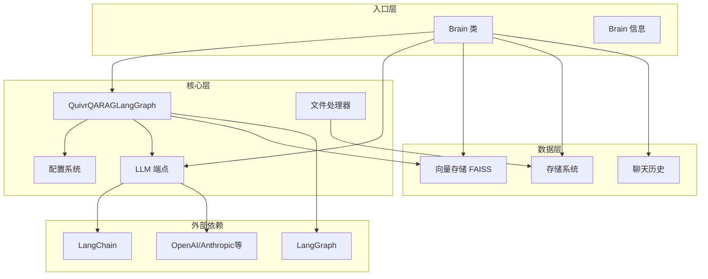
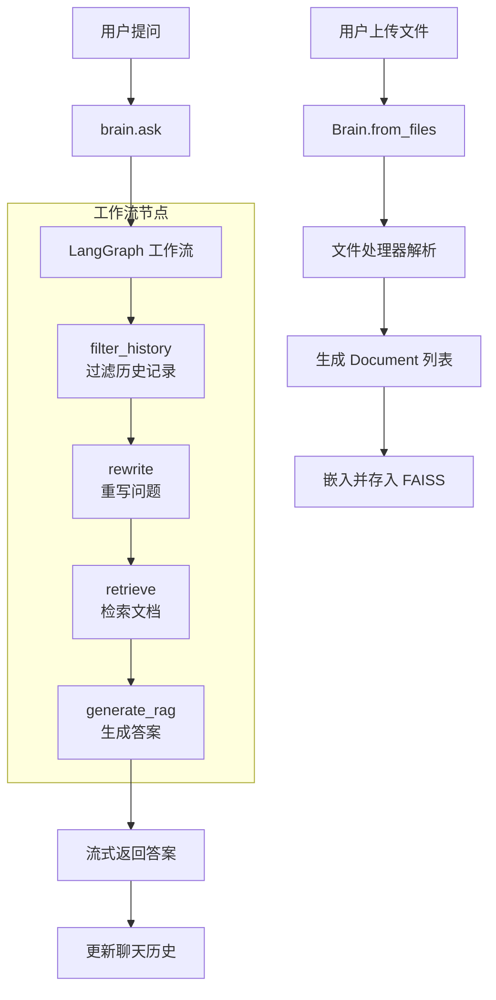
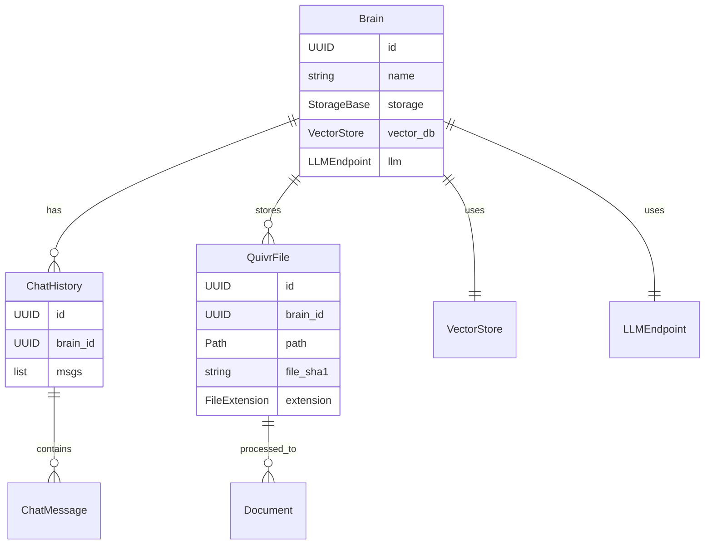

# Quivr — 代码逻辑分析报告

## 1. 执行摘要

| 维度 | 内容 |
|------|------|
| **项目名称** | Quivr |
| **项目定位** | 基于生成式 AI 的 "第二大脑" RAG 框架，专注于产品集成，支持多种 LLM 和向量存储 |
| **技术栈** | Python 3.11+ / LangChain / LangGraph / Pydantic / FAISS |
| **架构模式** | 模块化插件架构 + LangGraph 工作流编排 |
| **代码规模** | 约 77 个 Python 文件，约 14,000 行代码 |
| **核心入口** | `quivr_core/brain/brain.py` |

> **一段话总结**: Quivr 是一个高度可配置的 RAG（检索增强生成）框架，采用 LangGraph 实现复杂的工作流编排。它通过 "Brain" 概念封装知识库，支持多供应商 LLM（OpenAI、Anthropic、Mistral、Google 等）、多种文件格式处理，并提供可定制的工作流节点系统。架构上采用插件化设计，处理器、存储、LLM 端点均可扩展，适合构建企业级知识问答应用。

---

## 2. 目录结构解析

```
quivr/
├── core/                          # 核心层 (core): RAG 引擎主实现
│   ├── quivr_core/               
│   │   ├── brain/                # Brain 核心类：知识库封装与管理
│   │   ├── rag/                  # RAG 工作流实现
│   │   │   ├── entities/         # 数据模型/实体 (model/entity)
│   │   │   ├── quivr_rag_langgraph.py  # LangGraph 工作流实现
│   │   │   ├── prompts.py        # 提示词模板
│   │   │   └── utils.py          # RAG 工具函数
│   │   ├── processor/            # 文件处理器 (core)
│   │   │   ├── implementations/  # 具体处理器实现
│   │   │   ├── registry.py       # 处理器注册表
│   │   │   └── processor_base.py # 处理器抽象基类
│   │   ├── llm/                  # LLM 端点管理 (core)
│   │   ├── llm_tools/            # LLM 工具集成 (core)
│   │   ├── storage/              # 存储抽象 (core)
│   │   ├── files/                # 文件模型 (model/entity)
│   │   └── language/             # 语言检测工具 (util/common)
│   ├── tests/                    # 测试套件 (test)
│   └── example_workflows/        # 工作流示例 (docs)
├── docs/                         # 文档 (docs)
├── examples/                     # 示例应用 (docs)
└── .github/                      # CI/CD 配置
```

**关键观察**: 项目采用清晰的分层架构，按功能模块组织代码。核心逻辑集中在 `quivr_core` 包中，通过注册表模式实现插件化扩展，便于添加新的文件处理器和 LLM 供应商。

---

## 3. 架构与模块依赖

### 3.1 架构概览

Quivr 采用**模块化插件架构**结合**LangGraph 工作流编排**的设计模式：

1. **Brain 核心模式**: `Brain` 类作为知识库的封装，统一管理文件存储、向量数据库、LLM 端点和聊天历史
2. **处理器注册表**: 通过 `registry.py` 实现文件处理器的懒加载和优先级管理
3. **LangGraph 工作流**: 使用 LangGraph 的 `StateGraph` 构建可配置的 RAG 流水线
4. **多供应商 LLM 支持**: 通过 `LLMEndpoint` 统一封装不同供应商的 LLM 客户端
5. **存储抽象**: `StorageBase` 抽象类支持本地存储、透明存储等多种存储后端

### 3.2 模块依赖图



### 3.3 核心模块详解

#### Brain 模块

- **路径**: `quivr_core/brain/`
- **职责**: 知识库的核心封装，管理文件、向量数据库、LLM 和聊天历史
- **关键文件**:
  - `brain.py` — Brain 主类，提供 `from_files`, `ask`, `search` 等核心 API
  - `brain_defaults.py` — 默认配置（FAISS 向量库、OpenAI 嵌入、GPT-4o）
  - `serialization.py` — Brain 序列化/反序列化
- **对外暴露**: `Brain` 类
- **依赖关系**: 依赖 processor、rag、llm、storage 模块

#### RAG 工作流模块

- **路径**: `quivr_core/rag/`
- **职责**: 实现可配置的 RAG 流水线，基于 LangGraph
- **关键文件**:
  - `quivr_rag_langgraph.py` — LangGraph 工作流实现
  - `entities/config.py` — 配置类（RetrievalConfig、WorkflowConfig 等）
  - `prompts.py` — 提示词模板定义
- **对外暴露**: `QuivrQARAGLangGraph` 类
- **依赖关系**: 依赖 llm、vector_store

#### 处理器模块

- **路径**: `quivr_core/processor/`
- **职责**: 文件解析和文本提取
- **关键文件**:
  - `registry.py` — 处理器注册表，支持懒加载
  - `processor_base.py` — 处理器抽象基类
  - `implementations/` — 具体处理器（PDF、DOCX、Megaparse 等）
- **对外暴露**: `get_processor_class`, `register_processor`
- **依赖关系**: 被 brain 模块依赖

---

## 4. 核心业务流程与数据流

### 4.1 主流程描述

Quivr 的核心业务流程是 **RAG 问答流程**：

1. **文件摄取**: 用户上传文件 → Brain 通过 Processor 解析文件 → 生成 Document 列表 → 存入 VectorStore
2. **问题处理**: 用户提问 → 工作流节点处理（过滤历史、重写问题、检索文档）
3. **答案生成**: 结合检索到的文档上下文 → LLM 生成答案 → 流式返回

### 4.2 流程图



### 4.3 数据模型



---

## 5. 关键 API 接口与调用链路

### 5.1 API 总览

| 方法 | 路径/接口 | 说明 | 所在文件 |
|------|-----------|------|----------|
| `Brain.from_files` | 类方法 | 从文件列表创建 Brain | `brain/brain.py:332` |
| `Brain.ask` | 实例方法 | 同步问答 | `brain/brain.py:580` |
| `Brain.ask_streaming` | 实例方法 | 流式问答 | `brain/brain.py:515` |
| `Brain.asearch` | 实例方法 | 向量检索 | `brain/brain.py:426` |
| `QuivrQARAGLangGraph.answer_astream` | 实例方法 | LangGraph 流式回答 | `rag/quivr_rag_langgraph.py:685` |

### 5.2 核心 API 调用链路分析

#### `Brain.from_files` — 创建知识库

**调用链**:
```
Brain.from_files (同步包装)
  └── Brain.afrom_files (异步实现)
       ├── load_qfile (加载每个文件)
       ├── storage.upload_file (上传到存储)
       ├── process_files (解析文件)
       │    └── get_processor_class (获取处理器)
       │    └── processor.process_file (解析)
       └── build_default_vectordb (构建向量库)
            └── FAISS.afrom_documents
```

**关键代码片段**:

```python:332:390:quivr_core/brain/brain.py
# Brain.afrom_files 核心逻辑
@classmethod
async def afrom_files(
    cls,
    *,
    name: str,
    file_paths: list[str | Path],
    vector_db: VectorStore | None = None,
    storage: StorageBase = TransparentStorage(),
    llm: LLMEndpoint | None = None,
    embedder: Embeddings | None = None,
    skip_file_error: bool = False,
    processor_kwargs: dict[str, Any] | None = None,
):
    # 设置默认 LLM 和嵌入器
    if llm is None:
        llm = default_llm()
    if embedder is None:
        embedder = default_embedder()
    
    brain_id = uuid4()
    
    # 上传文件到存储
    for path in file_paths:
        file = await load_qfile(brain_id, path)
        await storage.upload_file(file)
    
    # 解析文件
    docs = await process_files(
        storage=storage,
        skip_file_error=skip_file_error,
        **processor_kwargs,
    )
    
    # 构建向量库
    if vector_db is None:
        vector_db = await build_default_vectordb(docs, embedder)
    else:
        await vector_db.aadd_documents(docs)
    
    return cls(...)
```

**逻辑说明**: 
1. 该方法首先设置默认的 LLM 和嵌入器（OpenAI）
2. 将文件上传到存储系统
3. 使用注册的处理器解析文件，生成 LangChain Document 列表
4. 使用 FAISS 构建向量数据库
5. 返回配置好的 Brain 实例

---

#### `Brain.ask_streaming` — 流式问答

**调用链**:
```
Brain.ask_streaming
  └── QuivrQARAGLangGraph.answer_astream
       ├── build_chain (编译 StateGraph)
       ├── astream_events (LangGraph 流式执行)
       │    ├── routing (路由节点)
       │    ├── filter_history (过滤历史)
       │    ├── rewrite (重写问题)
       │    ├── retrieve (检索文档)
       │    └── generate_rag (生成答案)
       └── parse_chunk_response (解析响应块)
```

**关键代码片段**:

```python:515:580:quivr_core/brain/brain.py
async def ask_streaming(
    self,
    question: str,
    run_id: UUID,
    system_prompt: str | None = None,
    retrieval_config: RetrievalConfig | None = None,
    rag_pipeline: Type[Union[QuivrQARAG, QuivrQARAGLangGraph]] | None = None,
    list_files: list[QuivrKnowledge] | None = None,
    chat_history: ChatHistory | None = None,
    **input_kwargs,
) -> AsyncGenerator[ParsedRAGChunkResponse, ParsedRAGChunkResponse]:
    llm = self.llm
    
    # 如果传入了不同的配置，覆盖默认 LLM
    if retrieval_config:
        if retrieval_config.llm_config != self.llm.get_config():
            llm = LLMEndpoint.from_config(config=retrieval_config.llm_config)
    
    # 创建 RAG 实例
    rag_instance = QuivrQARAGLangGraph(
        retrieval_config=retrieval_config, llm=llm, vector_store=self.vector_db
    )
    
    chat_history = self.default_chat if chat_history is None else chat_history
    
    # 流式获取答案
    async for response in rag_instance.answer_astream(
        run_id=run_id,
        question=question,
        system_prompt=system_prompt or None,
        history=chat_history,
        list_files=list_files,
        metadata=metadata,
        **input_kwargs,
    ):
        if not response.last_chunk:
            yield response
        full_answer += response.answer
    
    # 更新聊天历史
    chat_history.append(HumanMessage(content=question))
    chat_history.append(AIMessage(content=full_answer))
    yield response
```

**逻辑说明**: 
1. 根据配置创建或复用 LLM 端点
2. 实例化 `QuivrQARAGLangGraph`，传入检索配置和向量库
3. 调用 `answer_astream` 方法启动 LangGraph 工作流
4. 流式返回每个生成的文本块
5. 最后更新聊天历史记录

---

## 6. 算法与关键函数实现

### 6.1 LangGraph 工作流构建

- **位置**: `quivr_core/rag/quivr_rag_langgraph.py` 第 520-560 行
- **用途**: 根据 YAML 配置动态构建 LangGraph 状态机
- **复杂度**: 时间 O(n) / 空间 O(n)，n 为节点数量

**核心代码**:

```python:520:560:quivr_core/rag/quivr_rag_langgraph.py
def create_graph(self):
    workflow = StateGraph(AgentState)
    self.final_nodes = []
    
    self._build_workflow(workflow)
    
    return workflow.compile()

def _build_workflow(self, workflow: StateGraph):
    for node in self.retrieval_config.workflow_config.nodes:
        if node.name not in [START, END]:
            workflow.add_node(node.name, getattr(self, node.name))
    
    for node in self.retrieval_config.workflow_config.nodes:
        self._add_node_edges(workflow, node)

def _add_node_edges(self, workflow: StateGraph, node: NodeConfig):
    if node.edges:
        # 普通边
        for edge in node.edges:
            workflow.add_edge(node.name, edge)
            if edge == END:
                self.final_nodes.append(node.name)
    elif node.conditional_edge:
        # 条件边
        routing_function = getattr(self, node.conditional_edge.routing_function)
        workflow.add_conditional_edges(
            node.name, routing_function, node.conditional_edge.conditions
        )
```

**逐步解析**:

1. **创建 StateGraph**: 使用 LangGraph 的 `StateGraph` 类创建工作流图
2. **添加节点**: 遍历配置中的节点，将每个节点名称映射到类方法
3. **添加边**: 支持普通边和条件边两种类型
4. **编译**: 调用 `compile()` 生成可执行的工作流

---

### 6.2 文档检索与重排序

- **位置**: `quivr_core/rag/quivr_rag_langgraph.py` 第 350-400 行
- **用途**: 检索相关文档并进行重排序
- **复杂度**: 时间 O(k * log(k))，k 为检索文档数

**核心代码**:

```python:350:400:quivr_core/rag/quivr_rag_langgraph.py
async def retrieve(self, state: AgentState) -> AgentState:
    tasks = state["tasks"]
    
    # 配置检索器
    kwargs = {
        "search_kwargs": {
            "k": self.retrieval_config.k,  # 检索数量
            "filter": _filter,
        }
    }
    base_retriever = self.get_retriever(**kwargs)
    
    # 配置重排序器
    kwargs = {"top_n": self.retrieval_config.reranker_config.top_n}
    reranker = self.get_reranker(**kwargs)
    
    # 组合检索器和重排序器
    compression_retriever = ContextualCompressionRetriever(
        base_compressor=reranker, base_retriever=base_retriever
    )
    
    # 异步检索每个任务
    async_jobs = []
    for task_id in tasks.ids:
        async_jobs.append(
            (compression_retriever.ainvoke(tasks(task_id).definition), task_id)
        )
    
    responses = await asyncio.gather(*(task[0] for task in async_jobs))
    
    # 将文档关联到对应任务
    for response, task_id in zip(responses, task_ids, strict=False):
        _docs = self.filter_chunks_by_relevance(response)
        tasks.set_docs(task_id, _docs)
    
    return {**state, "tasks": tasks}
```

**逐步解析**:

1. **基础检索**: 使用向量存储的 `as_retriever` 获取 top-k 文档
2. **重排序**: 使用 `ContextualCompressionRetriever` 结合 Cohere/Jina 重排序
3. **异步并行**: 对每个用户任务并行执行检索
4. **相关性过滤**: 根据阈值过滤低相关性文档

---

### 6.3 处理器注册表（懒加载模式）

- **位置**: `quivr_core/processor/registry.py` 第 80-120 行
- **用途**: 根据文件扩展名动态加载处理器类
- **复杂度**: 首次加载 O(1)，后续 O(1)

**核心代码**:

```python:80:120:quivr_core/processor/registry.py
def get_processor_class(file_extension: FileExtension | str) -> Type[ProcessorBase]:
    """Fetch processor class from registry
    
    Loading of these classes is *Lazy*. Appropriate import will happen
    the first time we try to process some file type.
    """
    if file_extension not in registry:
        if file_extension not in known_processors:
            raise ValueError(f"Extension not known: {file_extension}")
        entries = known_processors[file_extension]
        while entries:
            proc_entry = heappop(entries)
            try:
                register_processor(file_extension, _import_class(proc_entry.cls_mod))
                break
            except ImportError:
                logger.warn(f"{proc_entry.err}. Falling to next processor")
        
    cls = registry[file_extension]
    return cls

def _import_class(full_mod_path: str):
    if ":" in full_mod_path:
        mod_name, name = full_mod_path.rsplit(":", 1)
    else:
        mod_name, name = full_mod_path.rsplit(".", 1)
    
    mod = importlib.import_module(mod_name)
    
    for cls in name.split("."):
        mod = getattr(mod, cls)
    
    if not issubclass(mod, ProcessorBase):
        raise TypeError(f"{full_mod_path} is not a subclass of ProcessorBase")
    
    return mod
```

**逐步解析**:

1. **检查缓存**: 首先检查处理器是否已在注册表中
2. **优先级队列**: 使用堆结构管理同一扩展名的多个处理器（按优先级排序）
3. **动态导入**: 使用 `importlib` 动态加载处理器类
4. **失败回退**: 如果高优先级处理器导入失败，自动尝试下一个

---

## 7. 架构评价与建议

### 优势

- **高度可配置**: 通过 YAML 配置即可自定义 RAG 工作流，无需修改代码
- **多供应商支持**: 统一封装 OpenAI、Anthropic、Mistral、Google 等 LLM，切换成本低
- **插件化设计**: 处理器注册表模式便于扩展新的文件格式支持
- **LangGraph 集成**: 利用 LangGraph 的状态机实现复杂工作流，支持条件分支和循环
- **流式响应**: 完整的流式处理支持，提升用户体验
- **类型安全**: 大量使用 Pydantic 进行数据验证和序列化

### 潜在问题

- **依赖较重**: 依赖 LangChain 生态，版本升级可能带来兼容性问题
- **默认配置硬编码**: 默认使用 OpenAI，需要显式配置才能使用其他供应商
- **错误处理**: 部分异步代码的错误处理较为简单，生产环境需加强
- **文档不足**: 复杂工作流配置缺乏详细文档，用户上手门槛较高
- **向量存储限制**: 目前主要支持 FAISS，其他向量数据库支持有限

### 进一步阅读建议

如果您想深入了解某个模块，建议从以下文件开始：

1. `quivr_core/brain/brain.py` — Brain 核心类，了解知识库的创建和问答流程
2. `quivr_core/rag/quivr_rag_langgraph.py` — LangGraph 工作流实现，理解 RAG 流水线编排
3. `quivr_core/rag/entities/config.py` — 配置系统，了解如何自定义工作流和模型参数
4. `quivr_core/processor/registry.py` — 处理器注册表，了解插件化扩展机制
5. `quivr_core/llm/llm_endpoint.py` — LLM 端点封装，了解多供应商支持实现