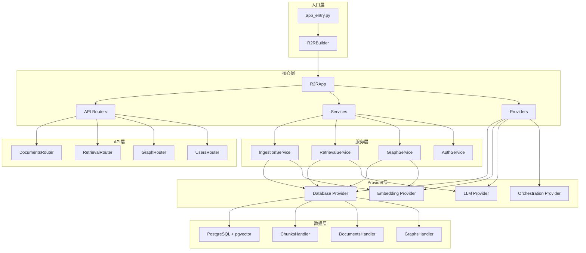
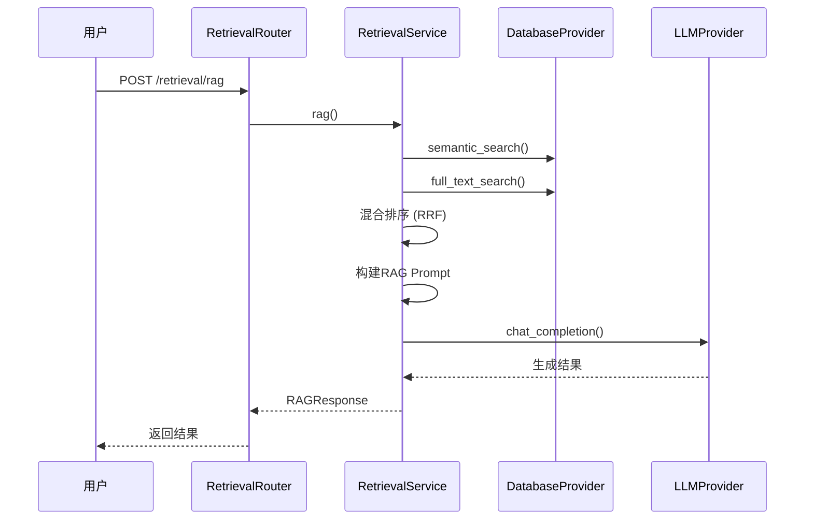
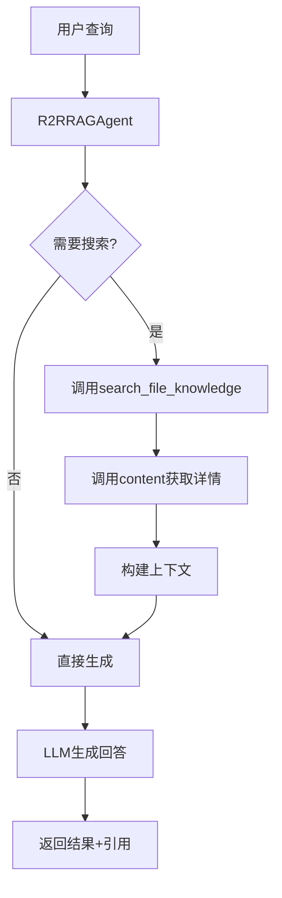
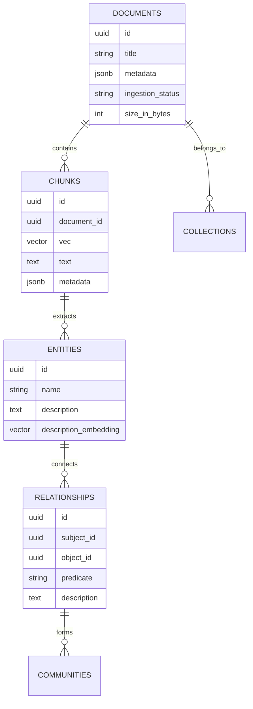

# R2R (SciPhi-AI) — 代码逻辑分析报告

## 1. 执行摘要

| 维度 | 内容 |
|------|------|
| **项目名称** | R2R (Retrieval-to-Retrieval) |
| **项目定位** | 生产就绪的AI检索系统，支持Agentic RAG (检索增强生成) 和Deep Research API |
| **技术栈** | Python 3.10-3.12 + FastAPI + PostgreSQL/pgvector + SQLAlchemy + LiteLLM |
| **架构模式** | 分层架构 (API层 → 服务层 → Provider层) + 依赖注入 |
| **代码规模** | ~271个Python文件，约8万行代码 |
| **核心入口** | `py/core/main/app_entry.py` |

> **一段话总结**: R2R是一个功能完备的RAG系统，提供多模态文档摄取、混合搜索、知识图谱和Agentic RAG能力。系统采用FastAPI构建RESTful API，使用PostgreSQL+pgvector作为向量数据库，支持多种LLM提供商(OpenAI、Anthropic、Azure等)。架构上采用清晰的分层设计，通过Provider工厂模式实现组件的可插拔性，支持同步/异步工作流编排(Hatchet/Simple)。

---

## 2. 目录结构解析

```
R2R/
├── py/                          # Python核心代码
│   ├── core/                    # 核心业务逻辑
│   │   ├── main/               # 主应用层 (API、服务、配置)
│   │   │   ├── api/v3/         # REST API路由 (FastAPI)
│   │   │   ├── services/       # 业务服务层
│   │   │   ├── assembly/       # 应用构建器和工厂
│   │   │   ├── config.py       # 配置管理
│   │   │   └── app_entry.py    # 应用入口
│   │   ├── base/               # 基础抽象类
│   │   ├── providers/          # 各种Provider实现
│   │   │   ├── database/       # 数据库操作 (Postgres)
│   │   │   ├── embeddings/     # 嵌入模型 (OpenAI, Ollama)
│   │   │   ├── llm/            # LLM提供商
│   │   │   ├── orchestration/  # 工作流编排
│   │   │   └── ingestion/      # 文档摄取管道
│   │   ├── parsers/            # 文档解析器
│   │   │   ├── text/           # 文本解析
│   │   │   ├── media/          # PDF/图片/音频解析
│   │   │   └── structured/     # 结构化数据解析
│   │   ├── agent/              # RAG Agent实现
│   │   └── utils/              # 工具函数
│   ├── shared/                 # 共享抽象和模型
│   ├── sdk/                    # Python SDK客户端
│   └── tests/                  # 测试套件
├── js/                         # JavaScript SDK
├── services/                   # 外部服务配置
├── docker/                     # Docker部署配置
└── docs/                       # 文档
```

**关键观察**: 采用按功能分包的目录结构，清晰分离了API层、服务层和Provider层。`core/main`是应用核心，`providers`实现各种外部依赖的抽象。

---

## 3. 架构与模块依赖

### 3.1 架构概览

R2R采用**分层架构 + Provider模式**，整体设计遵循以下原则：

1. **分层架构**: 清晰的API层 → 服务层 → Provider层分离
2. **依赖注入**: 通过R2RBuilder和R2RProviderFactory实现组件的组装
3. **可插拔Provider**: 数据库、Embedding、LLM等都通过Provider接口抽象
4. **异步优先**: 大量使用async/await，支持流式响应

### 3.2 模块依赖图



### 3.3 核心模块详解

#### R2RBuilder (应用构建器)

- **路径**: `core/main/assembly/builder.py`
- **职责**: 负责整个应用的依赖注入和组装
- **关键方法**:
  - `build()`: 构建R2RApp实例
  - `_create_providers()`: 创建Provider实例
  - `_create_services()`: 创建Service实例

#### R2RApp (应用核心)

- **路径**: `core/main/app.py`
- **职责**: FastAPI应用实例，管理路由和中间件
- **关键方法**:
  - `_setup_routes()`: 注册所有API路由
  - `_apply_middleware()`: 应用CORS和项目Schema中间件

#### Provider层

- **DatabaseProvider**: PostgreSQL + pgvector 向量数据库操作
- **EmbeddingProvider**: 文本嵌入 (OpenAI, Ollama, LiteLLM)
- **LLMProvider**: 大语言模型调用
- **OrchestrationProvider**: 工作流编排 (Hatchet/Simple)

---

## 4. 核心业务流程与数据流

### 4.1 文档摄取流程

**流程描述**: 用户上传文档 → 解析 → 分块 → 嵌入 → 存储到向量数据库


### 4.2 RAG检索流程

**流程描述**: 用户查询 → 混合搜索 → 重排序 → 构建Prompt → LLM生成



### 4.3 Agentic RAG流程

**流程描述**: Agent接收查询 → 工具调用循环 → 知识搜索/网页搜索 → 推理生成



### 4.4 数据模型

**核心实体关系**:



---

## 5. 关键 API 接口与调用链路

### 5.1 API 总览

| 方法 | 路径 | 说明 | 所在文件 |
|------|------|------|----------|
| POST | `/v3/documents` | 创建/上传文档 | `documents_router.py` |
| POST | `/v3/retrieval/search` | 混合搜索 | `retrieval_router.py` |
| POST | `/v3/retrieval/rag` | RAG问答 | `retrieval_router.py` |
| POST | `/v3/retrieval/agent` | Agentic RAG | `retrieval_router.py` |
| GET | `/v3/documents/{id}` | 获取文档详情 | `documents_router.py` |
| POST | `/v3/graphs/entities` | 创建实体 | `graph_router.py` |

### 5.2 核心 API 调用链路分析

#### `/v3/retrieval/rag` - RAG问答

**调用链**:
```
RetrievalRouter.rag() → RetrievalService.rag() → 
  → DatabaseProvider.semantic_search() 
  → DatabaseProvider.full_text_search()
  → RetrievalService._build_rag_prompt()
  → LLMProvider.chat_completion()
```

**关键代码片段** (来自 `retrieval_router.py`):

```python
@self.router.post("/retrieval/rag")
async def rag_app(
    query: str = Body(...),
    search_settings: Optional[SearchSettings] = Body(None),
    rag_generation_config: Optional[GenerationConfig] = Body(None),
) -> WrappedRAGResponse:
    effective_settings = self._prepare_search_settings(...)
    response = await self.services.retrieval.rag(
        query=query,
        search_settings=effective_settings,
        rag_generation_config=rag_generation_config,
    )
    return response
```

**逻辑说明**: 
1. 接收用户查询和搜索配置
2. 准备搜索设置 (合并默认配置和用户覆盖)
3. 调用RetrievalService执行RAG流程
4. 返回包含生成结果和引用的响应

#### `/v3/documents` - 文档上传

**调用链**:
```
DocumentsRouter.create_document() → IngestionService.ingest_file_ingress() → 
  → DatabaseProvider.upsert_documents_overview()
```

**关键代码片段** (来自 `documents_router.py`):

```python
@self.router.post("/documents")
async def create_document(
    file: UploadFile = File(...),
    metadata: Optional[str] = Form(None),
    auth_user=Depends(self.providers.auth.auth_wrapper()),
) -> WrappedIngestionResponse:
    document_id = generate_document_id()
    file_data = {"filename": file.filename, "content": await file.read()}
    result = await self.services.ingestion.ingest_file_ingress(
        file_data=file_data,
        user=auth_user,
        document_id=document_id,
        size_in_bytes=len(file_data["content"]),
        metadata=json.loads(metadata) if metadata else None,
    )
    return result
```

**逻辑说明**:
1. 接收上传文件和元数据
2. 生成文档ID并预处理文件数据
3. 调用IngestionService创建文档记录
4. 返回摄取响应（实际解析在后台进行）

---

## 6. 算法与关键函数实现

### 6.1 混合搜索算法

- **位置**: `core/providers/database/chunks.py` 第 200-300 行
- **用途**: 结合语义搜索和全文搜索的结果，使用RRF (Reciprocal Rank Fusion) 进行重排序
- **复杂度**: 时间 O(n log n) / 空间 O(n)

**核心代码**:

```python
def _hybrid_search_with_rrf(
    semantic_results: list[ChunkSearchResult],
    full_text_results: list[ChunkSearchResult],
    semantic_weight: float = 5.0,
    full_text_weight: float = 1.0,
    rrf_k: int = 50,
) -> list[ChunkSearchResult]:
    """Combine semantic and full-text search results using RRF."""
    # Create score maps for both result sets
    semantic_scores = {r.id: r.score for r in semantic_results}
    full_text_scores = {r.id: r.score for r in full_text_results}
    
    # Get all unique chunk IDs
    all_ids = set(semantic_scores.keys()) | set(full_text_scores.keys())
    
    # Calculate RRF scores
    hybrid_results = []
    for chunk_id in all_ids:
        semantic_rank = (
            1 / (rrf_k + list(semantic_scores.keys()).index(chunk_id) + 1)
            if chunk_id in semantic_scores
            else 0
        )
        full_text_rank = (
            1 / (rrf_k + list(full_text_scores.keys()).index(chunk_id) + 1)
            if chunk_id in full_text_scores
            else 0
        )
        
        combined_score = (
            semantic_weight * semantic_rank + full_text_weight * full_text_rank
        )
        hybrid_results.append((chunk_id, combined_score))
    
    # Sort by combined score and reconstruct results
    hybrid_results.sort(key=lambda x: x[1], reverse=True)
    return [find_chunk_by_id(chunk_id) for chunk_id, _ in hybrid_results]
```

**逐步解析**:

1. **结果映射**: 将语义搜索和全文搜索的结果分别映射为ID到分数的字典
2. **去重合并**: 获取所有唯一的chunk ID集合
3. **RRF计算**: 对每个chunk ID，计算其在两个结果集中的排名分数
4. **加权融合**: 使用配置的权重对两个分数进行加权
5. **重排序**: 按照融合后的分数重新排序并返回结果

### 6.2 Agentic RAG工具调用

- **位置**: `core/agent/rag.py` 第 50-150 行
- **用途**: 实现RAG Agent的工具注册和调用机制
- **复杂度**: 时间 O(m) / 空间 O(m)，其中m是工具数量

**核心代码**:

```python
def _register_tools(self):
    """Register all requested tools from self.config.rag_tools using the ToolRegistry."""
    if not self.config.rag_tools:
        logger.warning("No RAG tools requested. Skipping tool registration.")
        return

    for tool_name in set(self.config.rag_tools):
        if tool_instance := self.tool_registry.create_tool_instance(
            tool_name, format_function, context=self
        ):
            logger.debug(f"Successfully registered tool from registry: {tool_name}")
            self._tools.append(tool_instance)
        else:
            logger.warning(f"Unknown tool requested: {tool_name}")
```

**逐步解析**:

1. **工具检查**: 验证是否有配置的RAG工具
2. **去重处理**: 使用set确保每个工具只注册一次
3. **动态创建**: 通过ToolRegistry动态创建工具实例
4. **错误处理**: 对未知工具给出警告但不中断执行
5. **上下文绑定**: 将工具与当前Agent上下文绑定

---

## 7. 架构评价与建议

### 优势

- **模块化设计**: 清晰的分层架构和Provider模式使得系统高度可扩展和可维护
- **生产就绪**: 完整的认证、权限、日志、监控和错误处理机制
- **多模态支持**: 支持文本、PDF、图片、音频等多种文档格式
- **灵活配置**: 通过配置文件和环境变量支持多种部署场景
- **Agentic能力**: 不仅支持传统RAG，还提供深度研究的Agentic RAG能力

### 潜在问题

- **复杂度较高**: 对于简单用例可能过于复杂，学习曲线较陡峭
- **依赖较多**: 核心依赖列表较长，可能增加维护成本
- **PostgreSQL强依赖**: 目前主要针对PostgreSQL优化，其他数据库支持有限
- **内存使用**: 大量异步操作和缓存可能导致高内存使用

### 进一步阅读建议

如果您想深入了解某个模块，建议从以下文件开始：

1. `core/main/assembly/builder.py` — 理解整个应用的构建和依赖注入机制
2. `core/main/services/retrieval_service.py` — 掌握RAG和搜索的核心逻辑
3. `core/providers/database/chunks.py` — 了解向量存储和混合搜索的具体实现
4. `core/agent/rag.py` — 深入Agentic RAG的工作原理
5. `core/main/api/v3/retrieval_router.py` — 查看完整的API接口定义和参数处理