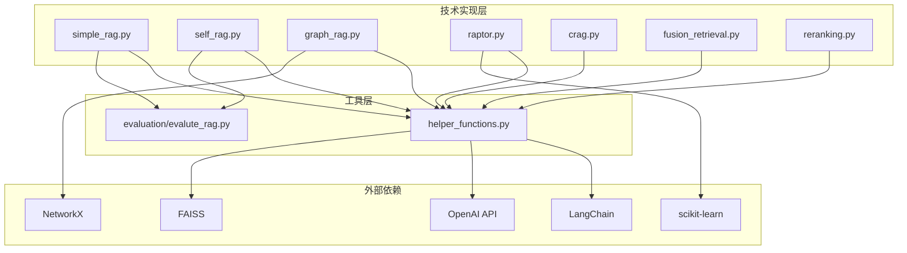
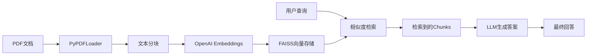
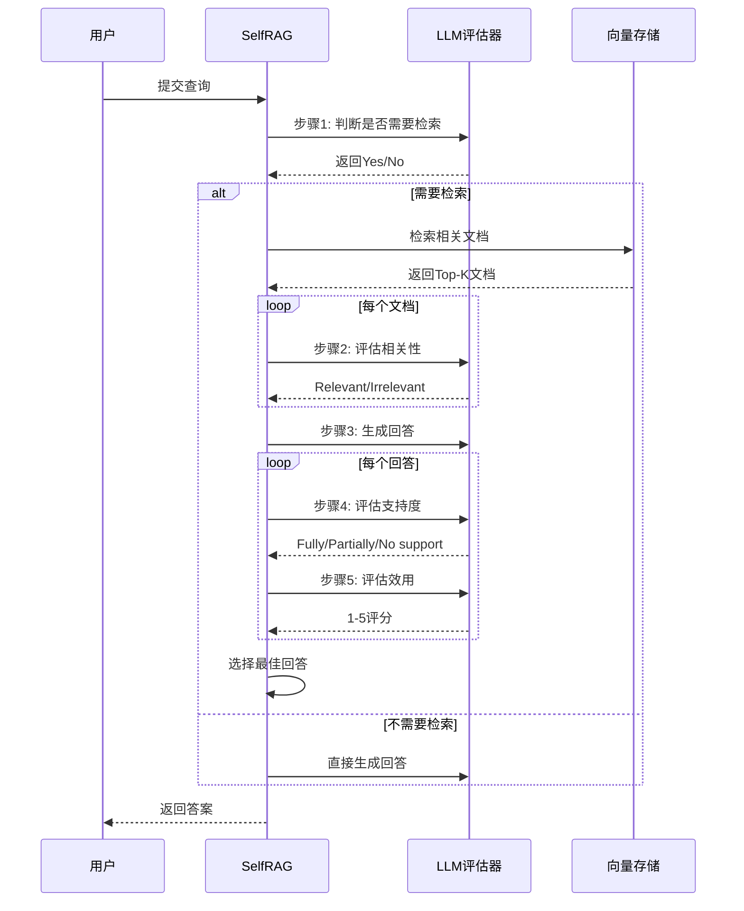
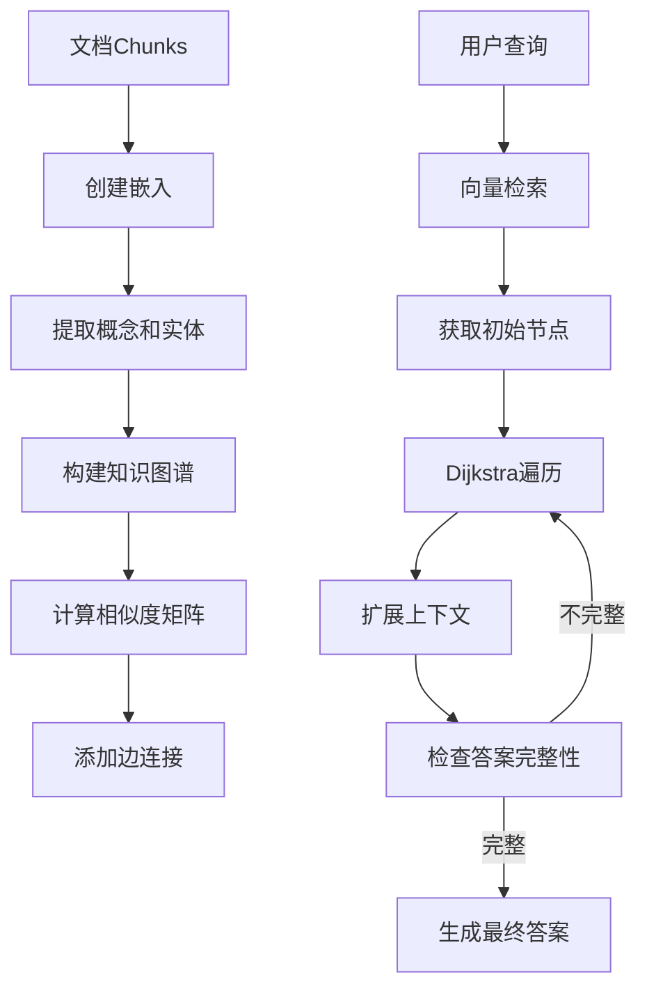

# RAG Techniques — 代码逻辑分析报告

## 1. 执行摘要

| 维度 | 内容 |
|------|------|
| **项目名称** | RAG Techniques |
| **项目定位** | 一个全面展示各种高级RAG（检索增强生成）技术实现的教育性代码仓库 |
| **技术栈** | Python + LangChain + OpenAI API + FAISS + NetworkX + scikit-learn |
| **架构模式** | 模块化示例代码库 / 教程驱动型架构 |
| **代码规模** | ~4000+ 行可运行Python脚本，38个Jupyter Notebook |
| **核心入口** | `all_rag_techniques_runnable_scripts/` 目录下的独立可运行脚本 |

> **一段话总结**: RAG Techniques 是一个由 Nir Diamant 维护的开源教育项目，旨在系统性地展示和教授30+种先进的RAG技术实现。项目采用模块化设计，每个技术都有独立的Jupyter Notebook和可运行Python脚本，涵盖从基础RAG到高级架构（如Graph RAG、Self-RAG、RAPTOR等）的完整技术栈。代码基于LangChain框架构建，使用OpenAI的嵌入和语言模型，依赖FAISS进行向量存储。项目结构清晰，适合学习和研究使用，但缺乏统一的抽象层和配置管理。

---

## 2. 目录结构解析

```
RAG_Techniques/
├── all_rag_techniques/                    # 核心: 各技术的Jupyter Notebook实现
│   ├── simple_rag.ipynb                   # 基础RAG
│   ├── self_rag.ipynb                     # 自反思RAG
│   ├── graph_rag.ipynb                    # 知识图谱RAG
│   ├── raptor.ipynb                       # 递归抽象树检索
│   ├── crag.ipynb                         # 纠正性RAG
│   ├── Agentic_RAG.ipynb                  # 智能体RAG
│   └── ... (共38个Notebook)
├── all_rag_techniques_runnable_scripts/   # 核心: 可独立运行的Python脚本
│   ├── simple_rag.py                      # 基础RAG脚本
│   ├── self_rag.py                        # Self-RAG实现
│   ├── graph_rag.py                       # Graph RAG实现
│   ├── raptor.py                          # RAPTOR实现
│   ├── crag.py                            # CRAG实现
│   └── ... (共23个脚本)
├── evaluation/                            # 评估: RAG系统评估工具和指标
│   ├── evalute_rag.py                     # 核心评估函数
│   ├── evaluation_deep_eval.ipynb         # DeepEval评估
│   └── evaluation_grouse.ipynb            # GroUSE评估
├── helper_functions.py                    # 核心: 共享工具函数库
├── data/                                  # 数据: 示例数据集
│   └── nike_2023_annual_report.txt
├── images/                                # 资源: 图片资源
├── tests/                                 # 测试: 测试用例
└── README.md                              # 文档: 项目说明
```

**关键观察**: 项目采用"按技术分类"的目录组织方式，每个RAG技术都有Notebook（教学演示）和Python脚本（生产使用）两种形式。`helper_functions.py`作为共享工具库，提供通用的文档编码、检索和回答生成功能。这种设计便于学习者对比不同技术的实现差异。

---

## 3. 架构与模块依赖

### 3.1 架构概览

RAG Techniques 采用**分层模块化架构**，整体设计以"教育展示"为核心目标：

1. **工具层** (`helper_functions.py`): 提供跨技术复用的基础功能，包括PDF编码、向量存储创建、检索执行等
2. **技术实现层** (`all_rag_techniques_runnable_scripts/`): 每个脚本实现一种特定的RAG技术，独立可运行
3. **演示层** (`all_rag_techniques/`): Jupyter Notebook形式，包含详细注释和可视化，用于教学
4. **评估层** (`evaluation/`): 提供RAG系统性能评估的统一接口

### 3.2 模块依赖图



### 3.3 核心模块详解

#### helper_functions.py (工具层)

- **路径**: `helper_functions.py`
- **职责**: 提供所有RAG技术共享的基础功能
- **关键函数**:
  - `encode_pdf()` — PDF文档编码为向量存储 (第24-44行)
  - `encode_from_string()` — 字符串编码为向量存储 (第47-85行)
  - `retrieve_context_per_question()` — 基于问题检索上下文 (第88-104行)
  - `create_question_answer_from_context_chain()` — 创建问答链 (第107-130行)
- **对外暴露**: 以上核心函数及EmbeddingProvider/ModelProvider枚举
- **依赖关系**: 依赖LangChain、OpenAI、FAISS等外部库，被所有技术脚本依赖

#### evaluation/evalute_rag.py (评估层)

- **路径**: `evaluation/evalute_rag.py`
- **职责**: 提供RAG系统性能评估的统一接口
- **关键函数**:
  - `create_deep_eval_test_cases()` — 创建测试用例 (第32-52行)
  - `evaluate_rag()` — 执行RAG评估 (第63-113行)
- **评估指标**: Correctness、Faithfulness、Contextual Relevancy

---

## 4. 核心业务流程与数据流

### 4.1 主流程描述

RAG Techniques 项目展示了多种RAG技术的完整流程，但所有技术都遵循以下**基础RAG流程**：

1. **文档加载**: 使用PyPDFLoader加载PDF文档
2. **文本分块**: 使用RecursiveCharacterTextSplitter将文档分割为chunks
3. **嵌入编码**: 使用OpenAIEmbeddings生成向量嵌入
4. **向量存储**: 使用FAISS存储嵌入向量
5. **检索查询**: 基于用户查询检索相关chunks
6. **答案生成**: 使用LLM基于检索到的上下文生成答案

不同技术在此基础上增加特定的增强步骤，如Self-RAG增加自我评估，Graph RAG增加知识图谱构建等。

### 4.2 基础RAG流程图



### 4.3 Self-RAG 增强流程

Self-RAG在基础流程上增加了**自我反思和评估**环节：



### 4.4 Graph RAG 数据流

Graph RAG引入了**知识图谱构建和遍历**：



---

## 5. 关键 API 接口与调用链路

### 5.1 API 总览

| 方法 | 接口 | 说明 | 所在文件 |
|------|------|------|----------|
| `encode_pdf()` | 函数 | PDF编码为向量存储 | `helper_functions.py:24` |
| `retrieve_context_per_question()` | 函数 | 基于问题检索上下文 | `helper_functions.py:88` |
| `SimpleRAG.run()` | 类方法 | 执行基础RAG流程 | `simple_rag.py:45` |
| `SelfRAG.run()` | 类方法 | 执行Self-RAG流程 | `self_rag.py:85` |
| `GraphRAG.query()` | 类方法 | 执行Graph RAG查询 | `graph_rag.py:595` |
| `CRAG.run()` | 类方法 | 执行CRAG流程 | `crag.py:108` |
| `RAPTORMethod.run()` | 类方法 | 执行RAPTOR检索 | `raptor.py:137` |

### 5.2 核心 API 调用链路分析

#### `SelfRAG.run()` — Self-RAG 完整流程

**调用链**:
```
SelfRAG.run() → retrieval_chain.invoke() → vectorstore.similarity_search() → 
relevance_chain.invoke() → generation_chain.invoke() → support_chain.invoke() → 
utility_chain.invoke()
```

**关键代码片段** (`self_rag.py:85-140`):

```python
def run(self, query):
    print(f"\nProcessing query: {query}")

    # Step 1: Determine if retrieval is necessary
    print("Step 1: Determining if retrieval is necessary...")
    input_data = {"query": query}
    retrieval_decision = self.retrieval_chain.invoke(input_data).response.strip().lower()
    print(f"Retrieval decision: {retrieval_decision}")

    if retrieval_decision == 'yes':
        # Step 2: Retrieve relevant documents
        print("Step 2: Retrieving relevant documents...")
        docs = self.vectorstore.similarity_search(query, k=self.top_k)
        contexts = [doc.page_content for doc in docs]

        # Step 3: Evaluate relevance of retrieved documents
        print("Step 3: Evaluating relevance of retrieved documents...")
        relevant_contexts = []
        for i, context in enumerate(contexts):
            input_data = {"query": query, "context": context}
            relevance = self.relevance_chain.invoke(input_data).response.strip().lower()
            if relevance == 'relevant':
                relevant_contexts.append(context)

        # Step 4: Generate responses using relevant contexts
        print("Step 4: Generating responses using relevant contexts...")
        responses = []
        for i, context in enumerate(relevant_contexts):
            input_data = {"query": query, "context": context}
            response = self.generation_chain.invoke(input_data).response
            
            # Step 5: Assess support
            input_data = {"response": response, "context": context}
            support = self.support_chain.invoke(input_data).response.strip().lower()
            
            # Step 6: Evaluate utility
            input_data = {"query": query, "response": response}
            utility = int(self.utility_chain.invoke(input_data).response)
            
            responses.append((response, support, utility))

        # Select the best response based on support and utility
        best_response = max(responses, key=lambda x: (x[1] == 'fully supported', x[2]))
        return best_response[0]
```

**逻辑说明**: Self-RAG通过多步骤的LLM评估实现自我反思。首先判断是否需要检索，然后检索文档并逐一评估相关性，只为相关文档生成回答，再评估回答的支持度和效用，最终选择最优回答。

#### `CRAG.run()` — Corrective RAG 流程

**调用链**:
```
CRAG.run() → retrieve_documents() → evaluate_documents() → 
[基于分数决定: 直接使用/网络搜索/混合] → generate_response()
```

**关键代码片段** (`crag.py:108-155`):

```python
def run(self, query):
    print(f"\nProcessing query: {query}")

    # Retrieve and evaluate documents
    retrieved_docs = self.retrieve_documents(query, self.vectorstore)
    eval_scores = self.evaluate_documents(query, retrieved_docs)

    print(f"\nRetrieved {len(retrieved_docs)} documents")
    print(f"Evaluation scores: {eval_scores}")

    # Determine action based on evaluation scores
    max_score = max(eval_scores)
    sources = []

    if max_score > self.upper_threshold:
        print("\nAction: Correct - Using retrieved document")
        best_doc = retrieved_docs[eval_scores.index(max_score)]
        final_knowledge = best_doc
        sources.append(("Retrieved document", ""))
    elif max_score < self.lower_threshold:
        print("\nAction: Incorrect - Performing web search")
        final_knowledge, sources = self.perform_web_search(query)
    else:
        print("\nAction: Ambiguous - Combining retrieved document and web search")
        best_doc = retrieved_docs[eval_scores.index(max_score)]
        retrieved_knowledge = self.knowledge_refinement(best_doc)
        web_knowledge, web_sources = self.perform_web_search(query)
        final_knowledge = "\n".join(retrieved_knowledge + web_knowledge)
        sources = [("Retrieved document", "")] + web_sources

    response = self.generate_response(query, final_knowledge, sources)
    return response
```

**逻辑说明**: CRAG通过评估检索文档的相关性分数，动态决定信息来源：高分直接使用检索结果，低分切换到网络搜索，中等分数则结合两者。

---

## 6. 算法与关键函数实现

### 6.1 RAPTOR 递归聚类算法

- **位置**: `raptor.py` 第 137-180 行
- **用途**: 构建递归抽象树，实现多层次的文档组织和检索
- **复杂度**: 时间 O(n * log(n)) / 空间 O(n)

**核心代码** (`raptor.py:60-100`):

```python
def build_raptor_tree(self) -> Dict[int, pd.DataFrame]:
    """Build the RAPTOR tree structure with level metadata and parent-child relationships."""
    results = {}
    current_texts = [extract_text(text) for text in self.texts]
    current_metadata = [{"level": 0, "origin": "original", "parent_id": None} for _ in self.texts]

    for level in range(1, self.max_levels + 1):
        logging.info(f"Processing level {level}")

        embeddings = embed_texts(current_texts)
        n_clusters = min(10, len(current_texts) // 2)
        cluster_labels = perform_clustering(np.array(embeddings), n_clusters)

        df = pd.DataFrame({
            'text': current_texts,
            'embedding': embeddings,
            'cluster': cluster_labels,
            'metadata': current_metadata
        })

        results[level - 1] = df

        summaries = []
        new_metadata = []
        for cluster in df['cluster'].unique():
            cluster_docs = df[df['cluster'] == cluster]
            cluster_texts = cluster_docs['text'].tolist()
            cluster_metadata = cluster_docs['metadata'].tolist()
            summary = summarize_texts(cluster_texts, self.llm)
            summaries.append(summary)
            new_metadata.append({
                "level": level,
                "origin": f"summary_of_cluster_{cluster}_level_{level - 1}",
                "child_ids": [meta.get('id') for meta in cluster_metadata],
                "id": f"summary_{level}_{cluster}"
            })

        current_texts = summaries
        current_metadata = new_metadata

        if len(current_texts) <= 1:
            break

    return results
```

**逐步解析**:

1. **初始化**: 将原始文本作为第0层，创建初始元数据
2. **循环构建层级**: 对每个层级执行以下操作：
   - 使用OpenAI嵌入模型生成文本嵌入
   - 使用高斯混合模型(GMM)进行聚类
   - 对每个聚类使用LLM生成摘要
   - 将摘要作为下一层的输入
3. **终止条件**: 当摘要数量小于等于1时停止
4. **返回结果**: 返回包含所有层级的树结构

### 6.2 Graph RAG 知识图谱构建

- **位置**: `graph_rag.py` 第 85-180 行
- **用途**: 从文档构建知识图谱，支持基于图的上下文扩展检索
- **复杂度**: 时间 O(n²) / 空间 O(n²)

**核心代码** (`graph_rag.py:85-130`):

```python
def build_graph(self, splits, llm, embedding_model):
    """Builds the knowledge graph by adding nodes, creating embeddings, extracting concepts, and adding edges."""
    self._add_nodes(splits)
    embeddings = self._create_embeddings(splits, embedding_model)
    self._extract_concepts(splits, llm)
    self._add_edges(embeddings)

def _add_edges(self, embeddings):
    """Adds edges to the graph based on the similarity of embeddings and shared concepts."""
    similarity_matrix = self._compute_similarities(embeddings)
    num_nodes = len(self.graph.nodes)

    for node1 in tqdm(range(num_nodes), desc="Adding edges"):
        for node2 in range(node1 + 1, num_nodes):
            similarity_score = similarity_matrix[node1][node2]
            if similarity_score > self.edges_threshold:
                shared_concepts = set(self.graph.nodes[node1]['concepts']) & set(
                    self.graph.nodes[node2]['concepts'])
                edge_weight = self._calculate_edge_weight(node1, node2, similarity_score, shared_concepts)
                self.graph.add_edge(node1, node2, weight=edge_weight,
                                    similarity=similarity_score,
                                    shared_concepts=list(shared_concepts))

def _calculate_edge_weight(self, node1, node2, similarity_score, shared_concepts, alpha=0.7, beta=0.3):
    """Calculates the weight of an edge based on similarity score and shared concepts."""
    max_possible_shared = min(len(self.graph.nodes[node1]['concepts']), len(self.graph.nodes[node2]['concepts']))
    normalized_shared_concepts = len(shared_concepts) / max_possible_shared if max_possible_shared > 0 else 0
    return alpha * similarity_score + beta * normalized_shared_concepts
```

**逐步解析**:

1. **添加节点**: 为每个文档chunk创建图节点
2. **创建嵌入**: 使用嵌入模型生成文本向量表示
3. **提取概念**: 使用spaCy和LLM提取命名实体和关键概念
4. **计算相似度**: 计算所有节点间的余弦相似度矩阵
5. **添加边**: 对相似度超过阈值的节点对添加边，边权重结合相似度和共享概念数量

### 6.3 BM25 检索算法

- **位置**: `helper_functions.py` 第 157-180 行
- **用途**: 基于词频的稀疏检索，与密集检索形成互补
- **复杂度**: 时间 O(n) / 空间 O(n)

**核心代码** (`helper_functions.py:157-180`):

```python
def bm25_retrieval(bm25: BM25Okapi, cleaned_texts: List[str], query: str, k: int = 5) -> List[str]:
    """
    Perform BM25 retrieval and return the top k cleaned text chunks.

    Args:
    bm25 (BM25Okapi): Pre-computed BM25 index.
    cleaned_texts (List[str]): List of cleaned text chunks corresponding to the BM25 index.
    query (str): The query string.
    k (int): The number of text chunks to retrieve.

    Returns:
    List[str]: The top k cleaned text chunks based on BM25 scores.
    """
    # Tokenize the query
    query_tokens = query.split()

    # Get BM25 scores for the query
    bm25_scores = bm25.get_scores(query_tokens)

    # Get the indices of the top k scores
    top_k_indices = np.argsort(bm25_scores)[::-1][:k]

    # Retrieve the top k cleaned text chunks
    top_k_texts = [cleaned_texts[i] for i in top_k_indices]

    return top_k_texts
```

**逐步解析**:

1. **查询分词**: 将输入查询按空格分割为词元
2. **计算分数**: 使用预计算的BM25索引获取每个文档的BM25分数
3. **排序选择**: 对分数进行降序排序，选择前k个最高分的文档
4. **返回结果**: 返回对应的文本chunks

---

## 7. 架构评价与建议

### 优势

- **全面性**: 涵盖30+种RAG技术，从基础到高级架构一应俱全
- **教育价值**: 每种技术都有详细的Jupyter Notebook和可运行脚本，非常适合学习
- **模块化设计**: `helper_functions.py`提供了良好的代码复用，避免重复实现
- **评估体系**: 内置了完整的RAG评估框架，支持多种评估指标
- **实战导向**: 所有代码都基于真实数据集（如Nike年报、气候变化PDF）进行测试

### 潜在问题

- **依赖耦合**: 所有技术都强依赖LangChain和OpenAI，缺乏对其他框架的支持
- **配置管理**: 缺少统一的配置管理，参数分散在各个脚本中
- **错误处理**: 异常处理相对简单，生产环境中可能需要更健壮的错误恢复机制
- **性能优化**: 大部分代码未针对性能进行优化，如缺少缓存机制和批处理
- **文档不足**: 虽然有README，但缺少详细的API文档和架构说明

### 进一步阅读建议

如果您想深入了解某个模块，建议从以下文件开始：

1. `helper_functions.py` — 理解项目的基础工具函数和通用模式
2. `all_rag_techniques_runnable_scripts/self_rag.py` — 学习Self-RAG的完整实现
3. `all_rag_techniques_runnable_scripts/graph_rag.py` — 掌握知识图谱RAG的构建过程
4. `evaluation/evalute_rag.py` — 了解RAG系统的评估方法和指标
5. `all_rag_techniques_runnable_scripts/raptor.py` — 研究递归抽象树检索算法