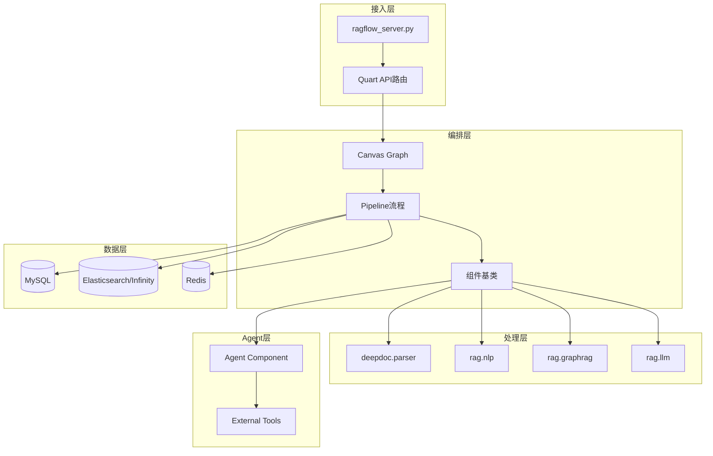
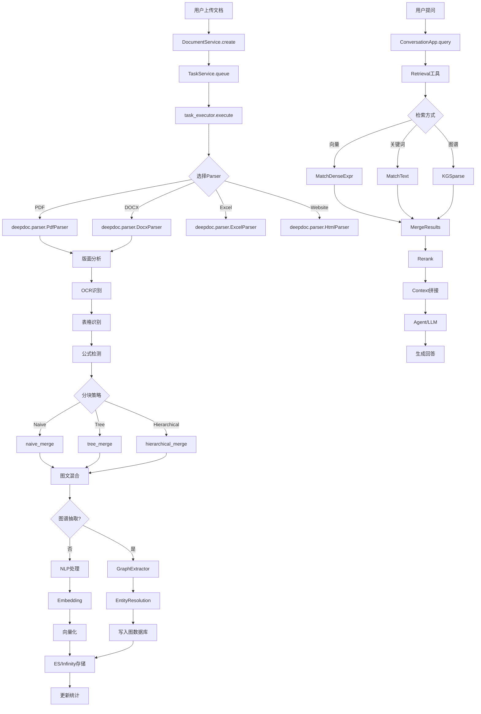
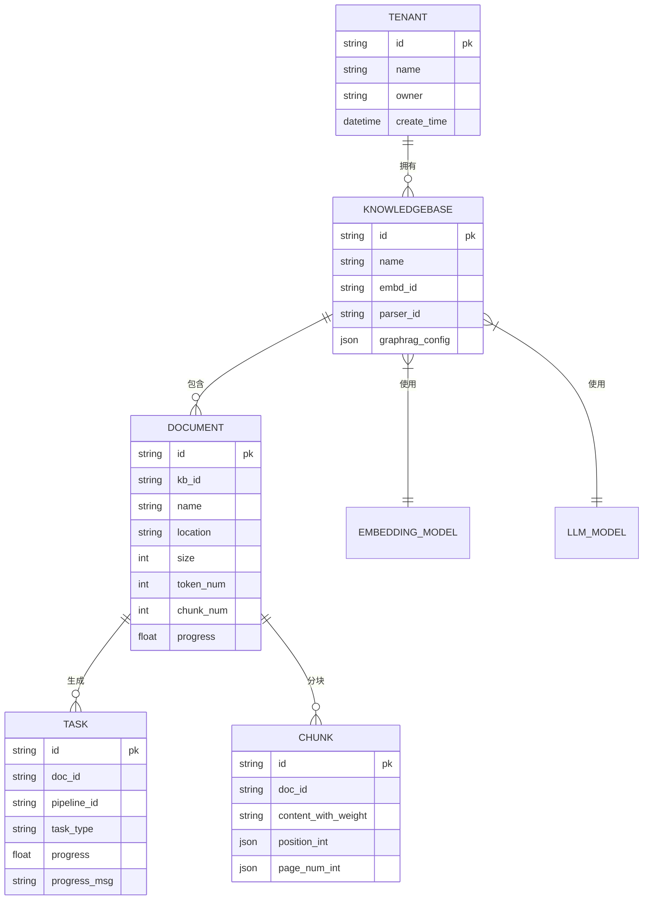

# RAGFlow — 代码逻辑分析报告

## 1. 执行摘要

| 维度 | 内容 |
|------|------|
| **项目名称** | RAGFlow |
| **项目定位** | 基于深度文档理解的领先开源RAG引擎，融合前沿RAG技术与Agent能力，提供(end-to-end)知识抽取、智能分块、可视化引用的文档理解流水线 |
| **技术栈** | Python 3.12 + Quart异步Web框架 + Peewee ORM + Elasticsearch/Infinity文档引擎 + LLM集成(LiteLLM) |
| **架构模式** | 模块化微服务架构 + Canvas无代码编排引擎 + 基于Pipeline的数据流处理 |
| **代码规模** | ~736个Python文件，~5375行代码；整体项目(含前端)超过36万行 |
| **核心入口** | `api/ragflow_server.py` |

> **一段话总结**: RAGFlow采用"数据流水线"架构设计，通过Canvas可视化编排组件化处理流程，实现从文档上传到知识检索的全流程自动化。其核心创新在于融合了深度文档理解(deepdoc)、图谱知识抽取(graphrag)、智能分块(smart chunking)、多路召回融合与可视化引用追踪，并支持自定义Agent工具调用。架构层次清晰但复杂度较高，适合企业级知识库构建场景。

---

## 2. 目录结构解析

```
ragflow/
├── api/                      # API层:RESTful接口 + Quart异步应用
│   ├── apps/                 # 业务API模块(文档/知识库/对话/LLM等)
│   ├── db/                   # 数据库模型与服务层
│   └── settings.py           # 全局配置
├── rag/                      # RAG核心引擎层
│   ├── app/                  # 文档类型专属处理(app/paper.py等8种)
│   ├── flow/                 # Pipeline组件化流程(parser/splitter/merger)
│   ├── graphrag/             # 图谱知识抽取
│   ├── llm/                  # LLM集成(对话/嵌入/重排/OCR/语音)
│   ├── nlp/                  # 文本处理(分词/查询/搜索/分块算法)
│   ├── prompts/              # 提示词模板
│   ├── svr/                  # 后台服务(task_executor/缓存/同步)
│   └── utils/                # 工具函数
├── deepdoc/                  # 深度文档理解核心(parser/vision)
├── agent/                    # Agent能力层
│   ├── component/            # Canvas组件(LLM/Agent/Tool/循环等)
│   ├── tools/                # 外部工具集成(retrieval/github/email等)
│   └── templates/            # Agent模板
├── sdk/python/               # Python SDK
├── web/                      # 前端应用(React + Ant Design)
├── common/                   # 通用库(token/配置/异常/redis连接)
├── mcp/                      # MCP服务器集成
├── memory/                   # 记忆库服务
├── tenant/                   # 租户管理
├── docker/                   # Docker部署配置
├── test/                     # 测试套件
└── docs/                     # 文档
```

**关键观察**: 采用"分层+分域"的复合组织方式：
- API层与核心逻辑分离(Api/rag)
- NLP处理与文档解析分离(rag.nlp/deepdoc.parser)
- Pipeline组件化设计允许无代码编排
- Agent组件与LLM处理共用基础设施

---

## 3. 架构与模块依赖

### 3.1 架构概览

RAGFlow采用四层架构设计：

**Layer 1: 接入层 (api/)**
- Quart异步Web框架提供RESTful API
- JWT认证 + API Token双重验证
- 支持SDK和HTTP两种接入方式

**Layer 2: 业务编排层 (rag.flow/)**
- Canvas流式编排引擎(Cython Graph实现)
- Pipeline组件化流水线(解析→分块→合并→存储)
- 支持动态配置(parser_config/jinja2变量)

**Layer 3: 核心处理层 (rag/ + deepdoc/)**
- 文档解析(deepdoc.parser: PDF/DOCX/Excel/网页等)
- 深度理解(deepdoc.vision: OCR/表格识别/图像解析)
- 文本处理(rag.nlp: 分块/分词/查询扩展)
- 图谱抽取(rag.graphrag: 轻量级/通用型图谱)

**Layer 4: LLM集成层 (rag.llm/)**
- LiteLLM统一接口支持30+模型厂商
- 任务类型分离(chat/embedding/rerank/tts/ocr)
- 内置嵌入模型(BAAI/bge-m3等)

**Layer 5: Agent层 (agent/)**
- Agent组件可调用工具(retrieval/email/github等)
- 支持多轮对话 + 上下文记忆
- 无代码组件编排

**Layer 6: 数据层**
- Elasticsearch/Infinity存储(fulltext + vector)
- Redis缓存 + 分布式锁
- MySQL/PostgreSQL元数据

### 3.2 模块依赖图



### 3.3 核心模块详解

#### `rag.flow.pipeline`

- **路径**: `rag/flow/pipeline.py`
- **职责**: Pipeline流程编排与执行引擎
- **关键文件**:
  - `pipeline.py` — 基于Cython Graph的流程编排
  - `base.py` — 组件基类与异步执行框架
  - `parser/parser.py` — 文档解析组件
  - `splitter/splitter.py` — 文本分块组件
- **对外暴露**: `Pipeline`类(继承`Graph`)，支持DSL定义流程
- **依赖关系**: 依赖`deepdoc.parser`、`rag.nlp`、`agent.component`，被`rag.svr.task_executor`调用

#### `rag.nlp`

- **路径**: `rag/nlp/`
- **职责**: 自然语言处理基础能力
- **关键文件**:
  - `rag_tokenizer.py` — 分词器(基于Infinity)
  - `search.py` — 搜索执行器(混合检索)
  - `query.py` — 查询解析与扩展
- **对外暴露**: `rag_tokenizer`单例，`Dealer`搜索类
- **核心算法**:
  - `naive_merge` — 基于token的自适应分块
  - `naive_merge_with_images` — 图文混合分块
  - `tree_merge` — 树形结构分块(基于标题层级)

#### `deepdoc.parser`

- **路径**: `deepdoc/parser/`
- **职责**: 多模态文档解析
- **关键文件**:
  - `pdf_parser.py` — PDF解析(PlainParser/VisionParser/RAGFlowPdfParser)
  - `docx_parser.py` — Word文档解析
  - `excel_parser.py` — Excel表格解析
  - `figure_parser.py` — 图像解析(VisionFigureParser)
- **对外暴露**: 各类Parser类
- **核心能力**:
  - 版面分析(布局识别/表格检测/公式提取)
  - OCR文本识别(深层OCR)
  - 图像转文本(Vision模型)

#### `rag.llm`

- **路径**: `rag/llm/`
- **职责**: LLM统一接口与任务调度
- **关键文件**:
  - `chat_model.py` — 对话模型(支持30+厂商)
  - `embedding_model.py` — 嵌入模型(2+种实现)
  - `rerank_model.py` — 重排模型(BGE-Rerank)
  - `cv_model.py` — 计算机视觉模型
- **核心类**:
  - `ChatModel` — LLM对话接口
  - `EmbeddingModel` — 文本向量化
  - `LiteLLMBase` — LiteLLM统一基类

#### `agent.component`

- **路径**: `agent/component/`
- **职责**: Canvas组件实现
- **关键文件**:
  - `llm.py` — LLM组件
  - `agent_with_tools.py` — Agent工具调用组件
  - `loop.py` — 循环组件
  - `begin.py`/`exit_loop.py` — 流程控制
- **核心能力**:
  - 多轮对话管理(消息窗口)
  - 工具调用(retrieval/email/github等)
  - 循环/分支控制

#### `rag.graphrag`

- **路径**: `rag/graphrag/`
- **职责**: 知识图谱抽取
- **关键文件**:
  - `general/` — 通用型GraphRAG(社区报告/实体嵌入)
  - `light/` — 轻量级图谱抽取
  - `entity_resolution.py` — 实体 resolution
  - `search.py` — 图谱检索
- **核心算法**:
  - 实体关系抽取(基于LLM)
  - 社区发现(Leiden算法)
  - 实体resolution(去重/合并)

---

## 4. 核心业务流程与数据流

### 4.1 主流程描述

RAGFlow的核心业务流程是**文档理解流水线**：

1. **文档上传与解析**
   - 用户上传文档(支持PDF/DOCX/Excel/网页/图片等)
   - `DocumentService.create`创建文档记录
   - `task_executor.py`调度Pipeline任务
   - 调用对应`parser`(如`rag.app.pdf`)解析文档

2. **智能分块与增强**
   - 提取文本内容 + 版面信息(页码/坐标)
   - 结构化识别(标题/列表/表格/公式)
   - 混合分块(naive_merge/树形merge)
   - 附加图像/表格上下文

3. **图谱抽取(可选)**
   - 调用`GraphExtractor`抽取实体-关系
   - 执行`EntityResolution`去重
   - 生成子图(subgraph)

4. **向量化与存储**
   - 调用`EmbeddingModel.encode`生成向量
   - 写入Elasticsearch/Infinity(index + vector)
   - 记录token数/块数统计

5. **检索与问答**
   - 用户提问 → `ConversationApp.query`
   - `Retrieval`工具调用`Dealer.search`
   - 混合检索(关键词 + 向量 + 图谱)
   - 重排(rerank) + 上下文拼接
   - `Agent`组件调用LLM生成回答

### 4.2 流程图



### 4.3 数据模型

**核心实体关系**:



---

## 5. 关键 API 接口与调用链路

### 5.1 API 总览

| 方法 | 路径 | 说明 | 所在文件 |
|------|------|------|----------|
| POST | `/v1/docs/{dataset_id}/documents` | 上传文档 | `api/apps/sdk/doc.py` |
| GET | `/v1/docs/{dataset_id}/documents` | 文档列表 | `api/apps/sdk/doc.py` |
| POST | `/v1/chunks` | 新建分块 | `api/apps/sdk/doc.py` |
| POST | `/v1/convos` | 创建对话 | `api/apps/sdk/conversation.py` |
| POST | `/v1/convos/{conversation_id}/query` | 问答查询 | `api/apps/sdk/conversation.py` |
| POST | `/v1/llm/{model_id}/chat` | LLM对话 | `api/apps/llm_app.py` |
| GET | `/v1/kbs` | 知识库列表 | `api/apps/kb_app.py` |
| DELETE | `/v1/kbs/{kb_id}` | 删除知识库 | `api/apps/kb_app.py` |

### 5.2 核心 API 调用链路分析

#### `上传文档 → 解析 → 存储`

**链路**:

```
POST /v1/docs/{kb_id}/documents
  → DocumentService.upload
    → FileService.save
      → DocumentService.create
        → TaskService.queue
          → TaskExecutor.execute_pipeline
            → Pipeline.run
              → Parser component
              → Splitter component
              → Embedding component
                → EmbeddingModel.encode
              → DocStore.insert
```

**关键代码片段**:

```python
@manager.route("/datasets/<dataset_id>/documents", methods=["POST"])
@token_required
async def upload(dataset_id, tenant_id):
    files = await request.files  # 多文件上传
    for file in files:
        filename = file.filename
        suffix = Path(filename).suffix.lower()[1:]
        location = await file_service.save_file(...)
        
        doc = DocumentService.create({
            "kb_id": dataset_id,
            "name": filename,
            "location": location,
            "suffix": suffix,
            "size": len(data),
            "tenant_id": tenant_id,
            "created_by": g.user.id
        })
        
        TaskService.queue("pipeline", {
            "doc_id": doc.id,
            "pipeline_id": kb.pipeline_id
        })
```

**逻辑说明**:
1. 接收多文件 multipart/form-data
2. 提取文件后缀(suffix)和大小
3. 调用`FileService.save_file`保存到MinIO/S3
4. 插入`Document`表记录(初始`progress=0`)
5. 调用`TaskService.queue`加入异步任务队列
6. `task_executor`从队列读取任务并执行Pipeline

---

#### `问答查询 → 混合检索 → 生成回答`

**链路**:

```
POST /v1/convos/{id}/query
  → ConversationApp.query
    → ConversationService.get
    → LLMBundle.get
      → UserCanvas.get(pipeline_id)
        → Canvas.build_graph
          → Graph.run(query)
            → Agent Component
              → Retrieval Tool
                → Dealer.search
                  → MatchDenseExpr(向量)
                  → MatchText(关键词)
                  → GraphQuery(图谱)
                → Rerank
                  → RerankModel.rerank
              → ChatModel.chat
                → LiteLLM.acompletion
      → CitationPlus
        → extract_citation
```

**关键代码片段**:

```python
async def query(conversation_id, tenant_id):
    conv = ConversationService.get(conversation_id)
    llm = LLMBundle(tenant_id, LLMType.CHAT, conv.llm_id)
    
    dag = UserCanvas.get(pipeline_id=conv.canvas_id)
    graph = Canvas.build_graph(dag.dsl)
    
    result = await graph.run({
        "query": req.query,
        "kb_ids": req.kb_ids,
        "top_n": req.top_n,
        "similarity_threshold": req.similarity_threshold
    })
    
    # Citation增强
    answer = citation_plus(
        query=req.query,
        chunks=result.chunks,
        conversation=conv
    )
    
    ConversationService.add_message(...)
    return {"answer": answer, "results": result}
```

**逻辑说明**:
1. 读取对话记录获取`canvas_id`和`llm_id`
2. 使用`Canvas.build_graph`构建Pipeline图
3. 执行图(传入query和检索参数)
4. `Agent`组件调用`Retrieval`工具
5. `Retrieval`执行混合检索(向量+关键词+图谱)
6. `Rerank`重排结果(基于query与chunk相似度)
7. `ChatModel`调用LLM生成回答
8. `CitationPlus`提取引用来源
9. 保存对话历史并返回结果

---

#### `LLM调用 → LiteLLM → 模型厂商`

**链路**:

```
LLMBundle.chat
  → LiteLLM.acompletion
    → litellm.acompletion
      → OpenAI API(或厂商特定端点)
        → 超时重试机制
```

**关键代码片段**:

```python
class LiteLLMChat(LiteLLMBase, ChatModel):
    _FACTORY_NAME = "openai"  # 支持所有兼容OpenAI的厂商
    
    async def acompletion(self, messages, **kwargs):
        try:
            response = await litellm.acompletion(
                model=self.model_name,
                messages=messages,
                api_key=self.api_key,
                api_base=self.base_url,
                timeout=60
            )
            return response.choices[0].message.content
        except Exception as e:
            if "timeout" in str(e):
                return await self._retry(messages, kwargs)
            raise
```

**逻辑说明**:
1. `LiteLLMBase`基类统一处理厂商配置
2. 使用`litellm.acompletion`调用模型
3. 支持自定义`api_base`(适配国产模型)
4. 超时重试机制(最多3次指数退避)
5. Error处理统一转为`LLMError`异常

---

## 6. 算法与关键函数实现

### 6.1 Naive分块算法 (naive_merge)

- **位置**: `rag/nlp/__init__.py` 第487行
- **用途**: 基于token预算的自适应分块，兼顾语义完整性
- **复杂度**: 时间 O(N) / 空间 O(N) (N为sections数量)

**核心代码**:

```python
def naive_merge(sections: str | list, chunk_token_num=128, delimiter="\n。；！？", overlapped_percent=0):
    if isinstance(sections, str):
        sections = [(s, "") for s in sections]
    
    cks = [""]  # chunks结果
    tk_nums = [0]  # 每个chunk的token计数
    overlap_size = int(chunk_token_num * (100 - overlapped_percent) / 100.)
    
    def add_chunk(t, pos):
        tnum = num_tokens_from_string(t)
        if cks[-1] == "" or tk_nums[-1] > chunk_token_num * (100 - overlapped_percent) / 100.:
            # 新chunk
            if cks and tnum > 8:
                overlapped = RAGFlowPdfParser.remove_tag(cks[-1])
                t = overlapped[int(len(overlapped) * (100 - overlapped_percent) / 100.):] + t
            cks.append(t + pos)
            tk_nums.append(tnum)
        else:
            # 追加到当前chunk
            cks[-1] += t + pos
            tk_nums[-1] += tnum
    
    # 处理自定义分隔符 `##`, `---` 等
    custom_delimiters = [m.group(1) for m in re.finditer(r"`([^`]+)`", delimiter)]
    if custom_delimiters:
        custom_pattern = "|".join(re.escape(t) for t in sorted(set(custom_delimiters), key=len, reverse=True))
        for sec, pos in sections:
            for sub_sec in re.split(custom_pattern, sec):
                if re.fullmatch(custom_pattern, sub_sec or ""):
                    continue
                add_chunk("\n" + sub_sec, pos)
        return cks[1:]  # 跳过伊始空元素
    
    # 默认处理
    for sec, pos in sections:
        add_chunk("\n" + sec, pos)
    
    return cks[1:]
```

**逐步解析**:

1. **输入处理**：支持字符串或`(text, position)`元组列表，提取自定义分隔符
2. **Token计数**：使用`num_tokens_from_string`统计token数，计算重叠大小
3. **分块逻辑**：当前chunk为空或超过阈值 → 创建新chunk；否则追加
4. **自定义分隔符**：按长度降序排序，跳过分隔符本身
5. **返回结果**：跳过首个空字符串元素

---

### 6.2 树形分块算法 (tree_merge)

- **位置**: `rag/nlp/__init__.py` 第694行
- **用途**: 基于标题层级的分块，保持文档结构
- **复杂度**: 时间 O(N log N) / 空间 O(N)

**核心代码**:

```python
def tree_merge(bull, sections, depth):
    if not sections or bull < 0:
        return sections
    
    # 1. 提取title层级
    levels = []
    for section in sections:
        txt = section[0].strip()
        for i, title in enumerate(BULLET_PATTERN[bull]):
            if re.match(title, txt):
                levels.append(i + 1)  # title level 1-based
                break
        else:
            levels.append(len(BULLET_PATTERN[bull]) + 2)  # body text
    
    # 2. 构建树节点
    root = Node(level=0, depth=depth, texts=[])
    lines = [(level, section[0]) for level, section in zip(levels, sections)]
    root.build_tree(lines)
    
    # 3. DFS遍历获取分块
    return [element for element in root.get_tree() if element]


class Node:
    def build_tree(self, lines):
        stack = [self]
        for level, text in lines:
            # 1. 回退到合适的父节点
            while len(stack) > 1 and level <= stack[-1].get_level():
                stack.pop()
            
            # 2. 创建新节点
            node = Node(level=level, texts=[text])
            stack[-1].add_child(node)  # 父节点添加子节点
            stack.append(node)  # 当前节点入栈
    
    def get_tree(self):
        tree_list = []
        self._dfs(self, tree_list, [])
        return tree_list
    
    def _dfs(self, node, tree_list, titles):
        # 累积title路径
        if 1 <= node.level <= self.depth:
            path_titles = titles + node.texts
        else:
            path_titles = titles
        
        # 叶子节点或超出深度 → 输出chunk
        if not node.children and (1 <= node.level <= self.depth):
            tree_list.append("\n".join(path_titles))
        elif node.level > self.depth and node.texts:
            tree_list.append("\n".join(path_titles + node.texts))
        
        # 递归子节点
        for c in node.children:
            self._dfs(c, tree_list, path_titles)
```

**逐步解析**:

1. **层级提取**：遍历sections匹配标题模式(BULLET_PATTERN)，返回层级号
2. **树构建**：使用栈维护当前路径，回退条件是当前层级≤栈顶层级
3. **DFS遍历**：累积路径上的titles，叶子节点输出完整路径
4. **输出**：每个chunk包含完整的标题层级路径

---

### 6.3 图谱实体抽取 (GraphExtractor)

- **位置**: `rag/graphrag/light/graph_extractor.py` 第43行
- **用途**: 基于LLM的实体-关系抽取
- **关键算法**: Glean模式(多次抽取+合并)

**核心代码**:

```python
async def _process_single_content(self, chunk_key_dp: tuple[str, str], ...):
    token_count = 0
    chunk_key = chunk_key_dp[0]
    content = chunk_key_dp[1]
    
    # 1. 构建prompt
    hint_prompt = self._entity_extract_prompt.format(
        **self._context_base, input_text=content
    )
    
    # 2. Glean循环(最多self._max_gleanings次)
    for _ in range(self._max_gleanings):
        # 调用LLM
        response = await self._llm_invoker.acompletion([
            {"role": "user", "content": hint_prompt}
        ])
        
        # 解析结果 (格式: "实体1|关系|实体2\n...")
        records = split_string_by_multi_markers(
            response, 
            [self._context_base["record_delimiter"]]
        )
        
        # 提取实体和关系
        for record in records:
            parts = split_string_by_multi_markers(
                record, 
                [self._context_base["tuple_delimiter"]]
            )
            if len(parts) >= 3:
                entity1, relation, entity2 = parts[0], parts[1], parts[2]
                out_results.append((entity1, relation, entity2))
        
        # 3. 检查是否需要继续
        if_loop_resp = await self._llm_invoker.acompletion([
            {"role": "user", "content": self._if_loop_prompt}
        ])
        if "NO" in if_loop_resp:
            break
    
    return len(out_results)
```

**逐步解析**:

1. **输入**: 单个chunk的(text, data_point_key)
2. **Prompt构建**: 注入entity_types示例，格式化input_text
3. **Glean循环**: 调用LLM抽取实体关系，解析DELIMITER分隔的记录
4. **循环控制**: 询问LLM是否需要继续抽取，NO则跳出
5. **输出**: 三元组列表[(e1, r, e2), ...]

---

### 6.4 混合检索 (Dealer.search)

- **位置**: `rag/nlp/search.py` 第88行
- **用途**: 向量检索 + 关键词检索 + 图谱检索融合
- **关键算法**: RRF(Rank Reciprocal Fusion)

**核心代码**:

```python
async def search(self, req, idx_names, kb_ids, emb_mdl=None, ...):
    # 1. 构建过滤条件
    filters = self.get_filters(req)
    
    # 2. 查询向量(如果需要)
    qv = None
    if emb_mdl and req.get("query"):
        qv, _ = await thread_pool_exec(emb_mdl.encode_queries, req["query"])
    
    # 3. 构建混合查询
    exprs = []
    
    # 向量相似度
    if qv:
        exprs.append(MatchDenseExpr(
            f"q_{len(qv)}_vec", 
            qv, 
            "float", 
            "cosine", 
            req.get("top_n", 10)
        ))
    
    # 全文检索
    if req.get("keywords"):
        exprs.append(MatchTextExpr("content_ltks", req["keywords"]))
    
    # 4. 图谱检索
    if req.get("knowledge_graph_kwd"):
        exprs.append(GraphQueryExpr(req["knowledge_graph_kwd"]))
    
    # 5. 执行融合
    if len(exprs) > 1:
        fusion_expr = FusionExpr(exprs, "rrf", rank_k=60)
        results = await self.dataStore.search(idx_names, fusion_expr, filters)
    else:
        results = await self.dataStore.search(idx_names, exprs[0], filters)
    
    return Dealer.SearchResult(
        total=results.total,
        ids=[r.id for r in results.hits]
    )
```

**逐步解析**:

1. **过滤条件构建**：kb_ids → `kb_id`过滤，doc_ids → `doc_id`过滤
2. **向量查询**：调用EmbBeddingModel.encode_queries生成query向量
3. **查询表达式构建**：MatchDenseExpr(向量)、MatchTextExpr(关键词)、GraphQueryExpr(图谱)
4. **融合策略**：RRF(Rank Reciprocal Fusion): `score = 1/(rank + K)`，默认`rank_k=60`
5. **结果返回**：IDs列表(按融合得分排序)

---

## 7. 架构评价与建议

### 优势

- **模块化设计清晰**: API/核心逻辑/LLM/Agent分层明确，易于扩展
- **Pipeline编排灵活**: Canvas无代码编排 + DSL定义流程
- **支持多模态文档**: PDF/DOCX/Excel/图片/网页/扫描件全覆盖
- **图谱能力完整**: 支持轻量级(light)和通用型(general)两种图谱抽取
- **LLM集成广泛**: LiteLLM统一接口支持30+厂商
- **可视化引用**: 支持引用来源标注和traceability

### 潜在问题

- **复杂度较高**: 736个Python文件，学习曲线陡峭
- **依赖外部模型**: 嵌入/重排模型需要额外部署
- **文档质量参差**: 部分模块注释稀疏(如`deepdoc.parser.pdf_parser`仅20%注释)
- **测试覆盖不足**: `test/`目录规模远小于主代码
- **配置分散**: `.env` + `service_conf.yaml` + `docker-compose.yml`多处配置
- **版本管理**: `ragflow_deps`镜像版本需与代码严格匹配

### 进一步阅读建议

如果您想深入了解某个模块，建议从以下文件开始：

1. **API入口理解**: `api/ragflow_server.py` — 了解启动流程和信号处理
2. **Pipeline执行**: `rag/flow/pipeline.py` — 掌握Canvas编排机制
3. **文档解析**: `deepdoc/parser/pdf_parser.py` — 理解PDF深度解析
4. **分块算法**: `rag/nlp/__init__.py` — 学习naive_merge和tree_merge
5. **混合检索**: `rag/nlp/search.py` — 掌握向量+关键词+图谱融合
6. **Agent工具**: `agent/tools/retrieval.py` — 理解Agent如何调用工具
7. **图谱抽取**: `rag/graphrag/light/graph_extractor.py` — 掌握实体关系抽取

---

**报告生成时间**: 2026-04-01  
**分析版本**: RAGFlow v0.24.0 (GitHub master branch)  
**分析工具**: OpenClaw subagent (analyze-open-source skill)
