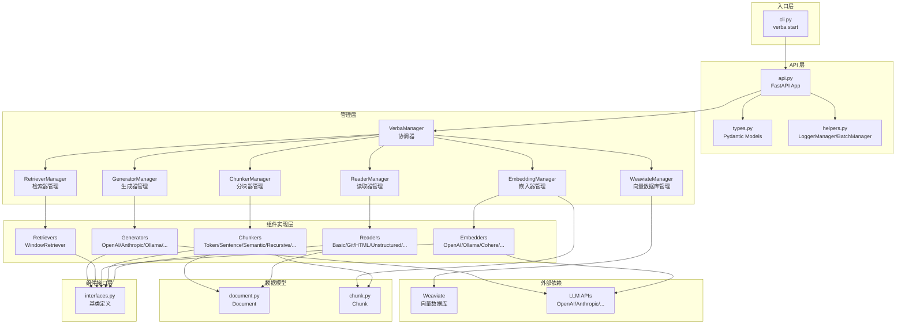
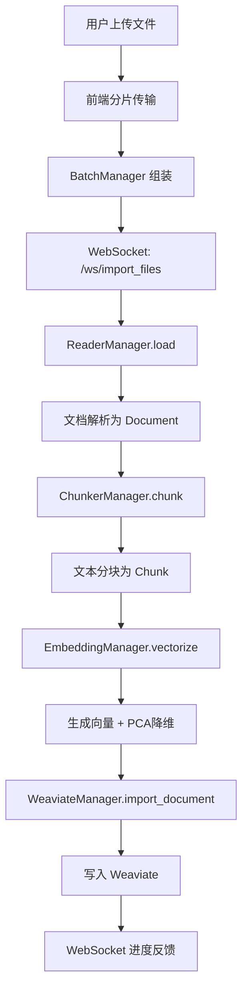
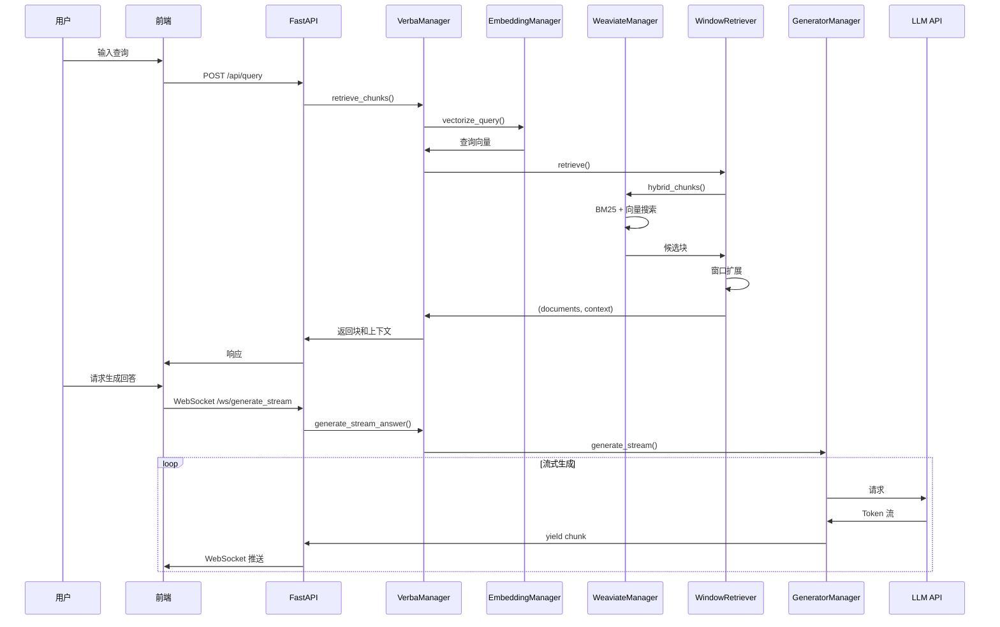

# Verba (The Golden RAGtriever) — 代码逻辑分析报告

## 1. 执行摘要

| 维度 | 内容 |
|------|------|
| **项目名称** | Verba (The Golden RAGtriever) |
| **项目定位** | 基于 Weaviate 的开源 RAG (Retrieval-Augmented Generation) 聊天机器人应用，提供端到端的文档问答解决方案 |
| **技术栈** | Python 3.10-3.12 + FastAPI + Weaviate + Next.js (前端) |
| **架构模式** | 插件化组件架构 (Component-based Architecture) + 分层架构 |
| **代码规模** | 约 53 个 Python 文件，约 8000+ 行代码 |
| **核心入口** | `goldenverba/server/cli.py` |

> **一段话总结**: Verba 是一个功能丰富的 RAG 应用，采用模块化插件架构设计，支持多种文档读取器、分块策略、嵌入模型和生成模型。核心亮点包括：基于 Weaviate 的向量存储、语义分块、混合检索、窗口检索策略，以及支持 OpenAI、Anthropic、Ollama 等多种 LLM 提供商。项目采用 FastAPI 提供后端 API，Next.js 构建前端界面，通过 WebSocket 实现实时流式响应和文件导入进度反馈。

---

## 2. 目录结构解析

```
Verba/
├── goldenverba/              # 核心后端代码 (Python)
│   ├── __init__.py          # 模块初始化，导出 VerbaManager
│   ├── components/          # 核心组件层: 按功能分包的插件系统
│   │   ├── interfaces.py    # 核心: 定义 Reader/Chunker/Embedding/Retriever/Generator 接口
│   │   ├── document.py      # 核心: Document 数据模型
│   │   ├── chunk.py         # 核心: Chunk 数据模型
│   │   ├── types.py         # 输入配置类型定义
│   │   ├── util.py          # 工具函数
│   │   ├── managers.py      # 核心: 管理器集合 (WeaviateManager/ReaderManager/ChunkerManager/EmbeddingManager/RetrieverManager/GeneratorManager)
│   │   ├── reader/          # 文档读取器组件: 支持多种数据源
│   │   ├── chunking/        # 分块策略组件: 8种分块算法
│   │   ├── embedding/       # 嵌入模型组件: 7种嵌入提供商
│   │   ├── retriever/       # 检索器组件: 窗口检索策略
│   │   └── generation/      # 生成器组件: 7种 LLM 提供商
│   └── server/              # API 服务层
│       ├── cli.py           # CLI 入口: verba start 命令
│       ├── api.py           # FastAPI 应用主文件: 路由和 WebSocket 定义
│       ├── types.py         # Pydantic 数据模型
│       └── helpers.py       # 辅助类: LoggerManager, BatchManager
├── frontend/                # 前端代码 (Next.js + React + TailwindCSS)
│   ├── app/                 # Next.js App Router
│   ├── public/              # 静态资源
│   └── package.json         # Node.js 依赖
├── setup.py                 # Python 包配置
├── Dockerfile               # Docker 部署配置
├── docker-compose.yml       # Docker Compose 配置
├── README.md                # 项目文档
├── TECHNICAL.md             # 技术文档
└── FRONTEND.md              # 前端开发文档
```

**关键观察**: 
- 采用**按功能分包**策略 (Feature-based Packaging)，每个组件类型 (reader/chunking/embedding 等) 独立成包
- 清晰的**分层架构**: 接口层 (interfaces) → 组件实现层 (components) → 管理层 (managers) → API 层 (server)
- **插件化设计**: 所有 RAG 组件均继承自基类，通过配置动态加载，易于扩展

---

## 3. 架构与模块依赖

### 3.1 架构概览

Verba 采用**组件化插件架构** (Component-based Plugin Architecture)，将 RAG 流程拆解为五个独立的可插拔组件：

1. **Reader** - 文档读取: 从各种来源读取文档
2. **Chunker** - 文本分块: 将文档切分为语义块
3. **Embedding** - 向量化: 将文本转换为向量
4. **Retriever** - 检索器: 从向量数据库检索相关块
5. **Generator** - 生成器: 基于检索结果生成回答

这种设计遵循**策略模式** (Strategy Pattern)，每个组件类型都有多个实现，用户可通过配置动态切换。

### 3.2 模块依赖图



### 3.3 核心模块详解

#### VerbaManager (协调器)

- **路径**: `goldenverba/components/managers.py` (隐含在 `__init__.py` 中)
- **职责**: 作为中央协调器，管理整个 RAG 流程的生命周期，包括文档导入、检索、生成等
- **关键方法**:
  - `import_document()` - 导入文档完整流程
  - `retrieve_chunks()` - 检索相关块
  - `generate_stream_answer()` - 流式生成回答
- **依赖关系**: 依赖所有 Manager 类，被 API 层依赖

#### WeaviateManager

- **路径**: `goldenverba/components/managers.py`
- **职责**: 管理 Weaviate 向量数据库的连接、集合操作、文档 CRUD
- **关键方法**:
  - `connect()` - 支持 Local/Docker/Weaviate Cloud/Custom 四种部署模式
  - `import_document()` - 将文档和块导入 Weaviate
  - `hybrid_chunks()` - 混合检索 (BM25 + 向量搜索)
  - `get_vectors()` - 获取向量用于 3D 可视化
- **集合设计**:
  - `VERBA_DOCUMENTS` - 存储文档元数据
  - `VERBA_SUGGESTIONS` - 存储搜索建议
  - `VERBA_CONFIGURATION` - 存储配置
  - `VERBA_Embedding_{model}` - 动态创建的嵌入集合

#### ReaderManager / ChunkerManager / EmbeddingManager / RetrieverManager / GeneratorManager

- **路径**: `goldenverba/components/managers.py`
- **职责**: 各自管理对应类型的组件，提供统一的调用接口
- **设计模式**: 工厂模式 + 策略模式

---

## 4. 核心业务流程与数据流

### 4.1 文档导入流程 (Ingestion Flow)

文档导入是 Verba 的核心流程之一，将外部文档转换为向量存储：



**详细步骤**:

1. **文件上传**: 前端通过 WebSocket 分片传输大文件
2. **文档读取**: `Reader` 组件根据文件类型解析内容 (支持 PDF、Word、Markdown、GitHub、URL 等)
3. **文本分块**: `Chunker` 组件将文档切分为语义块，支持 8 种策略:
   - TokenChunker: 按 Token 数量分块
   - SentenceChunker: 按句子分块
   - SemanticChunker: 基于语义相似度分块
   - RecursiveChunker: 递归分块
   - HTMLChunker/MarkdownChunker/CodeChunker/JSONChunker: 针对特定格式
4. **向量化**: `Embedding` 组件将每个块转换为向量，支持批处理
5. **PCA 降维**: 使用 sklearn 的 PCA 将高维向量降至 3D，用于前端可视化
6. **存储**: 文档元数据存入 `VERBA_DOCUMENTS`，块向量存入 `VERBA_Embedding_{model}`

### 4.2 查询检索流程 (RAG Query Flow)



### 4.3 数据模型

**Document 模型** (`goldenverba/components/document.py`):

```python
class Document:
    title: str          # 文档标题
    content: str        # 原始内容
    extension: str      # 文件扩展名
    fileSize: int       # 文件大小
    labels: list[str]   # 标签 (用于过滤)
    source: str         # 来源 URL
    meta: dict          # 内部元数据 (存储组件配置)
    metadata: str       # 用户自定义元数据 (参与嵌入)
    chunks: list[Chunk] # 文档块列表
    spacy_doc: Doc      # spaCy 处理后的文档 (用于句子分割)
```

**Chunk 模型** (`goldenverba/components/chunk.py`):

```python
class Chunk:
    content: str                # 块内容
    content_without_overlap: str # 无重叠内容
    chunk_id: int               # 块序号
    start_i: int                # 在原文中的起始位置
    end_i: int                  # 在原文中的结束位置
    vector: list[float]         # 嵌入向量
    pca: list[float]            # 3D PCA 降维向量 (用于可视化)
    doc_uuid: str               # 所属文档 UUID
    title: str                  # 文档标题
    labels: list[str]           # 标签
```

---

## 5. 关键 API 接口与调用链路

### 5.1 API 总览

| 方法 | 路径 | 说明 | 所在文件 |
|------|------|------|----------|
| GET | `/api/health` | 健康检查 | `api.py` |
| POST | `/api/connect` | 连接 Weaviate | `api.py` |
| POST | `/api/query` | 检索相关块 | `api.py` |
| WebSocket | `/ws/generate_stream` | 流式生成回答 | `api.py` |
| WebSocket | `/ws/import_files` | 文件导入 | `api.py` |
| POST | `/api/get_rag_config` | 获取 RAG 配置 | `api.py` |
| POST | `/api/set_rag_config` | 设置 RAG 配置 | `api.py` |
| POST | `/api/get_all_documents` | 获取文档列表 | `api.py` |
| POST | `/api/get_document` | 获取文档详情 | `api.py` |
| POST | `/api/delete_document` | 删除文档 | `api.py` |
| POST | `/api/get_vectors` | 获取向量 (3D 可视化) | `api.py` |
| POST | `/api/reset` | 重置数据 | `api.py` |

### 5.2 核心 API 调用链路分析

#### `/api/query` - 检索查询

**调用链**:
```
api.query() → VerbaManager.retrieve_chunks() → 
  EmbeddingManager.vectorize_query() → 
  RetrieverManager.retrieve() → 
    WindowRetriever.retrieve() → 
      WeaviateManager.hybrid_chunks() → 
      WeaviateManager.get_chunk_by_ids() (窗口扩展)
```

**关键代码片段** (简化):

```python
# goldenverba/components/retriever/WindowRetriever.py:65-95
async def retrieve(self, client, query, vector, config, weaviate_manager, embedder, labels, document_uuids):
    # 1. 混合检索
    chunks = await weaviate_manager.hybrid_chunks(
        client, embedder, query, vector, limit_mode, limit, labels, document_uuids
    )
    
    # 2. 按文档分组并计算得分
    doc_map = {}
    for chunk in chunks:
        if chunk.properties["doc_uuid"] not in doc_map:
            doc_map[chunk.properties["doc_uuid"]] = {
                "title": document["title"],
                "chunks": [],
                "score": 0,
            }
        doc_map[chunk.properties["doc_uuid"]]["chunks"].append(chunk)
    
    # 3. 窗口扩展: 获取相邻块
    for doc in doc_map:
        additional_chunk_ids = []
        for chunk in doc_map[doc]["chunks"]:
            if normalized_score > window_threshold:
                additional_chunk_ids += generate_window_list(chunk["chunk_id"], window)
        
        additional_chunks = await weaviate_manager.get_chunk_by_ids(
            client, embedder, doc, unique_chunk_ids
        )
```

**逻辑说明**: WindowRetriever 实现了**上下文窗口扩展**策略，在检索到相关块后，会自动获取其前后相邻的块，以提供更完整的上下文。这通过 `chunk_id` 范围查询实现。

#### `/ws/generate_stream` - 流式生成

**调用链**:
```
websocket_generate_stream() → 
  VerbaManager.generate_stream_answer() → 
    GeneratorManager.generate_stream() → 
      OpenAIGenerator.generate_stream() (或其他生成器)
```

**关键代码片段**:

```python
# goldenverba/components/generation/OpenAIGenerator.py:44-75
async def generate_stream(self, config, query, context, conversation):
    messages = self.prepare_messages(query, context, conversation, system_message)
    
    async with httpx.AsyncClient() as client:
        async with client.stream(
            "POST", f"{openai_url}/chat/completions",
            json={"messages": messages, "model": model, "stream": True},
            headers=headers,
        ) as response:
            async for line in response.aiter_lines():
                if line.startswith("data: "):
                    json_line = json.loads(line[6:])
                    choice = json_line["choices"][0]
                    yield {
                        "message": choice["delta"]["content"],
                        "finish_reason": choice.get("finish_reason"),
                    }
```

---

## 6. 算法与关键函数实现

### 6.1 语义分块算法 (Semantic Chunking)

- **位置**: `goldenverba/components/chunking/SemanticChunker.py`
- **用途**: 基于语义相似度进行智能分块
- **复杂度**: 时间 O(n²) / 空间 O(n) (n 为句子数)

**核心代码**:

```python
# goldenverba/components/chunking/SemanticChunker.py:45-95
async def chunk(self, config, documents, embedder, embedder_config):
    breakpoint_percentile_threshold = int(config["Breakpoint Percentile Threshold"].value)
    max_sentences = int(config["Max Sentences Per Chunk"].value)
    
    for document in documents:
        # 1. 句子分割
        sentences = [{"sentence": sent.text, "index": i} for i, sent in enumerate(document.spacy_doc.sents)]
        sentences = self.combine_sentences(sentences)  # 组合相邻句子
        
        # 2. 嵌入句子
        embeddings = await embedder.vectorize(embedder_config, [x["combined_sentence"] for x in sentences])
        for i, sentence in enumerate(sentences):
            sentence["combined_sentence_embedding"] = embeddings[i]
        
        # 3. 计算余弦距离
        distances, sentences = self.calculate_cosine_distances(sentences)
        
        # 4. 基于百分位数阈值确定分割点
        breakpoint_distance_threshold = np.percentile(distances, breakpoint_percentile_threshold)
        
        # 5. 分块
        chunks = []
        current_chunk = []
        for i, sentence in enumerate(sentences):
            current_chunk.append(sentence["sentence"])
            if (i < len(distances) and distances[i] > breakpoint_distance_threshold) or len(current_chunk) >= max_sentences:
                chunks.append(" ".join(current_chunk))
                current_chunk = []
```

**逐步解析**:

1. **句子组合**: 每个句子与前后各 1 个句子组合，形成上下文窗口
2. **语义嵌入**: 使用配置的嵌入模型计算组合句子的向量
3. **相似度计算**: 计算相邻句子组合的余弦相似度，转换为距离 (1 - similarity)
4. **阈值分割**: 使用百分位数确定分割阈值，距离超过阈值的点作为分块边界
5. **最大限制**: 同时限制每个块的最大句子数，避免块过大

### 6.2 混合检索算法 (Hybrid Search)

- **位置**: `goldenverba/components/managers.py:635-675`
- **用途**: 结合 BM25 关键词搜索和向量语义搜索
- **复杂度**: 依赖 Weaviate 内部实现

**核心代码**:

```python
# goldenverba/components/managers.py:635-675
async def hybrid_chunks(self, client, embedder, query, vector, limit_mode, limit, labels, document_uuids):
    embedder_collection = client.collections.get(self.embedding_table[embedder])
    
    # 构建过滤器
    filters = []
    if labels:
        filters.append(Filter.by_property("labels").contains_all(labels))
    if document_uuids:
        filters.append(Filter.by_property("doc_uuid").contains_any(document_uuids))
    
    # 执行混合搜索
    if limit_mode == "Autocut":
        chunks = await embedder_collection.query.hybrid(
            query=query,
            vector=vector,
            alpha=0.5,  # BM25 和向量搜索的权重
            auto_limit=limit,  # 自动截断
            return_metadata=MetadataQuery(score=True, explain_score=False),
            filters=apply_filters,
        )
    else:
        chunks = await embedder_collection.query.hybrid(
            query=query, vector=vector, alpha=0.5, limit=limit, ...
        )
    return chunks.objects
```

**算法说明**:

- `alpha=0.5` 表示 BM25 和向量搜索权重相等
- `Autocut` 模式使用 Weaviate 的自动截断功能，根据得分分布智能确定返回数量
- 支持标签过滤和指定文档 UUID 过滤

### 6.3 PCA 降维可视化

- **位置**: `goldenverba/components/managers.py:520-600`
- **用途**: 将高维向量降至 3D 用于前端可视化

**核心代码**:

```python
# goldenverba/components/managers.py:520-600
async def get_vectors(self, client, uuid, showAll):
    # 获取所有向量
    async for item in embedder_collection.iterator(include_vector=True):
        vector_list.append(item.vector["default"])
        vector_ids.append(doc_uuid)
    
    # PCA 降维到 3D
    if len(vector_ids) > 3:
        pca = PCA(n_components=3)
        generated_pca_embeddings = pca.fit_transform(vector_list)
        
        for pca_embedding, _uuid, _chunk_uuid in zip(pca_embeddings, vector_ids, vector_chunk_uuids):
            vector_map[_uuid]["chunks"].append({
                "vector": {"x": pca_embedding[0], "y": pca_embedding[1], "z": pca_embedding[2]},
                "uuid": str(_chunk_uuid),
                "chunk_id": _chunk_id,
            })
```

---

## 7. 架构评价与建议

### 优势

1. **优秀的插件化设计**: 组件接口清晰，新增 Reader/Chunker/Embedder/Retriever/Generator 只需继承基类并注册到对应列表，扩展性极佳
2. **灵活的 RAG 配置**: 通过 `RAGConfig` 模型，用户可以动态配置每个阶段使用的组件及其参数，支持运行时切换
3. **多部署模式支持**: WeaviateManager 支持 Local (Embedded)、Docker、Weaviate Cloud、Custom 四种部署模式，适应不同场景
4. **完善的类型系统**: 使用 Pydantic 定义所有数据模型，自动生成文档，类型安全
5. **实时进度反馈**: 通过 WebSocket 实现文件导入和生成的实时进度推送，用户体验好
6. **语义分块创新**: SemanticChunker 基于句子语义相似度分块，比固定长度分块更智能
7. **窗口检索策略**: WindowRetriever 的上下文窗口扩展有效提升了检索结果的完整性

### 潜在问题

1. **单用户设计限制**: 代码中明确说明 Verba 为单用户设计，ClientManager 虽支持多连接但缺乏用户隔离，不适合多用户场景
2. **Weaviate 强依赖**: 整个架构深度绑定 Weaviate，切换其他向量数据库需要大量改造
3. **缺少重排序 (Reranking)**: README 中标记为 planned，当前检索结果直接用于生成，缺少重排序优化
4. **错误处理可加强**: 部分代码使用裸 `Exception` 捕获，错误信息可能不够精确
5. **前端构建耦合**: 前端静态文件需要手动构建后复制到后端目录，部署流程略显繁琐
6. **文档注释不完整**: 部分关键类和方法缺少详细文档字符串 (如 `VerbaManager`)

### 进一步阅读建议

如果您想深入了解某个模块，建议从以下文件开始：

1. `goldenverba/components/interfaces.py` — 理解组件接口设计，这是整个插件系统的核心
2. `goldenverba/components/managers.py` — 理解管理层如何协调 RAG 流程，特别是 `WeaviateManager` 和 `VerbaManager`
3. `goldenverba/components/chunking/SemanticChunker.py` — 理解语义分块的实现细节，这是项目的亮点算法
4. `goldenverba/components/retriever/WindowRetriever.py` — 理解窗口检索和上下文扩展策略
5. `goldenverba/server/api.py` — 理解 API 路由和 WebSocket 实现

---

*报告生成时间: 2026-04-01*
*分析基于 Verba v2.1.3 版本代码*
